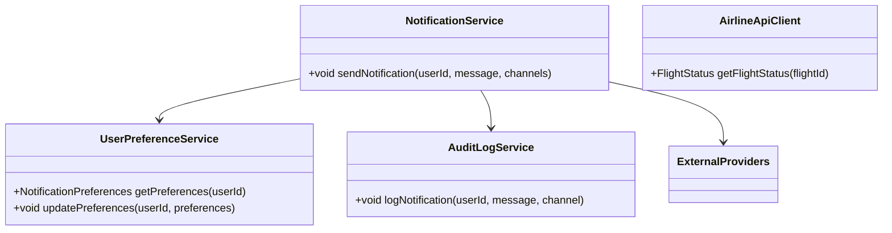
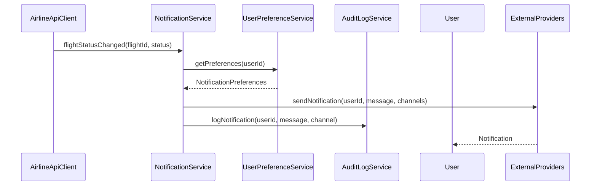
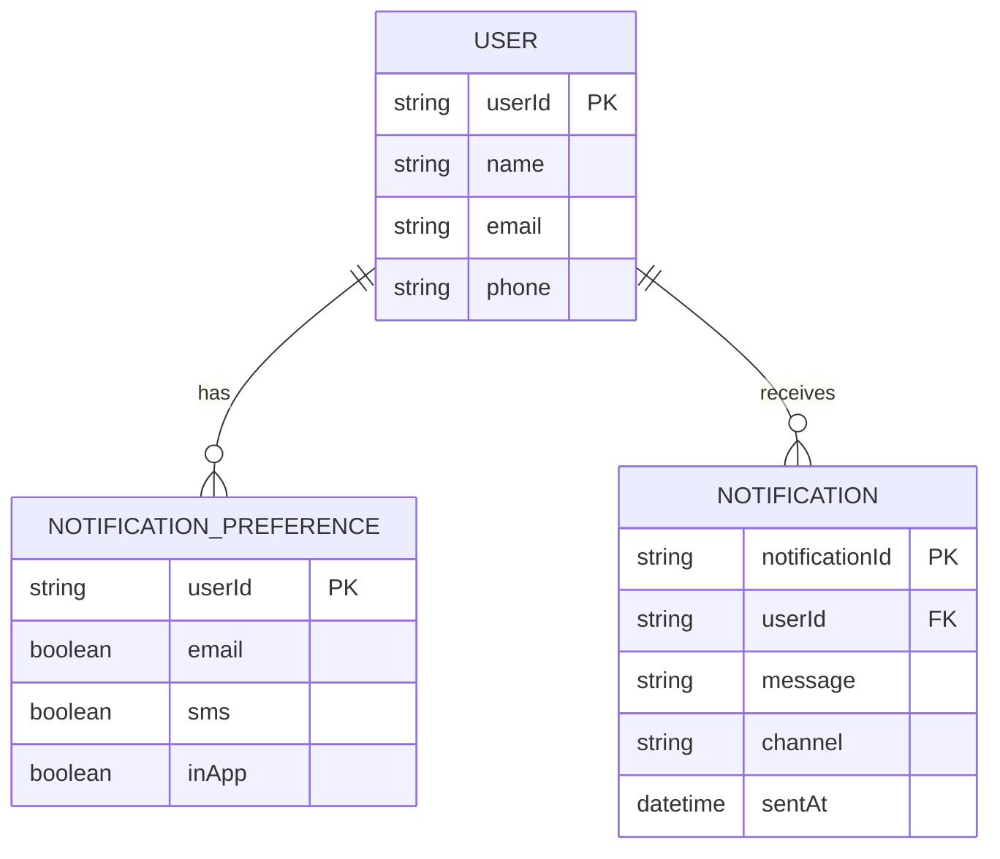

# For User Story Number [3]

1. Objective
This requirement enables the application to send real-time notifications to travelers about flight status changes, including delays, gate changes, or cancellations. Notifications are sent via email, SMS, and in-app alerts, with configurable user preferences. The goal is to keep users informed and reduce travel disruptions.

2. API Model
  2.1 Common Components/Services
  - NotificationService (new)
  - UserPreferenceService (new)
  - AirlineApiClient (existing)
  - AuditLogService (existing)

  2.2 API Details
| Operation | REST Method | Type | URL | Request | Response |
|-----------|-------------|------|-----|---------|----------|
| Get Notification Preferences | GET | Success/Failure | /api/users/{userId}/notification-preferences | - | { "email": true, "sms": false, "inApp": true } |
| Update Notification Preferences | PUT | Success/Failure | /api/users/{userId}/notification-preferences | { "email": true, "sms": false, "inApp": true } | { "status": "UPDATED" } |
| Send Notification | POST | Success/Failure | /api/notifications | { "userId": "U123", "message": "Flight DL123 delayed", "channels": ["email", "sms"] } | { "status": "SENT" } |

  2.3 Exceptions
| API | Exception | Description |
|-----|-----------|-------------|
| Get Notification Preferences | AuthenticationException | User not authenticated |
| Update Notification Preferences | ValidationException | Invalid preference format |
| Send Notification | NotificationFailedException | Notification could not be delivered |

3. Functional Design
  3.1 Class Diagram

  3.2 UML Sequence Diagram

  3.3 Components
| Component Name | Description | Existing/New |
|----------------|-------------|--------------|
| NotificationService | Manages notification workflow and delivery | New |
| UserPreferenceService | Stores and manages user notification preferences | New |
| AirlineApiClient | Monitors airline APIs for status updates | Existing |
| AuditLogService | Logs all sent notifications | Existing |

  3.4 Service Layer Logic and Validations
| FieldName | Validation | Error Message | ClassUsed |
|-----------|-----------|--------------|-----------|
| userId | Must be authenticated | "User not authenticated" | UserPreferenceService |
| preferences | Must be valid format (boolean per channel) | "Invalid preference format" | UserPreferenceService |
| message | Must be accurate and up-to-date | "Notification content invalid" | NotificationService |
| channels | Must match user preferences | "Channel not allowed" | NotificationService |

4. Integrations
| SystemToBeIntegrated | IntegratedFor | IntegrationType |
|----------------------|---------------|-----------------|
| Airline APIs | Flight status monitoring | API |
| Azure Notification Hubs | In-app notifications | API |
| Twilio | SMS notifications | API |
| SendGrid | Email notifications | API |

5. DB Details
  5.1 ER Model

  5.2 DB Validations
- Preferences must be set for each user.
- Notification records must reference a valid user.

6. Non-Functional Requirements
  6.1 Performance
  - Notifications delivered within 1 minute of status change.
  - Scalable notification service for high availability.
  6.2 Security
    6.2.1 Authentication
      - OAuth2/JWT for user authentication.
      - Secure storage of contact information.
    6.2.2 Authorization
      - Users can only update their own preferences.
  6.3 Logging
    6.3.1 Application Logging
      - DEBUG: Notification payloads (masked sensitive data)
      - INFO: Notification sent events
      - ERROR: Failed notification deliveries
      - WARN: Delivery retries
    6.3.2 Audit Log
      - Log all notifications sent with user, timestamp, channel, and status

7. Dependencies
- Airline APIs for flight status
- Azure Notification Hubs, Twilio, SendGrid

8. Assumptions
- User contact details are up-to-date
- Notification providers are highly available
