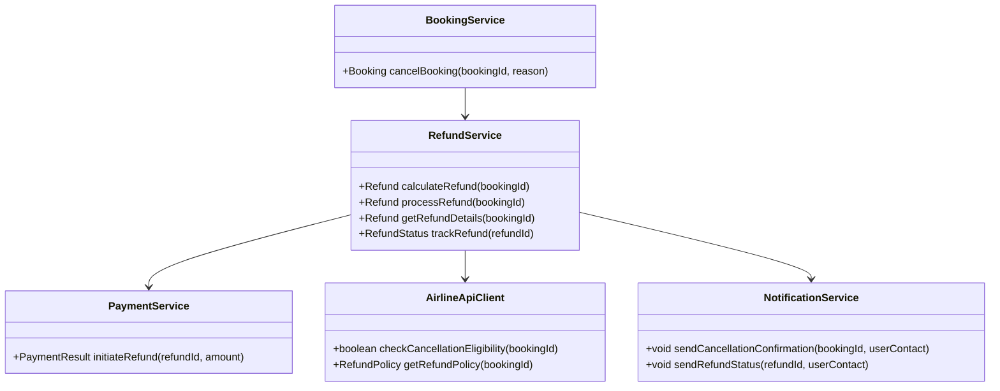
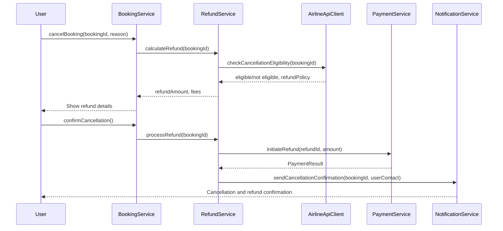
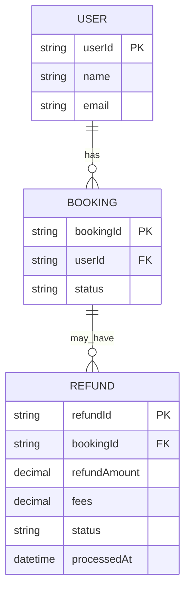

# For User Story Number [4]

1. Objective
This requirement enables travelers to cancel their air transport bookings and request refunds in accordance with airline policies. It ensures users are informed about refund eligibility, processing times, and any applicable fees. The goal is to provide a transparent and efficient cancellation and refund process.

2. API Model
  2.1 Common Components/Services
  - BookingService (existing)
  - RefundService (new)
  - PaymentService (existing)
  - AirlineApiClient (existing)
  - NotificationService (existing)

  2.2 API Details
| Operation | REST Method | Type | URL | Request | Response |
|-----------|-------------|------|-----|---------|----------|
| Cancel Booking | POST | Success/Failure | /api/bookings/{bookingId}/cancel | { "reason": "Change of plans" } | { "bookingId": "BK123", "status": "CANCELED", "refundAmount": 120, "fees": 30 } |
| Get Refund Details | GET | Success/Failure | /api/bookings/{bookingId}/refund | - | { "refundAmount": 120, "fees": 30, "status": "PROCESSING" } |
| Track Refund Status | GET | Success/Failure | /api/refunds/{refundId}/status | - | { "refundId": "RF123", "status": "COMPLETED", "processedAt": "2025-10-11T10:00:00Z" } |

  2.3 Exceptions
| API | Exception | Description |
|-----|-----------|-------------|
| Cancel Booking | NotAllowedException | Booking not eligible for cancellation |
| Cancel Booking | RefundCalculationException | Refund calculation failed |
| Get Refund Details | RefundNotFoundException | No refund found for booking |
| Track Refund Status | RefundNotFoundException | Refund ID invalid |

3. Functional Design
  3.1 Class Diagram

  3.2 UML Sequence Diagram

  3.3 Components
| Component Name | Description | Existing/New |
|----------------|-------------|--------------|
| BookingService | Manages booking cancellation | Existing |
| RefundService | Handles refund calculation and processing | New |
| PaymentService | Initiates refund transactions | Existing |
| AirlineApiClient | Checks eligibility and policies | Existing |
| NotificationService | Sends notifications for cancellation/refund | Existing |

  3.4 Service Layer Logic and Validations
| FieldName | Validation | Error Message | ClassUsed |
|-----------|-----------|--------------|-----------|
| bookingId | Must exist and be eligible | "Booking not eligible for cancellation" | AirlineApiClient |
| refundAmount | Must match airline policy | "Refund calculation error" | RefundService |
| fees | Must match airline policy | "Fee calculation error" | RefundService |
| refundId | Must exist and be valid | "Refund not found" | RefundService |

4. Integrations
| SystemToBeIntegrated | IntegratedFor | IntegrationType |
|----------------------|---------------|-----------------|
| Airline APIs | Cancellation eligibility and policy | API |
| Payment Gateway | Refund processing | API |
| Notification Service | Cancellation and refund notifications | API |

5. DB Details
  5.1 ER Model

  5.2 DB Validations
- Refund must reference a valid booking.
- Refund amount and fees must match airline policy.
- Status updates must be atomic and auditable.

6. Non-Functional Requirements
  6.1 Performance
  - Refund processing initiated within 1 hour of cancellation.
  - Real-time status tracking for refunds.
  6.2 Security
    6.2.1 Authentication
      - OAuth2/JWT for user authentication.
      - Secure handling of payment and personal data.
    6.2.2 Authorization
      - Users can only cancel their own bookings.
  6.3 Logging
    6.3.1 Application Logging
      - DEBUG: Refund calculation and processing payloads (masked sensitive data)
      - INFO: Cancellation and refund events
      - ERROR: Failed refund transactions
      - WARN: Policy mismatches
    6.3.2 Audit Log
      - Log all cancellation and refund actions with user, timestamp, and status

7. Dependencies
- Airline APIs for cancellation and refund policy
- Payment gateway for refund processing
- Notification service for user updates

8. Assumptions
- Airline policies are accessible via API
- Payment gateway supports refund APIs
- User authentication is managed via OAuth2/JWT
