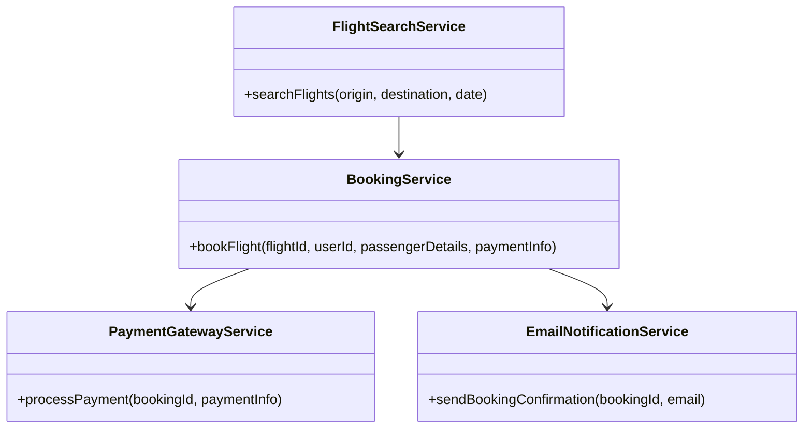
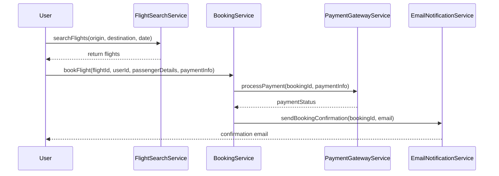

# For User Story Number [1]

1. Objective
The objective is to enable travelers to search, compare, and book air transport tickets online. The system should allow filtering by date, destination, airline, and price, and ensure secure payment and booking confirmation. This provides convenience and flexibility for travel planning.

2. API Model
  2.1 Common Components/Services
    - FlightSearchService (existing)
    - BookingService (new)
    - PaymentGatewayService (existing)
    - EmailNotificationService (existing)

  2.2 API Details
| Operation | REST Method | Type      | URL                       | Request (JSON) | Response (JSON) |
|-----------|-------------|-----------|---------------------------|----------------|-----------------|
| Search    | GET         | Success   | /api/flights/search       | {"origin": "JFK", "destination": "LAX", "date": "2025-11-01"} | [{"flightId": "F123", "airline": "Delta", "time": "10:00", "price": 200}] |
| Book      | POST        | Success   | /api/flights/book         | {"flightId": "F123", "userId": "U456", "passengerDetails": {...}, "paymentInfo": {...}} | {"bookingId": "B789", "status": "CONFIRMED"} |
| Book      | POST        | Failure   | /api/flights/book         | {"flightId": "F123", "userId": "U456", "passengerDetails": {...}, "paymentInfo": {...}} | {"error": "Payment failed"} |
| Payment   | POST        | Success   | /api/payments/process     | {"bookingId": "B789", "paymentInfo": {...}} | {"paymentStatus": "SUCCESS"} |
| Payment   | POST        | Failure   | /api/payments/process     | {"bookingId": "B789", "paymentInfo": {...}} | {"error": "Invalid card"} |
| Confirm   | POST        | Success   | /api/notifications/email  | {"bookingId": "B789", "email": "user@domain.com"} | {"notificationStatus": "SENT"} |

  2.3 Exceptions
| API                      | Exception Type           | Description                       |
|-------------------------|--------------------------|-----------------------------------|
| /api/flights/search     | InvalidAirportCodeException | Origin/Destination not valid      |
| /api/flights/search     | DateInPastException         | Date must not be in the past      |
| /api/flights/book       | PaymentFailedException      | Payment gateway failure           |
| /api/flights/book       | SeatUnavailableException    | No seats available                |
| /api/payments/process   | PaymentValidationException  | Invalid payment details           |
| /api/notifications/email| EmailSendException          | Email could not be sent           |

3 Functional Design
  3.1 Class Diagram


  3.2 UML Sequence Diagram


  3.3 Components
| Component Name            | Description                                         | Existing/New |
|--------------------------|-----------------------------------------------------|--------------|
| FlightSearchService      | Handles flight search logic                         | Existing     |
| BookingService           | Manages booking and seat reservation                | New          |
| PaymentGatewayService    | Integrates with payment gateway                     | Existing     |
| EmailNotificationService | Sends booking confirmation emails                   | Existing     |

  3.4 Service Layer Logic and Validations
| FieldName      | Validation                         | Error Message                   | ClassUsed              |
|----------------|------------------------------------|---------------------------------|------------------------|
| origin         | Valid airport code                  | Invalid origin airport code     | FlightSearchService    |
| destination    | Valid airport code                  | Invalid destination airport code| FlightSearchService    |
| date           | Not in the past                     | Date cannot be in the past      | FlightSearchService    |
| paymentInfo    | Valid payment details               | Payment details invalid         | PaymentGatewayService  |

4 Integrations
| SystemToBeIntegrated | IntegratedFor         | IntegrationType |
|----------------------|----------------------|-----------------|
| Payment Gateway      | Payment processing   | API             |
| Email Notification   | Booking confirmation | API             |

5 DB Details
  5.1 ER Model
```mermaid
erDiagram
  USERS ||--o{ BOOKINGS : has
  FLIGHTS ||--o{ BOOKINGS : reserved
  BOOKINGS ||--o{ PAYMENTS : paid
  BOOKINGS {
    bookingId PK
    userId FK
    flightId FK
    status
    bookingDate
  }
  USERS {
    userId PK
    name
    email
  }
  FLIGHTS {
    flightId PK
    airline
    origin
    destination
    date
    time
    price
    seatsAvailable
  }
  PAYMENTS {
    paymentId PK
    bookingId FK
    amount
    status
    paymentDate
  }
```

  5.2 DB Validations
- Foreign key constraints on userId and flightId in BOOKINGS
- SeatsAvailable must be > 0 for booking

6 Non-Functional Requirements
  6.1 Performance
    - Search results returned within 2 seconds
    - Caching of frequent search queries at API layer

  6.2 Security
    6.2.1 Authentication
      - OAuth2/JWT for user authentication
      - Integration with IAM if applicable
    6.2.2 Authorization
      - Role-based access for booking endpoints
      - Only authenticated users can book flights

  6.3 Logging
    6.3.1 Application Logging
      - DEBUG: API request/response payloads
      - INFO: Successful bookings and payments
      - ERROR: Payment failures, booking errors
      - WARN: Invalid search parameters
    6.3.2 Audit Log
      - Booking creation, payment processing, confirmation events

7 Dependencies
  - Payment gateway provider
  - Email notification service
  - Airline flight data provider

8 Assumptions
  - All airport codes are IATA standard
  - Payment gateway is PCI DSS compliant
  - Email service is reliable and supports transactional emails
