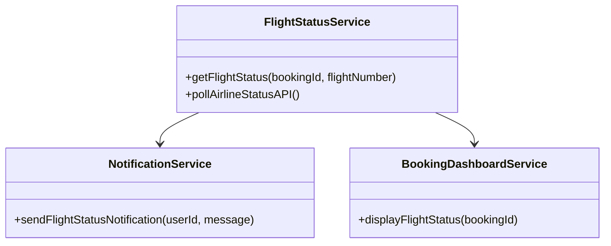
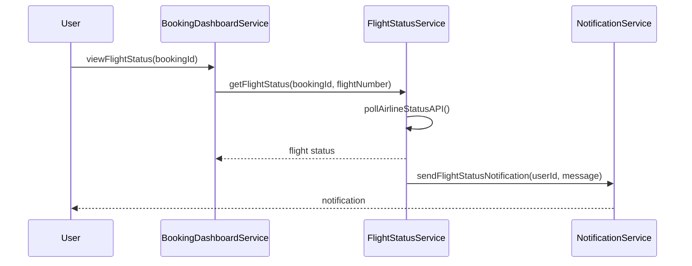

# For User Story Number [2]

1. Objective
The objective is to allow travelers to track the real-time status of their booked flights, including delays, cancellations, and gate changes. The system should provide timely notifications and updates through the booking dashboard. This ensures travelers are informed and can adjust their plans accordingly.

2. API Model
  2.1 Common Components/Services
    - FlightStatusService (new)
    - NotificationService (existing)
    - BookingDashboardService (existing)

  2.2 API Details
| Operation | REST Method | Type      | URL                           | Request (JSON) | Response (JSON) |
|-----------|-------------|-----------|-------------------------------|----------------|-----------------|
| GetStatus | GET         | Success   | /api/flights/status           | {"bookingId": "B789", "flightNumber": "DL123"} | {"flightNumber": "DL123", "status": "DELAYED", "gate": "A5", "eta": "12:30"} |
| GetStatus | GET         | Failure   | /api/flights/status           | {"bookingId": "B789", "flightNumber": "DL123"} | {"error": "Flight not found"} |
| Notify    | POST        | Success   | /api/notifications/flight     | {"userId": "U456", "message": "Flight DL123 delayed"} | {"notificationStatus": "SENT"} |
| Notify    | POST        | Failure   | /api/notifications/flight     | {"userId": "U456", "message": "Flight DL123 delayed"} | {"error": "Notification failed"} |

  2.3 Exceptions
| API                        | Exception Type             | Description                           |
|---------------------------|----------------------------|---------------------------------------|
| /api/flights/status       | InvalidBookingException    | Booking not found                     |
| /api/flights/status       | FlightNotFoundException    | Flight number not valid               |
| /api/notifications/flight | NotificationFailedException| Notification could not be delivered   |

3 Functional Design
  3.1 Class Diagram


  3.2 UML Sequence Diagram


  3.3 Components
| Component Name            | Description                                         | Existing/New |
|--------------------------|-----------------------------------------------------|--------------|
| FlightStatusService      | Handles polling and retrieving flight status         | New          |
| NotificationService      | Sends notifications to users                        | Existing     |
| BookingDashboardService  | Displays booking and flight status                  | Existing     |

  3.4 Service Layer Logic and Validations
| FieldName      | Validation                           | Error Message                   | ClassUsed              |
|----------------|--------------------------------------|---------------------------------|------------------------|
| bookingId      | Must be valid and exist              | Invalid booking                 | FlightStatusService    |
| flightNumber   | Must be valid and linked to booking  | Invalid flight number           | FlightStatusService    |
| statusUpdate   | Must be received from airline API    | Status update not received      | FlightStatusService    |
| userId         | Must be valid for notification       | Notification delivery failed    | NotificationService    |

4 Integrations
| SystemToBeIntegrated | IntegratedFor         | IntegrationType |
|----------------------|----------------------|-----------------|
| Airline Status API   | Real-time flight status| API            |
| Notification API     | User notifications    | API             |

5 DB Details
  5.1 ER Model
```mermaid
erDiagram
  USERS ||--o{ BOOKINGS : has
  BOOKINGS ||--o{ FLIGHT_STATUS : tracks
  FLIGHT_STATUS {
    statusId PK
    bookingId FK
    flightNumber
    status
    gate
    eta
    lastUpdated
  }
  BOOKINGS {
    bookingId PK
    userId FK
    flightNumber
    status
  }
  USERS {
    userId PK
    name
    email
  }
```

  5.2 DB Validations
- Foreign key constraints on bookingId in FLIGHT_STATUS
- FlightNumber must exist in BOOKINGS

6 Non-Functional Requirements
  6.1 Performance
    - Status updates reflected within 1 minute
    - Efficient polling of airline status API

  6.2 Security
    6.2.1 Authentication
      - OAuth2/JWT for user authentication
    6.2.2 Authorization
      - Only users with valid bookings can view flight status

  6.3 Logging
    6.3.1 Application Logging
      - DEBUG: API polling details
      - INFO: Status changes and notifications sent
      - ERROR: API failures, notification errors
      - WARN: Delayed updates
    6.3.2 Audit Log
      - Flight status changes and notification events

7 Dependencies
  - Airline status API provider
  - Notification service

8 Assumptions
  - Airline status API provides real-time updates
  - Notification service is reliable for timely delivery
