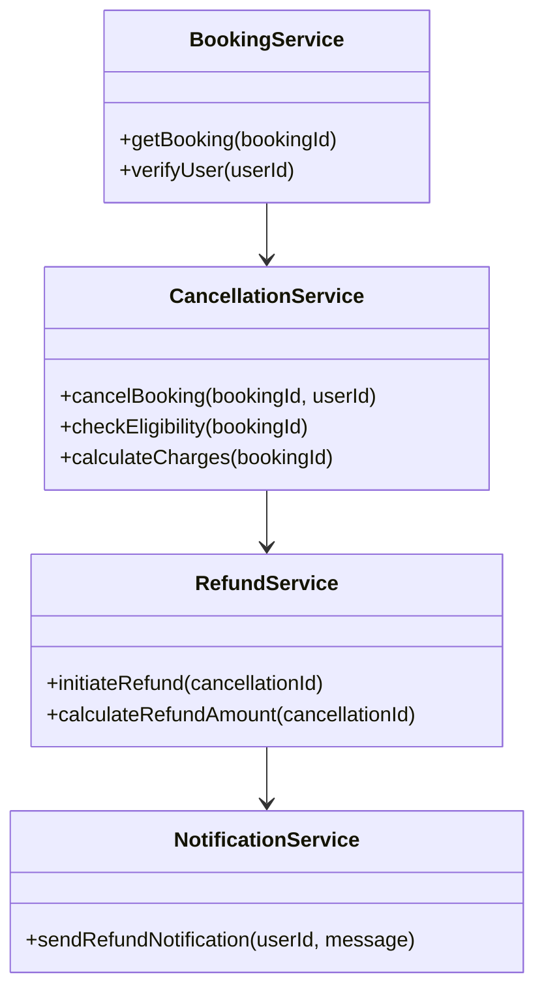
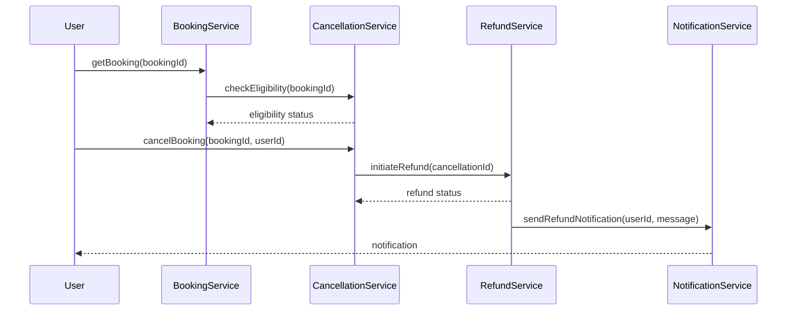

# For User Story Number [3]

1. Objective
The objective is to allow travelers to cancel their air transport bookings and request refunds in accordance with airline policies. The system should display cancellation charges, refund timelines, and provide confirmation and tracking of refund status. This ensures flexibility for travelers when plans change.

2. API Model
  2.1 Common Components/Services
    - BookingService (existing)
    - CancellationService (new)
    - RefundService (new)
    - NotificationService (existing)

  2.2 API Details
| Operation | REST Method | Type      | URL                           | Request (JSON) | Response (JSON) |
|-----------|-------------|-----------|-------------------------------|----------------|-----------------|
| Cancel    | POST        | Success   | /api/bookings/cancel          | {"bookingId": "B789", "userId": "U456"} | {"cancellationId": "C101", "refundAmount": 150, "status": "INITIATED"} |
| Cancel    | POST        | Failure   | /api/bookings/cancel          | {"bookingId": "B789", "userId": "U456"} | {"error": "Not eligible for cancellation"} |
| Refund    | POST        | Success   | /api/refunds/initiate         | {"cancellationId": "C101"} | {"refundId": "R202", "refundStatus": "PROCESSING"} |
| Refund    | POST        | Failure   | /api/refunds/initiate         | {"cancellationId": "C101"} | {"error": "Refund calculation error"} |
| Notify    | POST        | Success   | /api/notifications/refund     | {"userId": "U456", "message": "Refund initiated"} | {"notificationStatus": "SENT"} |

  2.3 Exceptions
| API                        | Exception Type             | Description                           |
|---------------------------|----------------------------|---------------------------------------|
| /api/bookings/cancel      | NotEligibleForCancellationException | Booking not eligible for cancellation |
| /api/refunds/initiate     | RefundCalculationException | Refund calculation failed              |
| /api/refunds/initiate     | RefundInitiationException  | Refund initiation failed               |
| /api/notifications/refund | NotificationFailedException| Notification could not be delivered    |

3 Functional Design
  3.1 Class Diagram


  3.2 UML Sequence Diagram


  3.3 Components
| Component Name            | Description                                         | Existing/New |
|--------------------------|-----------------------------------------------------|--------------|
| BookingService           | Manages bookings and user verification              | Existing     |
| CancellationService      | Handles cancellation logic and charge calculation   | New          |
| RefundService            | Manages refund initiation and calculation           | New          |
| NotificationService      | Sends notifications to users                        | Existing     |

  3.4 Service Layer Logic and Validations
| FieldName      | Validation                           | Error Message                   | ClassUsed              |
|----------------|--------------------------------------|---------------------------------|------------------------|
| bookingId      | Must be eligible for cancellation    | Not eligible for cancellation   | CancellationService    |
| refundAmount   | Must follow airline policy           | Refund calculation error        | RefundService          |
| userId         | Must be verified                     | User verification failed        | BookingService         |

4 Integrations
| SystemToBeIntegrated | IntegratedFor         | IntegrationType |
|----------------------|----------------------|-----------------|
| Airline Booking API  | Booking cancellation | API             |
| Payment Gateway API  | Refund processing    | API             |
| Notification API     | User notifications   | API             |

5 DB Details
  5.1 ER Model
```mermaid
erDiagram
  USERS ||--o{ BOOKINGS : has
  BOOKINGS ||--o{ CANCELLATIONS : cancelled
  CANCELLATIONS ||--o{ REFUNDS : refunded
  BOOKINGS {
    bookingId PK
    userId FK
    flightId FK
    status
    bookingDate
  }
  CANCELLATIONS {
    cancellationId PK
    bookingId FK
    charges
    cancellationDate
    status
  }
  REFUNDS {
    refundId PK
    cancellationId FK
    amount
    refundDate
    status
  }
  USERS {
    userId PK
    name
    email
  }
```

  5.2 DB Validations
- Foreign key constraints on bookingId in CANCELLATIONS
- Foreign key constraints on cancellationId in REFUNDS
- Refund amount must match airline policy

6 Non-Functional Requirements
  6.1 Performance
    - Cancellation and refund initiation within 5 seconds

  6.2 Security
    6.2.1 Authentication
      - OAuth2/JWT for user authentication
    6.2.2 Authorization
      - Only booking owner can cancel and request refund

  6.3 Logging
    6.3.1 Application Logging
      - DEBUG: API request/response payloads
      - INFO: Successful cancellations and refunds
      - ERROR: Refund calculation errors
      - WARN: Attempt to cancel ineligible booking
    6.3.2 Audit Log
      - Cancellation, refund initiation, and status changes

7 Dependencies
  - Airline booking API provider
  - Payment gateway provider
  - Notification service

8 Assumptions
  - Airline policy data is up-to-date and accessible
  - Payment gateway supports refund transactions
  - Notification service is reliable for refund updates
