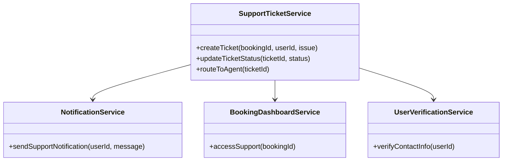
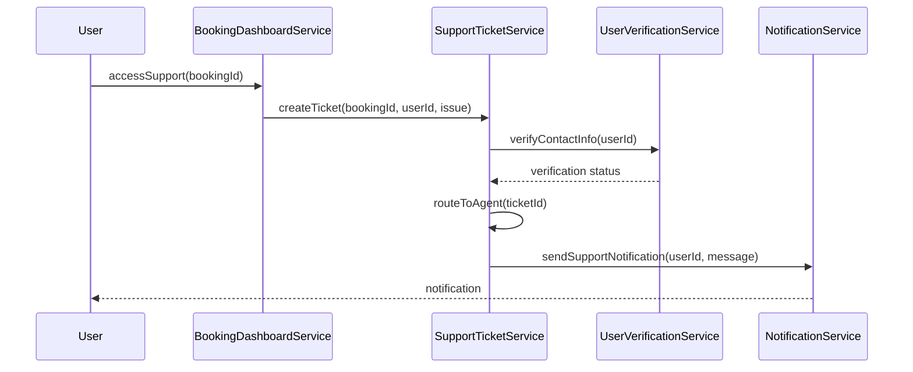

# For User Story Number [4]

1. Objective
The objective is to provide travelers with access to customer support channels (chat, email, phone) for resolving booking, payment, or flight status issues. The system should enable support ticket creation, status tracking, and timely resolution by support agents. This ensures quick and efficient problem resolution for users.

2. API Model
  2.1 Common Components/Services
    - SupportTicketService (new)
    - NotificationService (existing)
    - BookingDashboardService (existing)
    - UserVerificationService (existing)

  2.2 API Details
| Operation | REST Method | Type      | URL                           | Request (JSON) | Response (JSON) |
|-----------|-------------|-----------|-------------------------------|----------------|-----------------|
| Create    | POST        | Success   | /api/support/ticket           | {"bookingId": "B789", "userId": "U456", "issue": "Payment failed"} | {"ticketId": "T303", "status": "OPEN"} |
| Create    | POST        | Failure   | /api/support/ticket           | {"bookingId": "B789", "userId": "U456", "issue": "Payment failed"} | {"error": "Invalid booking"} |
| Update    | PUT         | Success   | /api/support/ticket/status    | {"ticketId": "T303", "status": "RESOLVED"} | {"ticketId": "T303", "status": "RESOLVED"} |
| Update    | PUT         | Failure   | /api/support/ticket/status    | {"ticketId": "T303", "status": "RESOLVED"} | {"error": "Ticket not found"} |
| Notify    | POST        | Success   | /api/notifications/support    | {"userId": "U456", "message": "Ticket resolved"} | {"notificationStatus": "SENT"} |

  2.3 Exceptions
| API                        | Exception Type             | Description                           |
|---------------------------|----------------------------|---------------------------------------|
| /api/support/ticket       | InvalidBookingException    | Booking not found                     |
| /api/support/ticket       | UserVerificationException  | User contact info invalid              |
| /api/support/ticket/status| TicketNotFoundException    | Ticket not found                      |
| /api/notifications/support| NotificationFailedException| Notification could not be delivered   |

3 Functional Design
  3.1 Class Diagram


  3.2 UML Sequence Diagram


  3.3 Components
| Component Name            | Description                                         | Existing/New |
|--------------------------|-----------------------------------------------------|--------------|
| SupportTicketService     | Manages support ticket creation and routing         | New          |
| NotificationService      | Sends notifications to users                        | Existing     |
| BookingDashboardService  | Allows user to access support from dashboard        | Existing     |
| UserVerificationService  | Verifies user contact information                   | Existing     |

  3.4 Service Layer Logic and Validations
| FieldName      | Validation                           | Error Message                   | ClassUsed              |
|----------------|--------------------------------------|---------------------------------|------------------------|
| bookingId      | Must be valid and exist              | Invalid booking                 | SupportTicketService   |
| userId         | Contact info must be verified        | User contact info invalid       | UserVerificationService|
| ticketId       | Must be valid for status update      | Ticket not found                | SupportTicketService   |
| response       | Must be logged and tracked           | Response not logged             | SupportTicketService   |

4 Integrations
| SystemToBeIntegrated | IntegratedFor         | IntegrationType |
|----------------------|----------------------|-----------------|
| Support Ticket API   | Ticket management    | API             |
| Notification API     | User notifications   | API             |

5 DB Details
  5.1 ER Model
```mermaid
erDiagram
  USERS ||--o{ BOOKINGS : has
  BOOKINGS ||--o{ SUPPORT_TICKETS : linked
  SUPPORT_TICKETS {
    ticketId PK
    bookingId FK
    userId FK
    issue
    status
    createdAt
    updatedAt
    agentId
  }
  USERS {
    userId PK
    name
    email
    phone
  }
  BOOKINGS {
    bookingId PK
    userId FK
    flightId FK
    status
  }
```

  5.2 DB Validations
- Foreign key constraints on bookingId and userId in SUPPORT_TICKETS
- Ticket status must be tracked and updated

6 Non-Functional Requirements
  6.1 Performance
    - Initial response within 2 minutes

  6.2 Security
    6.2.1 Authentication
      - OAuth2/JWT for user authentication
    6.2.2 Authorization
      - Only booking owner can create/view support tickets

  6.3 Logging
    6.3.1 Application Logging
      - DEBUG: API request/response payloads
      - INFO: Ticket creation, status updates
      - ERROR: Ticket creation/update failures
      - WARN: Invalid booking or user info
    6.3.2 Audit Log
      - Ticket creation, status changes, agent actions

7 Dependencies
  - Support ticket API provider
  - Notification service

8 Assumptions
  - Support agents are available 24/7
  - Notification service is reliable for ticket updates
