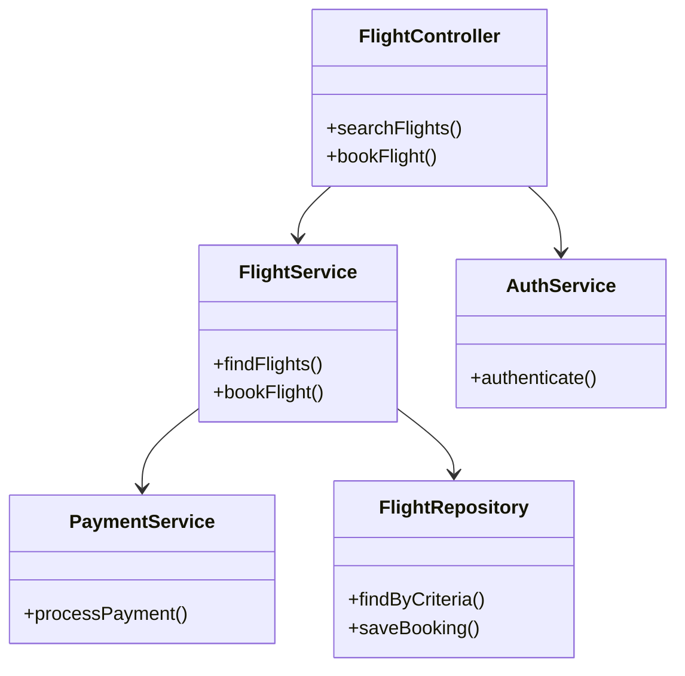
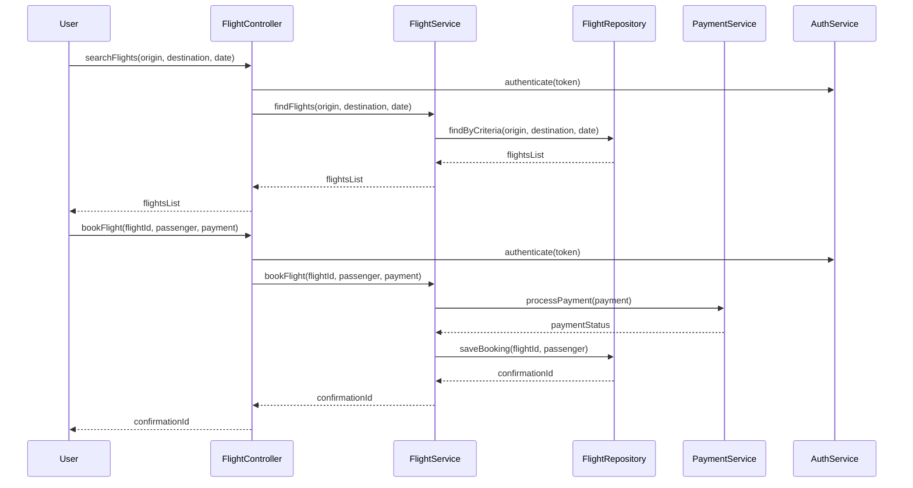
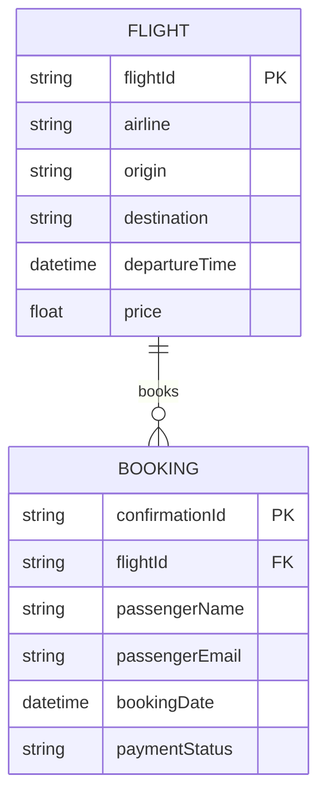

# For User Story Number [1]
1. Objective
This requirement enables travelers to search, compare, and book air transport tickets online, providing a seamless and convenient experience. The system will ensure real-time flight availability, pricing, and secure booking confirmation. It aims to streamline travel planning and payment processing within a single application.

2. API Model
	2.1 Common Components/Services
	- Authentication Service (OAuth2)
	- Payment Service (Stripe Integration)
	- Flight Search Service (Airline API Integration)
	- Logging Service

	2.2 API Details
| Operation | REST Method | Type | URL | Request | Response |
|-----------|------------|------|-----|---------|----------|
| Search Flights | GET | Success/Failure | /api/flights/search | {"origin": "JFK", "destination": "LAX", "date": "2025-11-01"} | {"flights": [{"flightId": "123", "airline": "Delta", "time": "10:00", "price": 320.00}]} |
| Book Flight | POST | Success/Failure | /api/flights/book | {"flightId": "123", "passenger": {"name": "John Doe", "email": "john@example.com"}, "payment": {"token": "tok_abc"}} | {"confirmationId": "ABC123", "status": "confirmed"} |
| Payment Processing | POST | Success/Failure | /api/payments/process | {"amount": 320.00, "token": "tok_abc"} | {"paymentStatus": "success", "transactionId": "txn_456"} |

	2.3 Exceptions
| API | Exception | Error Message |
|-----|-----------|--------------|
| Search Flights | InvalidAirportCodeException | "Invalid origin or destination airport code." |
| Search Flights | NoFlightsFoundException | "No flights found for the given criteria." |
| Book Flight | PaymentFailedException | "Payment could not be processed." |
| Book Flight | FlightUnavailableException | "Selected flight is no longer available." |
| Payment Processing | PaymentGatewayException | "Payment gateway error." |

3 Functional Design
	3.1 Class Diagram

	3.2 UML Sequence Diagram

	3.3 Components
| Component Name | Description | Existing/New |
|----------------|-------------|--------------|
| FlightController | Handles REST endpoints for flight search and booking | New |
| FlightService | Business logic for flight operations | New |
| PaymentService | Handles payment processing via Stripe | Existing |
| AuthService | Manages OAuth2 authentication | Existing |
| FlightRepository | Data access for flights and bookings | New |

	3.4 Service Layer Logic & Validations
| FieldName | Validation | Error Message | ClassUsed |
|-----------|-----------|--------------|-----------|
| origin | Valid airport code | "Invalid origin airport code." | FlightService |
| destination | Valid airport code | "Invalid destination airport code." | FlightService |
| date | Date in future | "Travel date must be in the future." | FlightService |
| payment.token | Payment processed | "Payment failed." | PaymentService |

4 Integrations
| SystemToBeIntegrated | IntegratedFor | IntegrationType |
|---------------------|---------------|----------------|
| Airline API | Flight search & availability | API |
| Stripe | Payment processing | API |
| OAuth2 IAM | Authentication | API |

5 DB Details
	5.1 ER Model

	5.2 DB Validations
- flightId must exist in FLIGHT table before booking
- confirmationId must be unique
- paymentStatus must be 'success' before booking confirmation

6 Non-Functional Requirements
	6.1 Performance
	- Response time <2 seconds for flight search
	- Scalable to 10,000 concurrent users
	- Caching of frequent search queries at API layer
	6.2 Security
		6.2.1 Authentication
		- OAuth2 authentication for all endpoints
		6.2.2 Authorization
		- Role-based access: only authenticated users can book flights
	6.3 Logging
		6.3.1 Application Logging
		- DEBUG: API request/response payloads
		- INFO: Successful searches/bookings
		- ERROR: Failed payments/bookings
		- WARN: Invalid input attempts
		6.3.2 Audit Log
		- Log booking events with user, flight, timestamp, and status

7 Dependencies
- Airline APIs for real-time flight data
- Stripe for payment processing
- OAuth2 IAM for authentication

8 Assumptions
- All airline APIs support REST and return data in JSON
- Payment gateway (Stripe) is PCI DSS compliant
- Users have valid OAuth2 tokens
