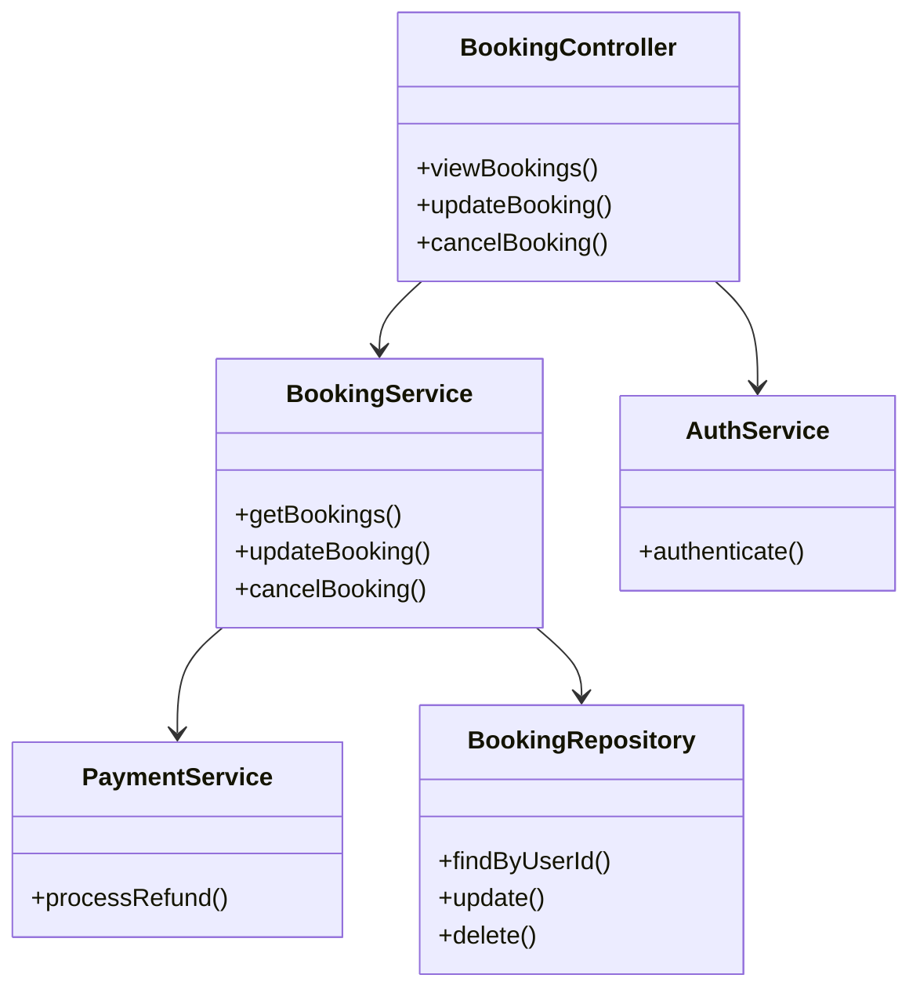
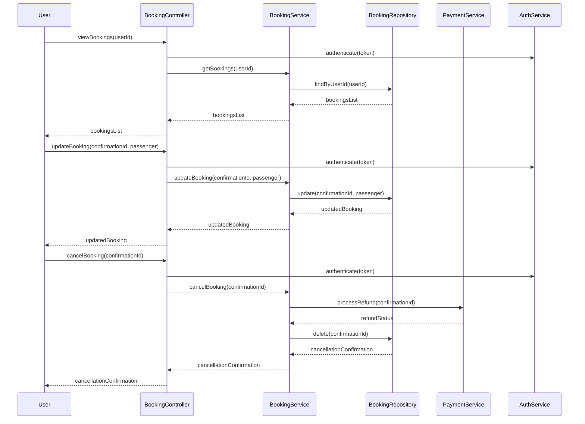
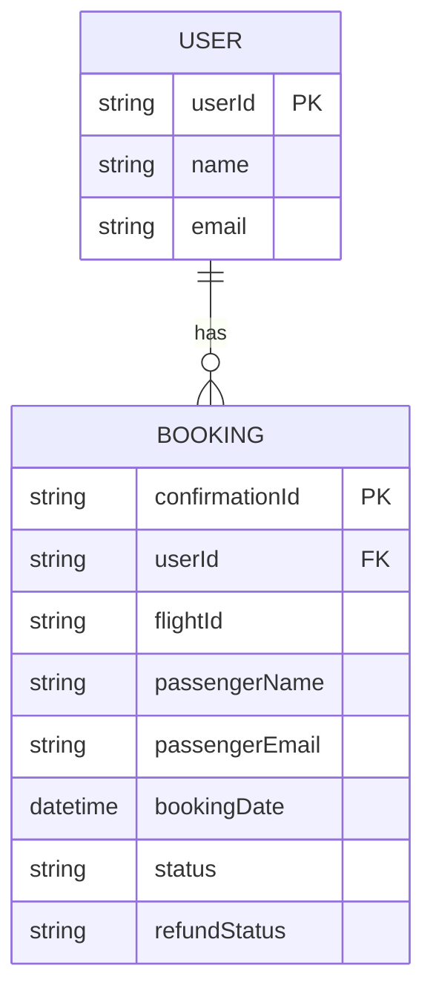

# For User Story Number [2]
1. Objective
This requirement allows travelers to view and manage their air transport bookings through a dashboard, enabling updates to passenger details and booking cancellations. It ensures users can only manage their own bookings, with all changes validated against airline policies. The system provides secure, real-time confirmation and refund processing for eligible cancellations.

2. API Model
	2.1 Common Components/Services
	- Authentication Service (JWT)
	- Booking Management Service
	- Payment Service (Refund Processing)
	- Audit Logging Service

	2.2 API Details
| Operation | REST Method | Type | URL | Request | Response |
|-----------|------------|------|-----|---------|----------|
| View Bookings | GET | Success/Failure | /api/bookings | {"userId": "u123"} | {"bookings": [{"confirmationId": "ABC123", "flightId": "123", "status": "confirmed"}]} |
| Update Booking | PUT | Success/Failure | /api/bookings/{confirmationId} | {"passenger": {"name": "Jane Doe", "email": "jane@example.com"}} | {"confirmationId": "ABC123", "status": "updated"} |
| Cancel Booking | DELETE | Success/Failure | /api/bookings/{confirmationId} | {} | {"confirmationId": "ABC123", "status": "cancelled", "refundStatus": "processed"} |

	2.3 Exceptions
| API | Exception | Error Message |
|-----|-----------|--------------|
| View Bookings | UnauthorizedAccessException | "Access denied to booking information." |
| Update Booking | InvalidUpdateException | "Update not permitted by airline policy." |
| Cancel Booking | RefundNotEligibleException | "Booking not eligible for refund." |
| Cancel Booking | CancellationFailedException | "Cancellation could not be processed." |

3 Functional Design
	3.1 Class Diagram

	3.2 UML Sequence Diagram

	3.3 Components
| Component Name | Description | Existing/New |
|----------------|-------------|--------------|
| BookingController | Handles REST endpoints for booking management | New |
| BookingService | Business logic for booking operations | New |
| PaymentService | Handles refund processing | Existing |
| AuthService | Manages JWT authentication | Existing |
| BookingRepository | Data access for bookings | New |

	3.4 Service Layer Logic & Validations
| FieldName | Validation | Error Message | ClassUsed |
|-----------|-----------|--------------|-----------|
| userId | Only own bookings | "Access denied to booking information." | BookingService |
| confirmationId | Booking exists | "Booking not found." | BookingService |
| passenger | Valid update per airline policy | "Update not permitted by airline policy." | BookingService |
| cancellation | Eligible for refund | "Booking not eligible for refund." | PaymentService |

4 Integrations
| SystemToBeIntegrated | IntegratedFor | IntegrationType |
|---------------------|---------------|----------------|
| Airline API | Booking updates/cancellations | API |
| Payment Gateway | Refund processing | API |
| JWT IAM | Authentication | API |

5 DB Details
	5.1 ER Model

	5.2 DB Validations
- confirmationId must exist in BOOKING table
- userId must match logged-in user
- refundStatus must be 'processed' for eligible cancellations

6 Non-Functional Requirements
	6.1 Performance
	- Dashboard loads within 2 seconds
	- Scalable to 5,000 concurrent users
	- Caching of booking data for frequent users
	6.2 Security
		6.2.1 Authentication
		- JWT authentication for all endpoints
		6.2.2 Authorization
		- Only logged-in users can view/manage their bookings
	6.3 Logging
		6.3.1 Application Logging
		- DEBUG: API request/response payloads
		- INFO: Successful updates/cancellations
		- ERROR: Failed updates/cancellations
		- WARN: Invalid access attempts
		6.3.2 Audit Log
		- Log all booking changes with user, booking, timestamp, and status

7 Dependencies
- Airline APIs for booking management
- Payment gateway for refund processing
- JWT IAM for authentication

8 Assumptions
- Airline APIs support booking updates/cancellations via REST
- Payment gateway supports refund processing
- Users have valid JWT tokens
