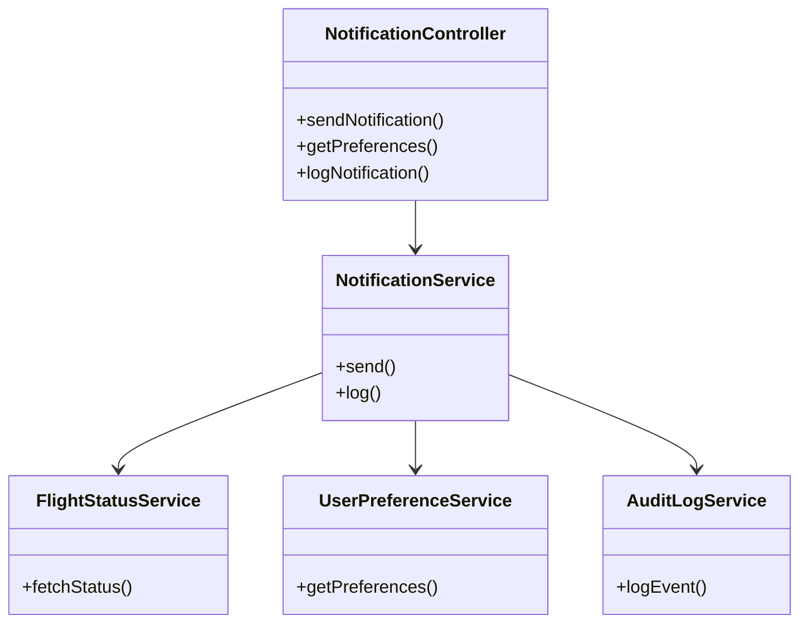
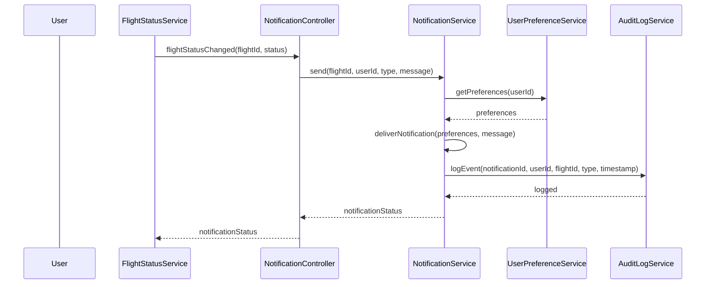
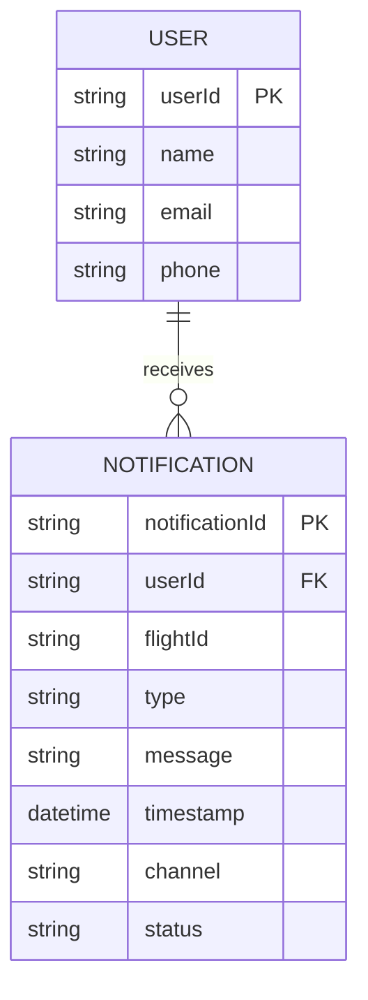

# For User Story Number [3]
1. Objective
This requirement provides travelers with real-time notifications about their flight status, including delays, cancellations, gate changes, and check-in reminders. The system ensures notifications are delivered promptly via email, SMS, and in-app alerts, respecting user preferences. All notifications are logged for audit and analytics purposes, enhancing user experience and reliability.

2. API Model
	2.1 Common Components/Services
	- Notification Service (AWS SNS)
	- Flight Status Service (Airline API Integration)
	- User Preferences Service
	- Audit Logging Service

	2.2 API Details
| Operation | REST Method | Type | URL | Request | Response |
|-----------|------------|------|-----|---------|----------|
| Send Notification | POST | Success/Failure | /api/notifications/send | {"userId": "u123", "flightId": "123", "type": "delay", "message": "Flight delayed by 2 hours."} | {"notificationId": "n456", "status": "sent"} |
| Get Notification Preferences | GET | Success/Failure | /api/notifications/preferences/{userId} | {} | {"preferences": {"email": true, "sms": false, "inApp": true}} |
| Log Notification | POST | Success/Failure | /api/notifications/log | {"notificationId": "n456", "userId": "u123", "flightId": "123", "type": "delay", "timestamp": "2025-11-01T09:00:00Z"} | {"status": "logged"} |

	2.3 Exceptions
| API | Exception | Error Message |
|-----|-----------|--------------|
| Send Notification | PreferenceNotSetException | "Notification preference not set for user." |
| Send Notification | NotificationDeliveryException | "Notification could not be delivered." |
| Log Notification | LoggingFailedException | "Notification logging failed." |

3 Functional Design
	3.1 Class Diagram

	3.2 UML Sequence Diagram

	3.3 Components
| Component Name | Description | Existing/New |
|----------------------|-----------------------------------------------|--------------|
| NotificationController | Handles REST endpoints for notifications | New |
| NotificationService | Business logic for notification delivery | New |
| FlightStatusService | Integrates with airline APIs for flight status | Existing |
| UserPreferenceService | Manages user notification preferences | Existing |
| AuditLogService | Handles audit logging of notifications | New |

	3.4 Service Layer Logic & Validations
| FieldName | Validation | Error Message | ClassUsed |
|-----------|-----------|--------------|-----------|
| userId | Only notify booked flights | "No booking found for user and flight." | NotificationService |
| preferences | Respect notification channel | "Notification preference not set for user." | UserPreferenceService |
| notification | Delivery within 1 minute | "Notification could not be delivered." | NotificationService |

4 Integrations
| SystemToBeIntegrated | IntegratedFor | IntegrationType |
|---------------------|---------------|----------------|
| Airline API | Real-time flight status | API |
| AWS SNS | Notification delivery (email/SMS) | API |
| Audit Log DB | Notification history/audit | API |

5 DB Details
	5.1 ER Model

	5.2 DB Validations
- notificationId must be unique
- userId must exist in USER table
- channel must match user preferences

6 Non-Functional Requirements
	6.1 Performance
	- Notifications delivered within 1 minute of event
	- Scalable to 100,000 notifications/day
	- Analytics dashboard for notification delivery
	6.2 Security
		6.2.1 Authentication
		- Secure notification endpoints
		6.2.2 Authorization
		- Only notify users for their booked flights
	6.3 Logging
		6.3.1 Application Logging
		- DEBUG: Notification payloads
		- INFO: Successful deliveries
		- ERROR: Failed deliveries
		- WARN: Preference issues
		6.3.2 Audit Log
		- Log all notifications with user, flight, type, timestamp, and channel

7 Dependencies
- Airline APIs for flight status
- AWS SNS for notification delivery
- Audit Log DB for history

8 Assumptions
- Airline APIs provide real-time status updates
- AWS SNS supports required notification channels
- Users have set notification preferences
