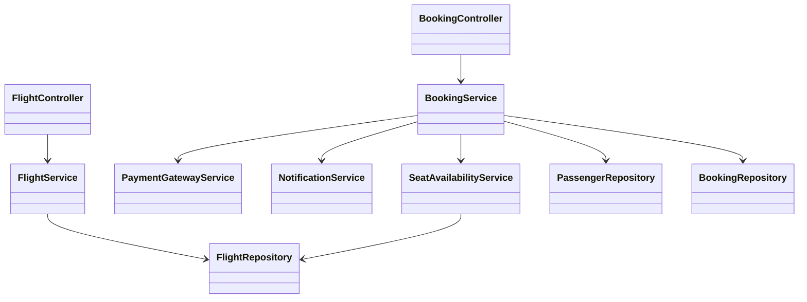
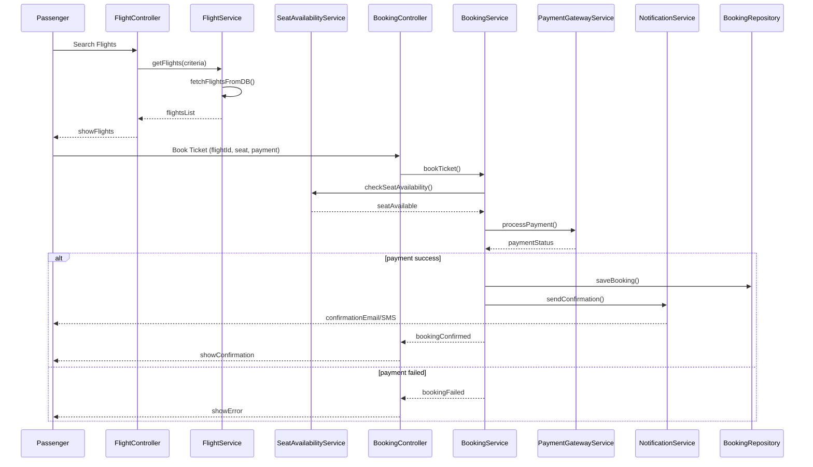
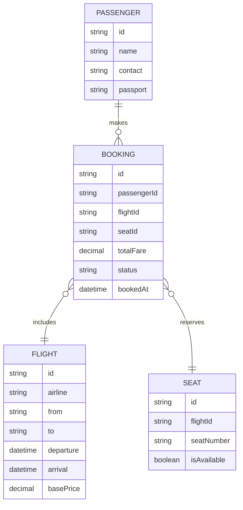

# For User Story Number [1]
1. Objective
This requirement enables passengers to search, compare, and book air transport tickets online, supporting one-way, round-trip, and multi-city options. It allows seat selection, baggage addition, and provides booking confirmation via email or SMS. The goal is to deliver a seamless and secure booking experience.

2. API Model
  2.1 Common Components/Services
  - AuthenticationService (OAuth2 based)
  - PaymentGatewayService (PCI DSS compliant)
  - NotificationService (Email/SMS)
  - FlightSearchService
  - BookingService
  - SeatAvailabilityService

  2.2 API Details
| Operation      | REST Method | Type    | URL                          | Request (JSON)                                                                                       | Response (JSON)                                                                                     |
|---------------|-------------|---------|------------------------------|------------------------------------------------------------------------------------------------------|-----------------------------------------------------------------------------------------------------|
| Search Flights| GET         | Success | /api/flights/search          | {"from":"JFK","to":"LAX","date":"2025-11-01","passengers":2}                                 | [{"flightId":123,"airline":"Delta","price":350.00,"seatsAvailable":5}]                      |
| View Flight   | GET         | Success | /api/flights/{flightId}      | N/A                                                                                                  | {"flightId":123,"airline":"Delta","details":{...},"seats":[...]}                            |
| Book Ticket   | POST        | Success | /api/bookings                | {"flightId":123,"passengerInfo":{...},"seat":"12A","baggage":1,"payment":{...}}            | {"bookingId":456,"status":"CONFIRMED","confirmationCode":"ABC123"}                          |
| Book Ticket   | POST        | Failure | /api/bookings                | {"flightId":123,"passengerInfo":{...},"seat":"12A","baggage":1,"payment":{...}}            | {"error":"Payment failed. Booking not confirmed."}                                               |

  2.3 Exceptions
| API           | Exception Type          | Description                                 |
|---------------|------------------------|---------------------------------------------|
| Search Flights| FlightNotFoundException| No flights found for criteria               |
| View Flight   | FlightNotFoundException| Flight ID not found                         |
| Book Ticket   | PaymentFailedException | Payment processing failed                   |
| Book Ticket   | SeatUnavailableException| Seat already booked                         |
| Book Ticket   | ValidationException    | Invalid passenger or payment information    |

3 Functional Design
  3.1 Class Diagram

  3.2 UML Sequence Diagram

  3.3 Components
| Component Name           | Description                                              | Existing/New |
|-------------------------|----------------------------------------------------------|--------------|
| FlightController        | Handles flight search and retrieval requests              | New          |
| BookingController       | Handles booking requests                                 | New          |
| FlightService           | Business logic for flight search                         | New          |
| BookingService          | Business logic for booking, seat, and payment            | New          |
| PaymentGatewayService   | Integrates with external payment gateway                 | Existing     |
| NotificationService     | Sends confirmation via email/SMS                         | Existing     |
| SeatAvailabilityService | Checks real-time seat availability                       | New          |
| PassengerRepository     | CRUD operations for passenger data                       | Existing     |
| BookingRepository       | CRUD operations for booking data                         | Existing     |
| FlightRepository        | CRUD operations for flight data                          | Existing     |

  3.4 Service Layer Logic and Validations
| FieldName         | Validation                                      | Error Message                        | ClassUsed                |
|-------------------|------------------------------------------------|--------------------------------------|--------------------------|
| passengerInfo     | Required, valid name, contact, passport        | Invalid passenger information        | BookingService           |
| payment           | Valid card details, PCI DSS, not expired       | Invalid payment information          | PaymentGatewayService    |
| seat              | Must be available at booking time              | Seat not available                   | SeatAvailabilityService  |
| flightId          | Must exist, not expired                        | Flight not found or expired          | FlightService            |

4 Integrations
| SystemToBeIntegrated | IntegratedFor        | IntegrationType |
|----------------------|---------------------|-----------------|
| Payment Gateway      | Payment processing  | API             |
| Email/SMS Service    | Booking confirmation| API             |
| Flight Data Provider | Flight info         | API             |

5 DB Details
  5.1 ER Model

  5.2 DB Validations
- Unique constraint on (flightId, seatNumber) in SEAT table
- Foreign key constraints between BOOKING and PASSENGER, FLIGHT, SEAT
- Not null constraints on all required fields

6 Non-Functional Requirements
  6.1 Performance
  - API response time for search <2 seconds
  - Caching of flight search results for 1 minute
  - Asynchronous processing for notifications

  6.2 Security
    6.2.1 Authentication
    - OAuth2 based authentication for all endpoints
    - HTTPS enforced for all APIs
    6.2.2 Authorization
    - Role-based access for booking and admin operations

  6.3 Logging
    6.3.1 Application Logging
    - DEBUG: API request/response payloads (masked sensitive data)
    - INFO: Successful bookings, payment status
    - WARN: Payment retries, seat unavailability
    - ERROR: Payment failures, booking errors
    6.3.2 Audit Log
    - Log all booking transactions with timestamp, user, status

7 Dependencies
- Payment gateway availability
- Email/SMS provider uptime
- Flight data provider APIs

8 Assumptions
- All external APIs are available and responsive
- Payment gateway is PCI DSS compliant
- Passengers provide valid contact and payment information
