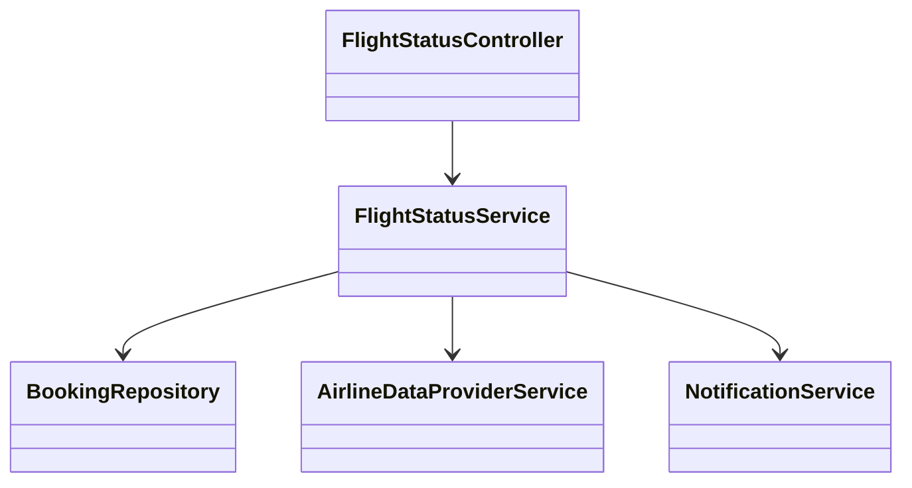
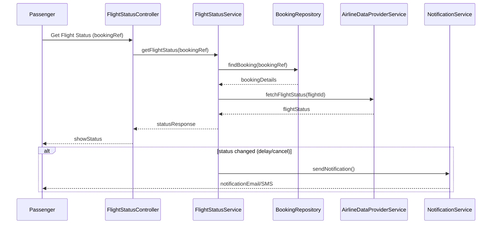
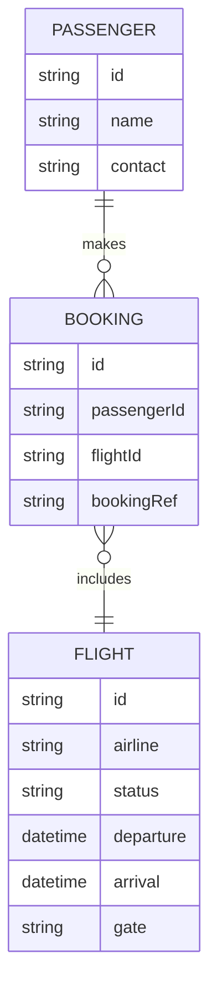

# For User Story Number [2]
1. Objective
This requirement enables passengers to track the real-time status of their booked flights, including updates on delays, cancellations, and gate changes. The system provides timely notifications via email or SMS for any changes. The goal is to keep passengers informed and reduce travel disruptions.

2. API Model
  2.1 Common Components/Services
  - AuthenticationService (OAuth2 based)
  - FlightStatusService
  - NotificationService (Email/SMS)
  - BookingRepository
  - AirlineDataProviderService

  2.2 API Details
| Operation        | REST Method | Type    | URL                               | Request (JSON)                                 | Response (JSON)                                                                 |
|------------------|-------------|---------|-----------------------------------|------------------------------------------------|----------------------------------------------------------------------------------|
| Get Flight Status| GET         | Success | /api/flights/status/{bookingRef}  | N/A                                           | {"bookingRef":"ABC123","status":"DELAYED","gate":"A12","eta":"15:30"}         |
| Get Flight Status| GET         | Failure | /api/flights/status/{bookingRef}  | N/A                                           | {"error":"Booking reference not found."}                                         |

  2.3 Exceptions
| API             | Exception Type            | Description                                 |
|-----------------|--------------------------|---------------------------------------------|
| Get Flight Status| BookingNotFoundException | Booking reference does not exist            |
| Get Flight Status| DataFeedException        | Airline data feed unavailable or invalid     |
| Get Flight Status| NotificationException    | Notification delivery failed                |

3 Functional Design
  3.1 Class Diagram

  3.2 UML Sequence Diagram

  3.3 Components
| Component Name              | Description                                              | Existing/New |
|----------------------------|----------------------------------------------------------|--------------|
| FlightStatusController     | Handles flight status requests                            | New          |
| FlightStatusService        | Business logic for status polling and notification        | New          |
| BookingRepository          | Retrieves booking details                                | Existing     |
| AirlineDataProviderService | Integrates with airline APIs for real-time status         | New          |
| NotificationService        | Sends notifications via email/SMS                        | Existing     |

  3.4 Service Layer Logic and Validations
| FieldName      | Validation                                      | Error Message                        | ClassUsed                |
|---------------|------------------------------------------------|--------------------------------------|--------------------------|
| bookingRef     | Must exist in system                           | Booking reference not found          | BookingRepository        |
| flightStatus   | Must be accurate and timely                    | Data feed unavailable or outdated    | AirlineDataProviderService|
| contactDetails | Must be valid for notifications                | Notification delivery failed         | NotificationService      |

4 Integrations
| SystemToBeIntegrated | IntegratedFor        | IntegrationType |
|----------------------|---------------------|-----------------|
| Airline Data Provider| Flight status update | API             |
| Email/SMS Service    | Status notifications | API             |

5 DB Details
  5.1 ER Model

  5.2 DB Validations
- Unique constraint on bookingRef in BOOKING table
- Foreign key constraints between BOOKING and PASSENGER, FLIGHT
- Not null constraints on all required fields

6 Non-Functional Requirements
  6.1 Performance
  - Real-time updates with <1 minute latency
  - Scalable to 10,000 simultaneous users
  - Monitoring of API health and notification delivery

  6.2 Security
    6.2.1 Authentication
    - OAuth2 based authentication for all endpoints
    - HTTPS enforced for all APIs
    6.2.2 Authorization
    - Passengers can only access their own flight status

  6.3 Logging
    6.3.1 Application Logging
    - DEBUG: API request/response payloads (masked sensitive data)
    - INFO: Status updates, notification sent
    - WARN: Data feed delays, notification retries
    - ERROR: Data feed failures, notification errors
    6.3.2 Audit Log
    - Log all status changes and notifications with timestamp, user, status

7 Dependencies
- Airline data provider API availability
- Email/SMS provider uptime

8 Assumptions
- Airline APIs provide timely and accurate status
- Passengers have valid contact information
- Notification service is reliable
