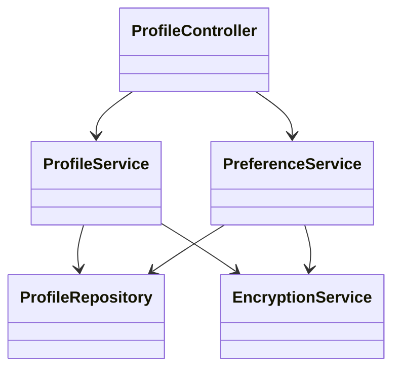
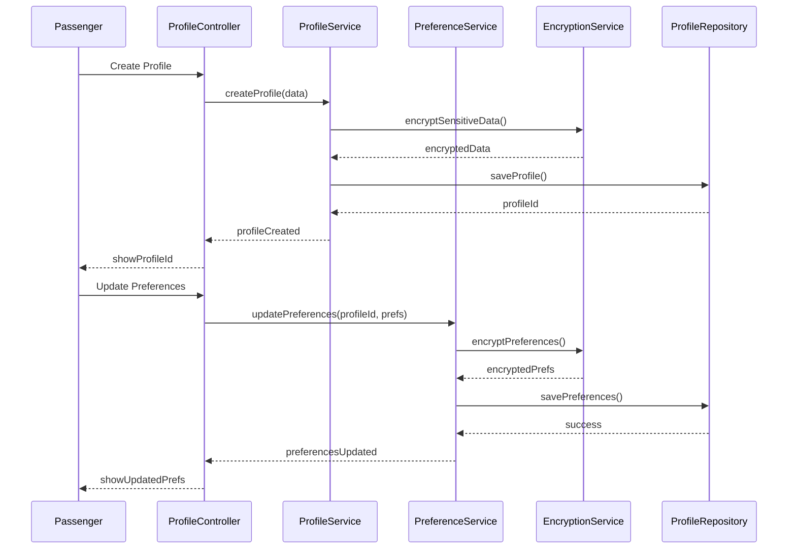

# For User Story Number [3]
1. Objective
This requirement enables passengers to create, view, and update their profiles and travel preferences, including personal details, frequent flyer information, and saved payment methods. The system uses these preferences to personalize the booking experience and suggest relevant flights and services. The goal is to provide a seamless, secure, and personalized user journey.

2. API Model
  2.1 Common Components/Services
  - AuthenticationService (OAuth2 based)
  - ProfileService
  - PreferenceService
  - EncryptionService
  - ProfileRepository

  2.2 API Details
| Operation        | REST Method | Type    | URL                              | Request (JSON)                                                                 | Response (JSON)                                                                 |
|------------------|-------------|---------|----------------------------------|--------------------------------------------------------------------------------|----------------------------------------------------------------------------------|
| Create Profile   | POST        | Success | /api/profile                     | {"name":"John Doe","contact":"john@email.com","passport":"X12345"}        | {"profileId":789,"status":"CREATED"}                                         |
| Get Profile      | GET         | Success | /api/profile/{profileId}         | N/A                                                                           | {"profileId":789,"name":"John Doe","preferences":{...}}                      |
| Update Profile   | PUT         | Success | /api/profile/{profileId}         | {"name":"John Doe","contact":"john@email.com","preferences":{...}}         | {"profileId":789,"status":"UPDATED"}                                         |
| Update Preferences| PUT        | Success | /api/profile/{profileId}/prefs   | {"meal":"Vegetarian","seat":"Aisle"}                                       | {"profileId":789,"preferences":{"meal":"Vegetarian","seat":"Aisle"}}     |
| Get Preferences  | GET         | Success | /api/profile/{profileId}/prefs   | N/A                                                                           | {"meal":"Vegetarian","seat":"Aisle"}                                       |

  2.3 Exceptions
| API               | Exception Type            | Description                                 |
|-------------------|--------------------------|---------------------------------------------|
| Create Profile    | ValidationException      | Invalid or incomplete profile data           |
| Get/Update Profile| ProfileNotFoundException | Profile ID does not exist                   |
| Update Preferences| ValidationException      | Invalid preference data                     |
| Any               | EncryptionException      | Error encrypting/decrypting sensitive data  |

3 Functional Design
  3.1 Class Diagram


  3.2 UML Sequence Diagram


  3.3 Components
| Component Name      | Description                                              | Existing/New |
|--------------------|----------------------------------------------------------|--------------|
| ProfileController  | Handles profile and preferences API requests             | New          |
| ProfileService     | Business logic for profile management                    | New          |
| PreferenceService  | Business logic for travel preferences                    | New          |
| EncryptionService  | Encrypts/decrypts sensitive data                         | Existing     |
| ProfileRepository  | CRUD operations for profile and preferences              | Existing     |

  3.4 Service Layer Logic and Validations
| FieldName         | Validation                                      | Error Message                        | ClassUsed                |
|-------------------|------------------------------------------------|--------------------------------------|--------------------------|
| name              | Required, valid characters                      | Invalid name                         | ProfileService           |
| contact           | Required, valid email/phone                     | Invalid contact information          | ProfileService           |
| passport          | Required, valid format                          | Invalid passport details             | ProfileService           |
| preferences       | Valid options (meal, seat, etc.)                | Invalid preference                   | PreferenceService        |
| paymentMethod     | Encrypted, valid card/bank info                 | Invalid payment method               | EncryptionService        |

4 Integrations
| SystemToBeIntegrated | IntegratedFor        | IntegrationType |
|----------------------|---------------------|-----------------|
| Encryption Service   | Secure data storage | API/Library     |

5 DB Details
  5.1 ER Model
```mermaid
erDiagram
    PASSENGER ||--|| PROFILE : has
    PROFILE ||--o{ PREFERENCE : includes
    PROFILE {
        string id
        string name
        string contact
        string passport
        string frequentFlyerNo
        string paymentMethod (encrypted)
    }
    PREFERENCE {
        string id
        string profileId
        string meal
        string seat
        string other
    }
```

  5.2 DB Validations
- Unique constraint on contact in PROFILE table
- Foreign key constraint between PREFERENCE and PROFILE
- Not null constraints on all required fields
- Encrypted storage for sensitive fields (paymentMethod)

6 Non-Functional Requirements
  6.1 Performance
  - Response time <1 second for profile actions
  - Real-time update of preferences

  6.2 Security
    6.2.1 Authentication
    - OAuth2 based authentication for all endpoints
    - HTTPS enforced for all APIs
    6.2.2 Authorization
    - Passengers can only access/update their own profiles
    - GDPR compliance for data handling

  6.3 Logging
    6.3.1 Application Logging
    - DEBUG: API request/response payloads (masked sensitive data)
    - INFO: Profile created/updated
    - WARN: Validation errors
    - ERROR: Encryption/storage failures
    6.3.2 Audit Log
    - Log all profile changes with timestamp, user, change details

7 Dependencies
- Encryption service/library
- Secure database storage

8 Assumptions
- Passengers provide accurate and up-to-date information
- Encryption service is available and reliable
- GDPR and security standards are enforced
