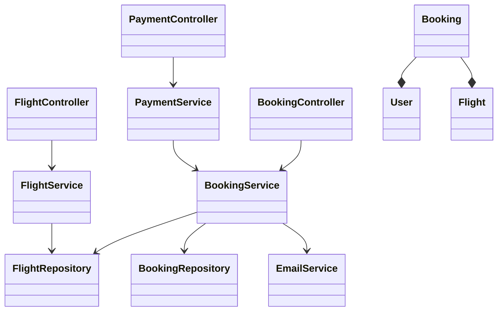
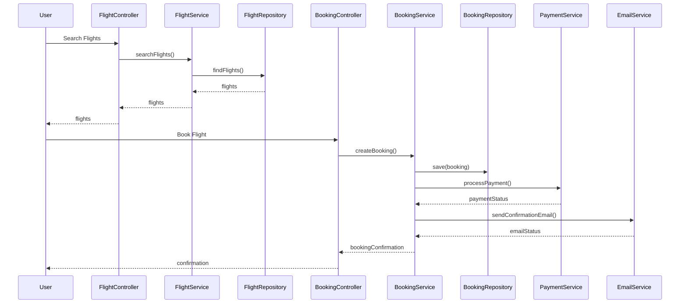
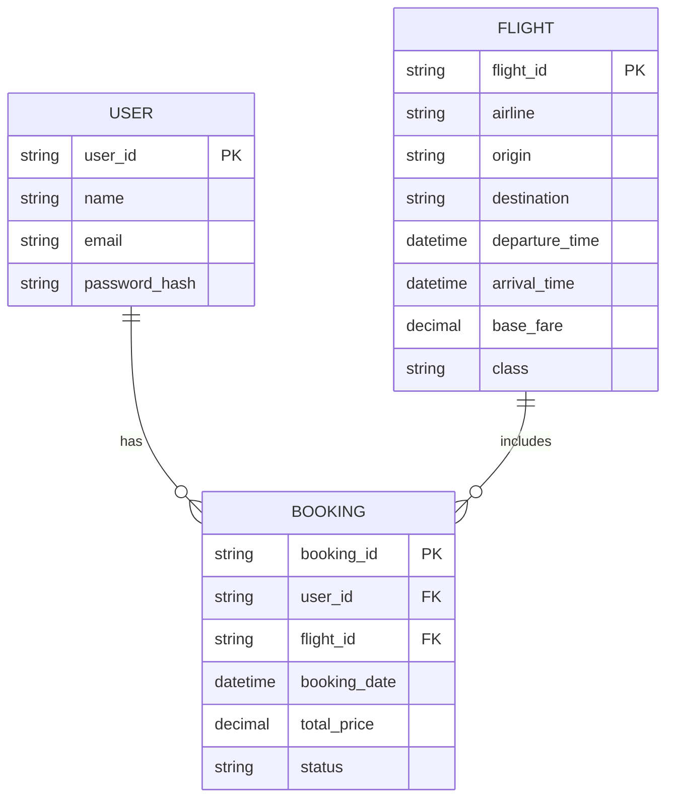

# For User Story Number [1]

1. Objective
This requirement enables travelers to search, compare, and book air transport tickets online through a secure and scalable platform. The system must allow searching by destination, date, and class, and complete bookings with electronic confirmation. The goal is to provide a seamless and convenient booking experience for users.

2. API Model
2.1 Common Components/Services
- User Authentication Service (OAuth2/JWT)
- Flight Search Service
- Booking Service
- Payment Service
- Email Notification Service

2.2 API Details
| Operation    | REST Method | Type    | URL                              | Request (Sample JSON)                                                                 | Response (Sample JSON)                                                               |
|-------------|-------------|---------|-----------------------------------|--------------------------------------------------------------------------------------|--------------------------------------------------------------------------------------|
| Search      | GET         | Success | /api/flights/search               | {"destination": "LAX", "date": "2024-07-01", "class": "Economy"}              | [{"flightId": "F123", "price": 320.00, "departure": "2024-07-01T10:00"}]      |
| Book        | POST        | Success | /api/bookings                     | {"flightId": "F123", "userId": "U1", "paymentInfo": { ... }}                  | {"bookingId": "B456", "status": "CONFIRMED", "emailSent": true}              |
| Payment     | POST        | Success | /api/payments/process             | {"bookingId": "B456", "paymentInfo": { ... }}                                    | {"paymentStatus": "SUCCESS", "transactionId": "T789"}                          |
| Confirmation| GET         | Success | /api/bookings/{bookingId}/confirm |                                                                                      | {"bookingId": "B456", "status": "CONFIRMED", "emailSent": true}              |

2.3 Exceptions
| API                | Exception Type         | Description                                   |
|--------------------|-----------------------|-----------------------------------------------|
| /api/flights/search| InvalidInputException | One or more search fields are empty/invalid   |
| /api/bookings      | BookingException      | Flight not available or payment failed        |
| /api/payments      | PaymentException      | Payment declined or invalid payment info      |
| /api/bookings/*    | NotFoundException     | Booking not found                             |

3 Functional Design
3.1 Class Diagram

3.2 UML Sequence Diagram

3.3 Components
| Component Name      | Description                                         | Existing/New |
|--------------------|-----------------------------------------------------|--------------|
| FlightController   | Handles flight search requests                      | New          |
| BookingController  | Handles booking creation and confirmation           | New          |
| PaymentController  | Handles payment processing                          | New          |
| FlightService      | Business logic for flight search                    | New          |
| BookingService     | Business logic for booking and confirmation         | New          |
| PaymentService     | Manages payment processing with gateway             | New          |
| EmailService       | Sends confirmation emails                           | New          |
| FlightRepository   | Data access for flights                             | New          |
| BookingRepository  | Data access for bookings                            | New          |
| User               | User entity                                         | Existing     |
| Flight             | Flight entity                                       | New          |
| Booking            | Booking entity                                      | New          |

3.4 Service Layer Logic and Validations
| FieldName      | Validation                             | Error Message                  | ClassUsed         |
|---------------|----------------------------------------|-------------------------------|-------------------|
| destination   | Not empty, valid airport code           | Invalid destination           | FlightService     |
| date          | Not empty, valid date, not in past      | Invalid date                  | FlightService     |
| class         | Not empty, valid class (Economy/Business)| Invalid class                | FlightService     |
| paymentInfo   | Valid card, PCI DSS, not expired        | Invalid payment information   | PaymentService    |

4 Integrations
| SystemToBeIntegrated | IntegratedFor         | IntegrationType |
|---------------------|----------------------|-----------------|
| Airline APIs        | Fetch flights, booking| API (REST/JSON) |
| Payment Gateway     | Payment processing    | API (REST/JSON) |
| Email Provider      | Confirmation emails   | API (SMTP/REST) |

5 DB Details
5.1 ER Model

5.2 DB Validations
- Unique constraints on booking_id, user_id, flight_id
- Foreign key constraints for user_id and flight_id in Booking
- Check constraints for valid status values (e.g., CONFIRMED, CANCELLED)

6 Non-Functional Requirements
6.1 Performance
- Search API must return results within 2 seconds.
- Use caching for frequent search queries at API layer.

6.2 Security
6.2.1 Authentication
- OAuth2/JWT for user authentication on all endpoints.
- HTTPS enforced for all API traffic.
6.2.2 Authorization
- Only authenticated users can book flights.
- Role-based access for admin operations (not in scope for this story).

6.3 Logging
6.3.1 Application Logging
- DEBUG: API request/response payloads (excluding sensitive data)
- INFO: Successful bookings, payments, email sent
- ERROR: Failed payments, booking errors
- WARN: Invalid search or booking attempts
6.3.2 Audit Log
- Log all booking and payment transactions with userId, timestamp, and status.

7 Dependencies
- Airline partner APIs must be available and reliable
- Payment gateway integration must be certified for PCI DSS
- Email provider must support high-volume transactional emails

8 Assumptions
- All partner airline APIs provide real-time availability and pricing
- Payment gateway supports all major cards and currencies
- Email confirmations are considered sufficient for booking proof
