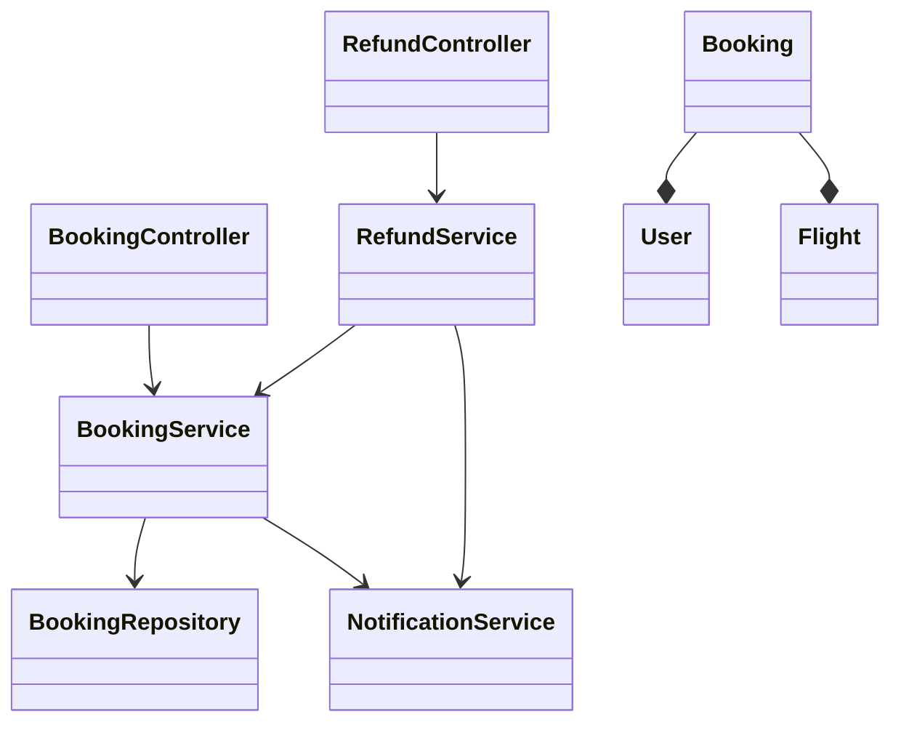
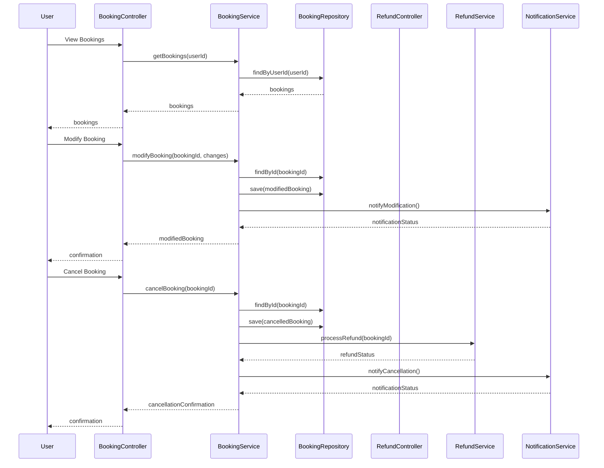
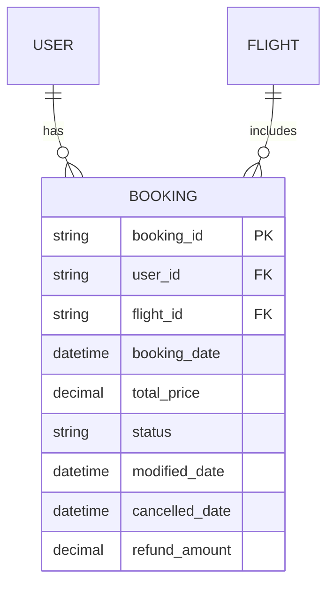

# For User Story Number [2]

1. Objective
This requirement enables travelers to view, modify, or cancel their air transport bookings online. The system must validate eligibility for changes, process refunds according to policy, and notify users of any updates. The goal is to provide a flexible and transparent booking management experience.

2. API Model
2.1 Common Components/Services
- User Authentication Service (OAuth2/JWT)
- Booking Management Service
- Refund Service
- Notification Service

2.2 API Details
| Operation    | REST Method | Type    | URL                                 | Request (Sample JSON)                                                        | Response (Sample JSON)                                                       |
|-------------|-------------|---------|--------------------------------------|-------------------------------------------------------------------------------|-------------------------------------------------------------------------------|
| View        | GET         | Success | /api/bookings?userId=U1              |                                                                               | [{"bookingId": "B456", "flightId": "F123", "status": "CONFIRMED"}]         |
| Modify      | PUT         | Success | /api/bookings/{bookingId}            | {"date": "2024-07-05", "passengerInfo": { ... }}                            | {"bookingId": "B456", "status": "MODIFIED", "changeFee": 50.00}            |
| Cancel      | DELETE      | Success | /api/bookings/{bookingId}            |                                                                               | {"bookingId": "B456", "status": "CANCELLED", "refund": 200.00}             |
| Refund      | POST        | Success | /api/refunds                         | {"bookingId": "B456"}                                                        | {"refundStatus": "PROCESSED", "amount": 200.00}                              |

2.3 Exceptions
| API                | Exception Type            | Description                                   |
|--------------------|--------------------------|-----------------------------------------------|
| /api/bookings      | NotFoundException         | Booking not found                             |
| /api/bookings      | ModificationException     | Booking not eligible for modification         |
| /api/bookings      | CancellationException     | Booking not eligible for cancellation         |
| /api/refunds       | RefundException           | Refund processing failed                      |

3 Functional Design
3.1 Class Diagram

3.2 UML Sequence Diagram

3.3 Components
| Component Name      | Description                                         | Existing/New |
|--------------------|-----------------------------------------------------|--------------|
| BookingController  | Handles booking view, modify, cancel requests        | New          |
| RefundController   | Handles refund processing requests                   | New          |
| BookingService     | Business logic for booking management                | New          |
| RefundService      | Business logic for refunds                           | New          |
| NotificationService| Sends notifications for changes/cancellations        | New          |
| BookingRepository  | Data access for bookings                             | New          |
| User               | User entity                                         | Existing     |
| Booking            | Booking entity                                      | Existing     |
| Flight             | Flight entity                                       | Existing     |

3.4 Service Layer Logic and Validations
| FieldName      | Validation                             | Error Message                  | ClassUsed         |
|---------------|----------------------------------------|-------------------------------|-------------------|
| bookingId     | Exists, eligible for change/cancel      | Booking not eligible          | BookingService    |
| changes       | Valid per airline policy & seat avail.  | Invalid modification          | BookingService    |
| refund        | Calculated per fare rules               | Refund calculation error      | RefundService     |

4 Integrations
| SystemToBeIntegrated | IntegratedFor         | IntegrationType |
|---------------------|----------------------|-----------------|
| Airline APIs        | Booking validation    | API (REST/JSON) |
| Payment Gateway     | Refund processing     | API (REST/JSON) |
| Notification System | Change/cancel alerts | API (REST/JSON) |

5 DB Details
5.1 ER Model

5.2 DB Validations
- Unique constraints on booking_id
- Foreign key constraints for user_id and flight_id
- Check constraints for valid status values (e.g., CONFIRMED, MODIFIED, CANCELLED)

6 Non-Functional Requirements
6.1 Performance
- Modifications processed within 5 seconds.
- Efficient queries for booking lookups.

6.2 Security
6.2.1 Authentication
- OAuth2/JWT for user authentication on all endpoints.
- HTTPS enforced for all API traffic.
6.2.2 Authorization
- Only booking owner can modify/cancel.

6.3 Logging
6.3.1 Application Logging
- INFO: Booking modifications, cancellations, refunds
- ERROR: Failed modifications, refund errors
- WARN: Unauthorized modification/cancellation attempts
6.3.2 Audit Log
- Log all changes to bookings with userId, timestamp, and action.

7 Dependencies
- Airline partner APIs for real-time validation
- Payment gateway for refund processing
- Notification system for alerts

8 Assumptions
- Airline APIs provide up-to-date eligibility and seat info
- Refunds are processed instantly by payment gateway
- Notification system is reliable for user alerts
