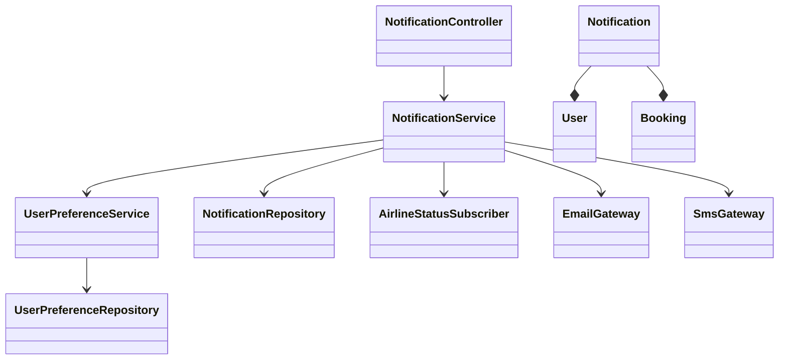
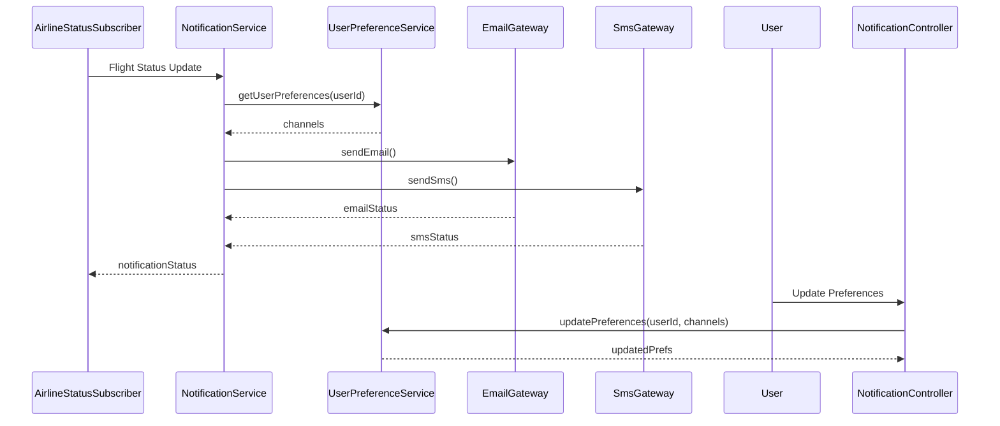
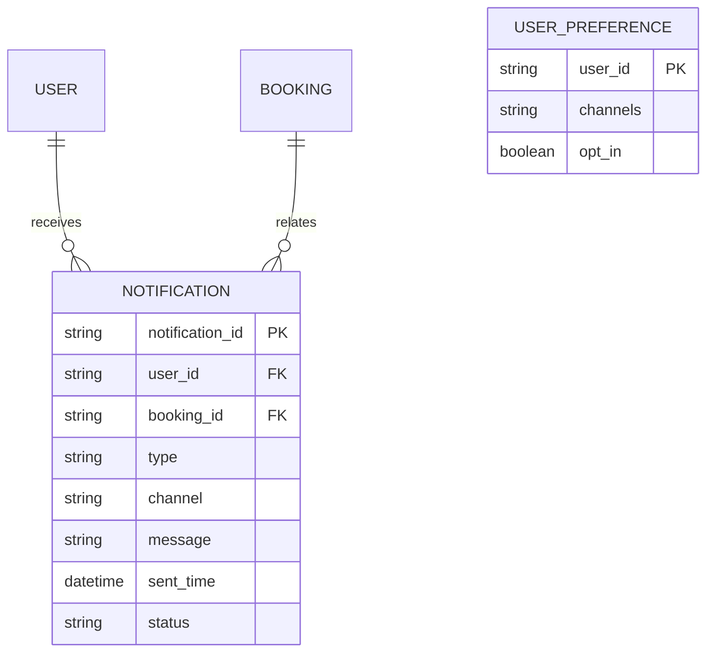

# For User Story Number [3]

1. Objective
This requirement enables travelers to receive real-time notifications about their air transport bookings, including confirmations, reminders, and flight status updates. The system must support multiple notification channels (email, SMS, in-app) and respect user preferences. The goal is to keep users informed and reduce travel disruptions.

2. API Model
2.1 Common Components/Services
- Notification Service
- User Preference Service
- Airline Status Feed Subscriber
- Email/SMS Gateway Integration

2.2 API Details
| Operation         | REST Method | Type    | URL                               | Request (Sample JSON)                                                        | Response (Sample JSON)                                                       |
|------------------|-------------|---------|------------------------------------|-------------------------------------------------------------------------------|-------------------------------------------------------------------------------|
| Send Notification| POST        | Success | /api/notifications/send            | {"userId": "U1", "type": "REMINDER", "message": "Your flight departs in 2h"}   | {"status": "SENT", "channels": ["EMAIL", "SMS"]}                            |
| Update Prefs     | PUT         | Success | /api/notifications/preferences     | {"userId": "U1", "channels": ["EMAIL", "IN_APP"]}                           | {"userId": "U1", "channels": ["EMAIL", "IN_APP"]}                          |
| Get Prefs        | GET         | Success | /api/notifications/preferences/U1  |                                                                               | {"userId": "U1", "channels": ["EMAIL", "SMS"]}                             |

2.3 Exceptions
| API                         | Exception Type         | Description                                   |
|-----------------------------|-----------------------|-----------------------------------------------|
| /api/notifications/send     | NotificationException | Failed to deliver notification                |
| /api/notifications/preferences | NotFoundException   | User preferences not found                    |

3 Functional Design
3.1 Class Diagram

3.2 UML Sequence Diagram

3.3 Components
| Component Name           | Description                                         | Existing/New |
|-------------------------|-----------------------------------------------------|--------------|
| NotificationController  | Handles notification and preference APIs             | New          |
| NotificationService     | Business logic for sending notifications             | New          |
| UserPreferenceService   | Manages user notification preferences                | New          |
| AirlineStatusSubscriber | Subscribes to airline status feeds                   | New          |
| EmailGateway            | Sends email notifications                            | New          |
| SmsGateway              | Sends SMS notifications                              | New          |
| NotificationRepository  | Data access for notification logs                    | New          |
| UserPreferenceRepository| Data access for user preferences                     | New          |
| User                    | User entity                                         | Existing     |
| Booking                 | Booking entity                                      | Existing     |

3.4 Service Layer Logic and Validations
| FieldName      | Validation                             | Error Message                  | ClassUsed         |
|---------------|----------------------------------------|-------------------------------|-------------------|
| userId        | Exists, valid user                      | Invalid user                  | NotificationService|
| type          | Valid notification type                 | Invalid notification type     | NotificationService|
| channels      | Valid channels (EMAIL, SMS, IN_APP)     | Invalid channel               | UserPreferenceService|
| recipient     | Notification sent only to intended user | Unauthorized recipient        | NotificationService|

4 Integrations
| SystemToBeIntegrated | IntegratedFor         | IntegrationType |
|---------------------|----------------------|-----------------|
| Airline Status API  | Real-time updates     | API (REST/JSON) |
| Email Provider      | Email notifications   | API (SMTP/REST) |
| SMS Provider        | SMS notifications     | API (REST)      |

5 DB Details
5.1 ER Model

5.2 DB Validations
- Unique constraints on notification_id
- Foreign key constraints for user_id and booking_id
- Check constraints for valid type and channel values

6 Non-Functional Requirements
6.1 Performance
- Notifications delivered within 1 minute of event.
- Asynchronous processing for high throughput.

6.2 Security
6.2.1 Authentication
- OAuth2/JWT for user authentication on preference APIs.
- HTTPS enforced for all API traffic.
6.2.2 Authorization
- Only intended user receives notifications.

6.3 Logging
6.3.1 Application Logging
- INFO: Notification sent, preference updated
- ERROR: Notification delivery failure
- WARN: Invalid notification attempt
6.3.2 Audit Log
- Log all notifications with userId, type, channel, and timestamp.

7 Dependencies
- Airline status API for real-time updates
- Email and SMS providers for notifications

8 Assumptions
- Airline status API provides real-time, reliable updates
- Users have valid contact details for notifications
- Notification preferences are respected for all alerts
