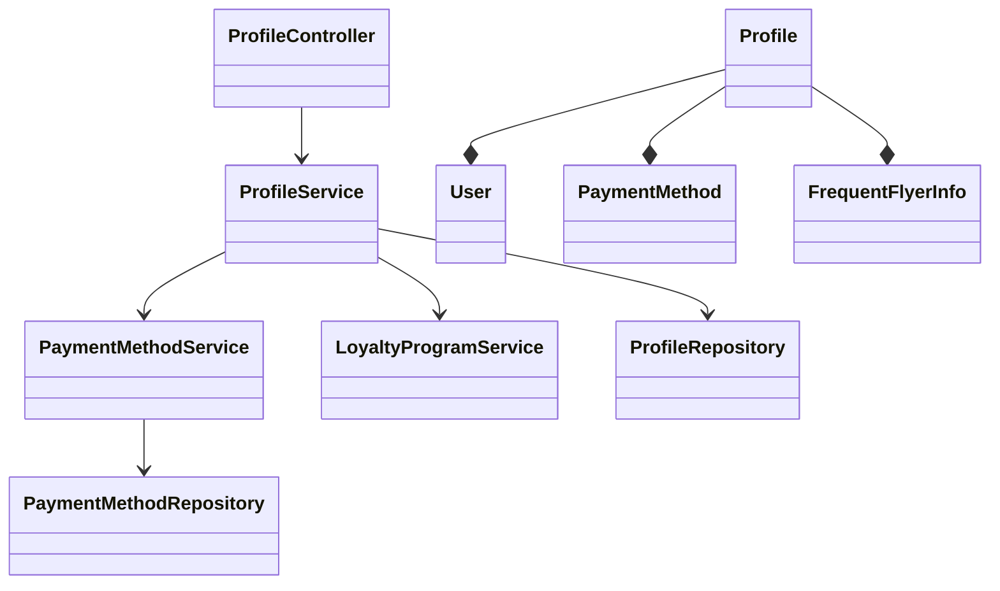
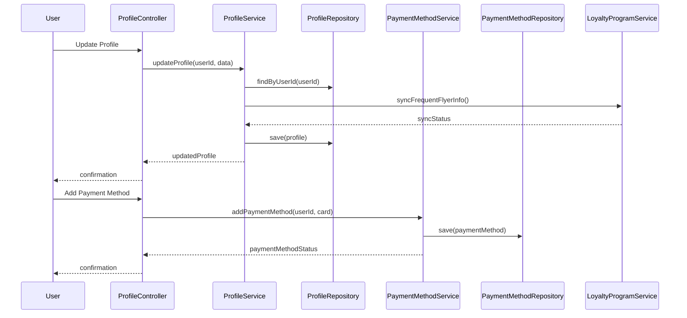
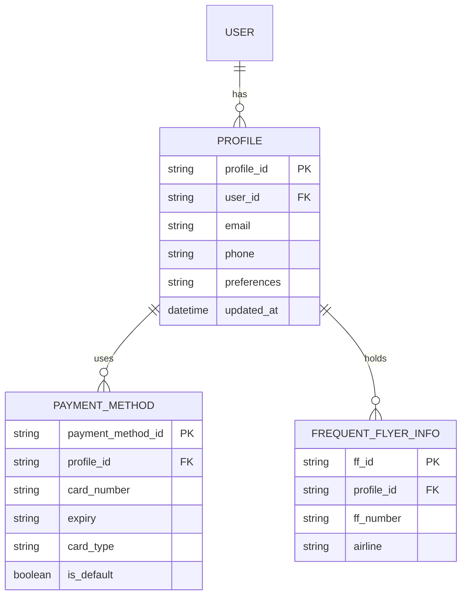

# For User Story Number [4]

1. Objective
This requirement enables travelers to manage their user profiles, including personal information, travel preferences, frequent flyer details, and payment methods. The system must ensure data privacy, secure storage, and immediate reflection of updates. The goal is to streamline future bookings and enhance user experience.

2. API Model
2.1 Common Components/Services
- User Authentication Service (OAuth2/JWT)
- Profile Management Service
- Payment Method Service
- Loyalty Program Integration Service

2.2 API Details
| Operation         | REST Method | Type    | URL                                  | Request (Sample JSON)                                                        | Response (Sample JSON)                                                       |
|------------------|-------------|---------|--------------------------------------|-------------------------------------------------------------------------------|-------------------------------------------------------------------------------|
| Create Profile   | POST        | Success | /api/profile                         | {"userId": "U1", "email": "a@b.com", "phone": "1234567890", ...}             | {"userId": "U1", "status": "CREATED"}                                      |
| Update Profile   | PUT         | Success | /api/profile/{userId}                | {"email": "a@b.com", "preferences": { ... }, ...}                             | {"userId": "U1", "status": "UPDATED"}                                      |
| Get Profile      | GET         | Success | /api/profile/{userId}                |                                                                               | {"userId": "U1", "email": "a@b.com", "preferences": { ... }, ...}          |
| Add Payment      | POST        | Success | /api/profile/{userId}/payment-method | {"cardNumber": "****1234", "expiry": "12/26", ...}                           | {"paymentMethodId": "PM1", "status": "ADDED"}                              |
| Update FF Info   | PUT         | Success | /api/profile/{userId}/frequent-flyer | {"ffNumber": "FF12345", "airline": "XYZ"}                                   | {"userId": "U1", "ffNumber": "FF12345", "status": "UPDATED"}            |

2.3 Exceptions
| API                          | Exception Type         | Description                                   |
|------------------------------|-----------------------|-----------------------------------------------|
| /api/profile                 | ValidationException   | Invalid email/phone format                    |
| /api/profile/{userId}        | NotFoundException     | User profile not found                        |
| /api/profile/payment-method  | PaymentException      | Invalid or duplicate payment method           |
| /api/profile/frequent-flyer  | LoyaltySyncException  | Failed to sync with airline loyalty program   |

3 Functional Design
3.1 Class Diagram

3.2 UML Sequence Diagram

3.3 Components
| Component Name           | Description                                         | Existing/New |
|-------------------------|-----------------------------------------------------|--------------|
| ProfileController       | Handles profile CRUD and payment/FF updates          | New          |
| ProfileService          | Business logic for profile management                | New          |
| PaymentMethodService    | Manages payment methods                              | New          |
| LoyaltyProgramService   | Syncs frequent flyer info with airlines              | New          |
| ProfileRepository       | Data access for profiles                             | New          |
| PaymentMethodRepository | Data access for payment methods                      | New          |
| User                    | User entity                                         | Existing     |
| Profile                 | Profile entity                                      | New          |
| PaymentMethod           | Payment method entity                                | New          |
| FrequentFlyerInfo       | Frequent flyer info entity                           | New          |

3.4 Service Layer Logic and Validations
| FieldName      | Validation                             | Error Message                  | ClassUsed         |
|---------------|----------------------------------------|-------------------------------|-------------------|
| email         | Valid email format                      | Invalid email                 | ProfileService    |
| phone         | Valid phone number                      | Invalid phone number          | ProfileService    |
| paymentMethod | PCI DSS, unique per user                | Invalid/duplicate payment     | PaymentMethodService|
| ffNumber      | Valid format, airline sync              | Invalid FF info/sync failed   | LoyaltyProgramService|

4 Integrations
| SystemToBeIntegrated | IntegratedFor         | IntegrationType |
|---------------------|----------------------|-----------------|
| Airline Loyalty API | Frequent flyer sync  | API (REST/JSON) |
| Payment Gateway     | Payment method validation | API (REST/JSON) |

5 DB Details
5.1 ER Model

5.2 DB Validations
- Unique constraints on profile_id, payment_method_id, ff_id
- Foreign key constraints for user_id, profile_id
- Check constraints for valid email and phone formats
- Masking and encryption for sensitive fields

6 Non-Functional Requirements
6.1 Performance
- Profile updates processed within 2 seconds.
- Optimized queries for large user base.

6.2 Security
6.2.1 Authentication
- OAuth2/JWT for all profile endpoints.
- Multi-factor authentication for sensitive updates.
- HTTPS enforced for all API traffic.
6.2.2 Authorization
- Only authenticated user can update their profile.

6.3 Logging
6.3.1 Application Logging
- INFO: Profile created/updated, payment method added
- ERROR: Validation or sync errors
- WARN: Unauthorized update attempts
6.3.2 Audit Log
- Log all profile changes with userId, timestamp, and field changes.

7 Dependencies
- Airline loyalty APIs for frequent flyer sync
- Payment gateway for payment method validation

8 Assumptions
- Users have valid contact and payment details
- Airline loyalty APIs are available and responsive
- Sensitive data is encrypted and masked in all logs and storage
