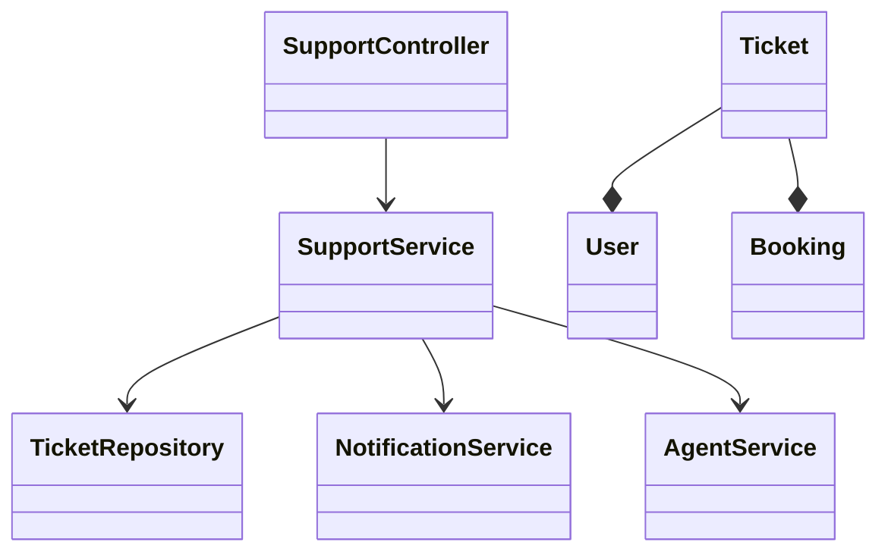
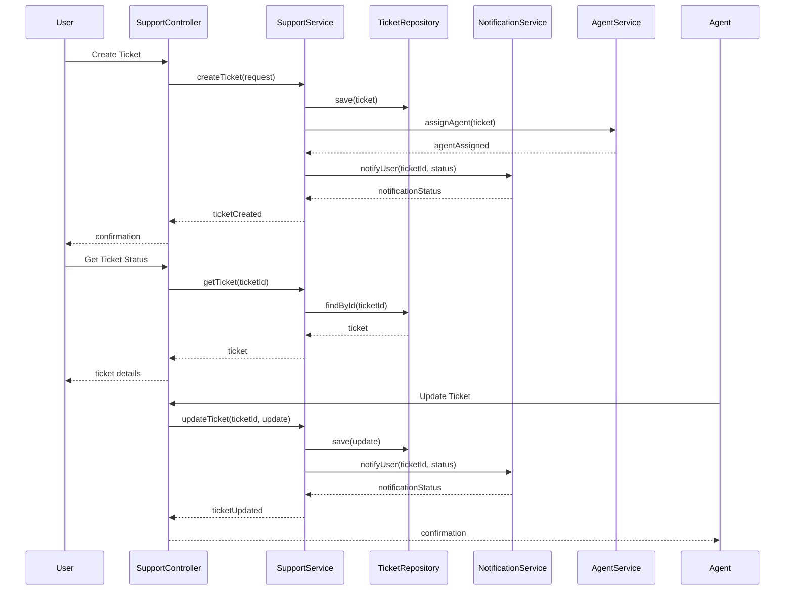
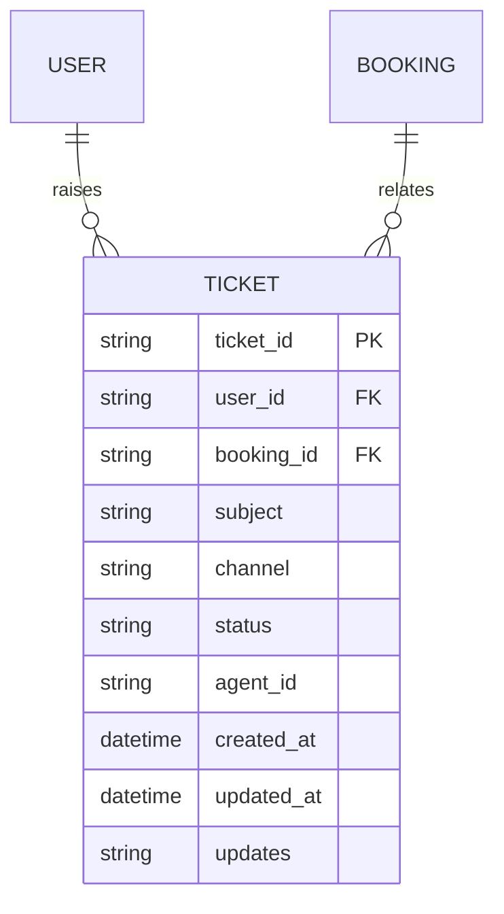

# For User Story Number [5]

1. Objective
This requirement enables travelers to access customer support for air transport needs via chat, email, or phone. The system must provide a ticketing mechanism, allow users to track request status, and ensure secure access for support agents. The goal is to resolve user issues efficiently and transparently.

2. API Model
2.1 Common Components/Services
- User Authentication Service (OAuth2/JWT)
- Support Ticketing Service
- Notification Service
- Agent Management Service

2.2 API Details
| Operation         | REST Method | Type    | URL                                 | Request (Sample JSON)                                                        | Response (Sample JSON)                                                       |
|------------------|-------------|---------|--------------------------------------|-------------------------------------------------------------------------------|-------------------------------------------------------------------------------|
| Create Ticket    | POST        | Success | /api/support/tickets                 | {"userId": "U1", "subject": "Booking issue", "channel": "CHAT", ...}         | {"ticketId": "T123", "status": "OPEN"}                                      |
| Get Ticket       | GET         | Success | /api/support/tickets/{ticketId}      |                                                                               | {"ticketId": "T123", "status": "OPEN", "updates": [ ... ]}                  |
| Update Ticket    | PUT         | Success | /api/support/tickets/{ticketId}      | {"status": "RESOLVED", "agentNotes": "Issue fixed"}                            | {"ticketId": "T123", "status": "RESOLVED"}                                  |
| List Tickets     | GET         | Success | /api/support/tickets?userId=U1       |                                                                               | [{"ticketId": "T123", "status": "OPEN"}, ...]                                |

2.3 Exceptions
| API                         | Exception Type         | Description                                   |
|-----------------------------|-----------------------|-----------------------------------------------|
| /api/support/tickets        | ValidationException   | Invalid request or missing fields             |
| /api/support/tickets/{id}   | NotFoundException     | Ticket not found                              |
| /api/support/tickets        | UnauthorizedException | User not authenticated or not ticket owner    |

3 Functional Design
3.1 Class Diagram

3.2 UML Sequence Diagram

3.3 Components
| Component Name           | Description                                         | Existing/New |
|-------------------------|-----------------------------------------------------|--------------|
| SupportController       | Handles support ticket APIs                          | New          |
| SupportService          | Business logic for ticket creation and management    | New          |
| TicketRepository        | Data access for support tickets                      | New          |
| NotificationService     | Notifies users and agents of ticket updates          | New          |
| AgentService            | Assigns and manages support agents                   | New          |
| User                    | User entity                                         | Existing     |
| Ticket                  | Support ticket entity                                | New          |
| Booking                 | Booking entity                                      | Existing     |

3.4 Service Layer Logic and Validations
| FieldName      | Validation                             | Error Message                  | ClassUsed         |
|---------------|----------------------------------------|-------------------------------|-------------------|
| userId        | Authenticated, owns booking             | Unauthorized access           | SupportService    |
| subject       | Not empty                              | Subject required              | SupportService    |
| channel       | Valid channel (CHAT, EMAIL, PHONE)      | Invalid channel               | SupportService    |
| ticketId      | Exists, user/agent authorized           | Ticket not found/unauthorized | SupportService    |

4 Integrations
| SystemToBeIntegrated | IntegratedFor         | IntegrationType |
|---------------------|----------------------|-----------------|
| Ticketing System    | Ticket management     | API (REST/JSON) |
| Communication APIs  | Chat, email, phone    | API (REST/SMTP) |

5 DB Details
5.1 ER Model

5.2 DB Validations
- Unique constraints on ticket_id
- Foreign key constraints for user_id and booking_id
- Check constraints for valid status and channel values
- Audit log for all ticket updates

6 Non-Functional Requirements
6.1 Performance
- Initial chat response within 2 minutes, email within 1 hour.
- Scalable to handle high support volumes.

6.2 Security
6.2.1 Authentication
- OAuth2/JWT for all support endpoints.
- HTTPS enforced for all API traffic.
6.2.2 Authorization
- Only ticket owner and assigned agent can view/update ticket.

6.3 Logging
6.3.1 Application Logging
- INFO: Ticket created/updated, agent assigned
- ERROR: Unauthorized or failed actions
- WARN: Escalation triggers
6.3.2 Audit Log
- Log all support interactions with userId, agentId, timestamp, and action.

7 Dependencies
- Ticketing system (e.g., Zendesk) for ticket management
- Communication APIs for chat, email, phone

8 Assumptions
- Users are authenticated for booking-specific support
- Ticketing system is reliable and supports API integration
- Sensitive information is masked in all logs and communications
