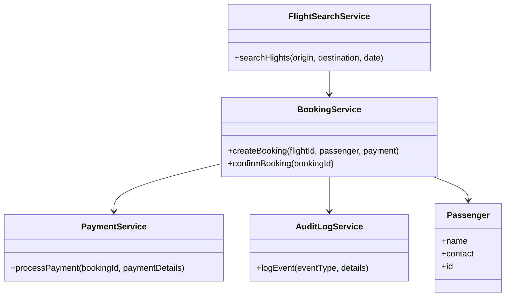
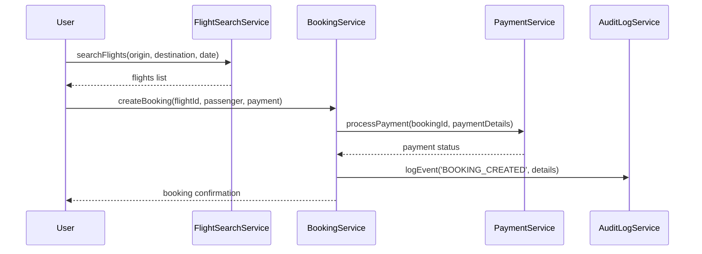
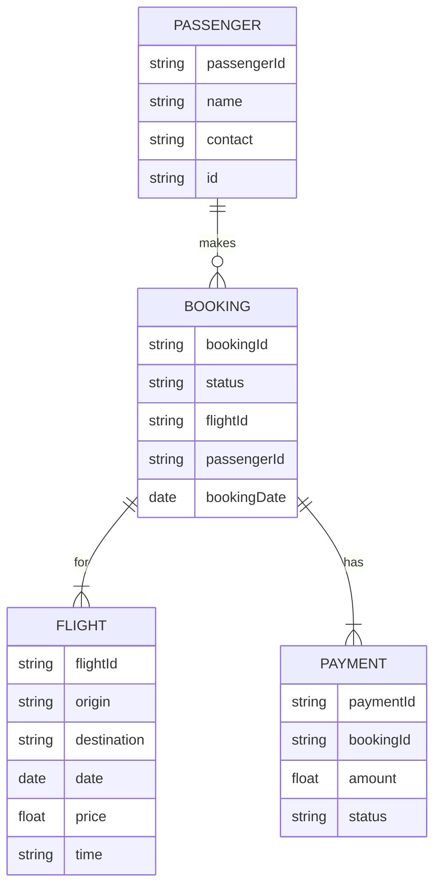

# For User Story Number [1]

1. Objective
This requirement enables passengers to book flight tickets online by searching for available flights, selecting travel dates and times, and completing bookings through a secure portal. The system provides real-time flight availability, pricing, and booking confirmation. It ensures a convenient, secure, and efficient ticket booking experience.

2. API Model
  2.1 Common Components/Services
    - AuthenticationService (for user login/session management)
    - FlightSearchService (for flight search and availability)
    - BookingService (for ticket booking and confirmation)
    - PaymentService (for payment processing)
    - AuditLogService (for transaction logging)

  2.2 API Details
| Operation      | REST Method | Type           | URL                        | Request (sample JSON)                                                                 | Response (sample JSON)                                                           |
|---------------|------------|----------------|----------------------------|--------------------------------------------------------------------------------------|-----------------------------------------------------------------------------------|
| Search Flights| GET        | Success/Failure| /api/flights/search        | {"origin": "JFK", "destination": "LAX", "date": "2025-10-10"}                | {"flights": [{"flightId": "XY123", "price": 350, "time": "10:00"}]}         |
| Book Ticket   | POST       | Success/Failure| /api/bookings              | {"flightId": "XY123", "passenger": {"name": "John Doe", "contact": "...", "id": "..."}, "payment": {"card": "...", "expiry": "..."}} | {"bookingId": "BK456", "status": "CONFIRMED", "details": {...}}              |
| Payment       | POST       | Success/Failure| /api/payments/process      | {"bookingId": "BK456", "amount": 350, "paymentMethod": "CARD", "details": {...}} | {"paymentId": "PM789", "status": "SUCCESS"}                                   |

  2.3 Exceptions
| API                | Exception Type          | Description                                         |
|--------------------|------------------------|-----------------------------------------------------|
| /api/flights/search| InvalidDateException   | Travel date is in the past                          |
| /api/bookings      | ValidationException    | Passenger details missing/invalid                   |
| /api/payments/process | PaymentFailedException | Payment processing failed                          |

3 Functional Design
  3.1 Class Diagram

  3.2 UML Sequence Diagram

  3.3 Components
| Component Name        | Description                                             | Existing/New |
|----------------------|---------------------------------------------------------|--------------|
| FlightSearchService  | Handles flight search and availability queries           | New          |
| BookingService       | Manages booking creation, confirmation, and seat reserve | New          |
| PaymentService       | Integrates with payment gateway for payment processing   | New          |
| AuditLogService      | Logs all booking and payment transactions                | Existing     |
| Passenger            | Represents passenger entity and details                  | Existing     |

  3.4 Service Layer Logic and Validations
| FieldName      | Validation                                  | Error Message                          | ClassUsed           |
|---------------|---------------------------------------------|----------------------------------------|---------------------|
| travelDate    | Must not be in the past                      | Invalid travel date                    | BookingService      |
| passengerName | Must be non-empty and valid                  | Passenger name required                | BookingService      |
| passengerID   | Must be valid format                         | Invalid passenger ID                   | BookingService      |
| payment       | Must be processed securely and successfully  | Payment failed                         | PaymentService      |

4 Integrations
| SystemToBeIntegrated     | IntegratedFor          | IntegrationType |
|-------------------------|------------------------|-----------------|
| Airline Reservation API | Flight search/booking  | API             |
| Payment Gateway         | Payment processing     | API             |
| Audit Logging System    | Transaction logs       | API             |

5 DB Details
  5.1 ER Model

  5.2 DB Validations
- Ensure booking status is updated only after successful payment.
- Unique constraint on bookingId and paymentId.
- Foreign key relationships enforced.

6 Non-Functional Requirements
  6.1 Performance
    - API response time <2 seconds for flight search.
    - Backend caching for frequent search queries.
    - Load balancing for concurrent users.

  6.2 Security
    6.2.1 Authentication
      - OAuth2/JWT for user authentication.
      - IAM integration for secure access.
    6.2.2 Authorization
      - Role-based access for booking and payment APIs.
      - Only authenticated users can book flights.

  6.3 Logging
    6.3.1 Application Logging
      - DEBUG: API request/response payloads.
      - INFO: Successful bookings and payments.
      - ERROR: Payment failures, invalid data.
      - WARN: Suspicious activities.
    6.3.2 Audit Log
      - Log all booking and payment events with timestamp, user, and details.

7 Dependencies
    - Airline reservation system API
    - Payment gateway
    - Audit logging system

8 Assumptions
    - All airline APIs are RESTful and available.
    - Payment gateway is PCI DSS compliant.
    - Users have valid credentials for booking.
