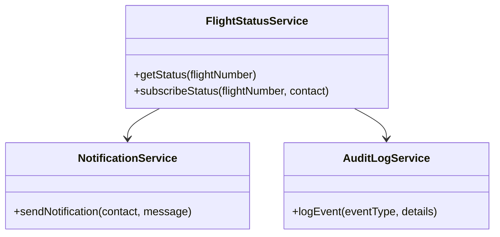
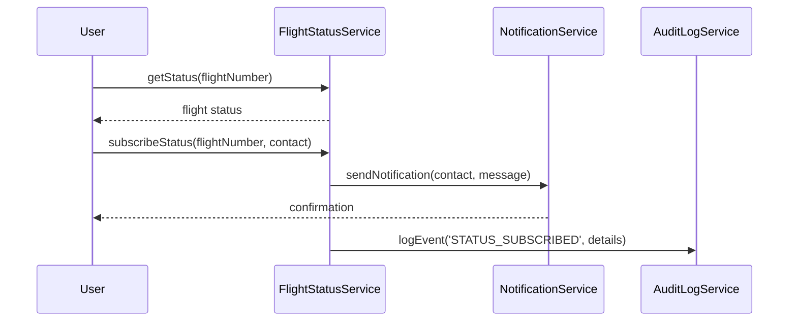
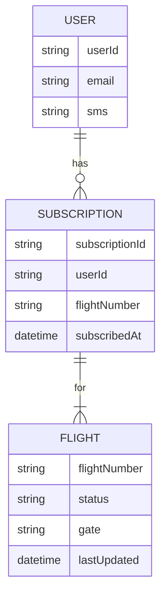

# For User Story Number [2]

1. Objective
This requirement enables passengers to track the status of their booked flights in real-time, including updates for delays, cancellations, and gate changes. Users can view flight status via the web portal and opt-in for notifications. The solution ensures timely, accurate, and secure delivery of flight status information.

2. API Model
  2.1 Common Components/Services
    - AuthenticationService (for user verification)
    - FlightStatusService (for fetching flight status)
    - NotificationService (for sending SMS/email notifications)
    - AuditLogService (for logging status queries and notifications)

  2.2 API Details
| Operation         | REST Method | Type           | URL                              | Request (sample JSON)                                        | Response (sample JSON)                                              |
|-------------------|------------|----------------|-----------------------------------|--------------------------------------------------------------|---------------------------------------------------------------------|
| Get Flight Status | GET        | Success/Failure| /api/flights/status              | {"flightNumber": "XY123"}                                   | {"flightNumber": "XY123", "status": "DELAYED", "gate": "A12"}         |
| Subscribe Status  | POST       | Success/Failure| /api/flights/subscribe           | {"flightNumber": "XY123", "contact": {"email": "...", "sms": "..."}} | {"subscriptionId": "SUB001", "status": "SUBSCRIBED"}                  |

  2.3 Exceptions
| API                   | Exception Type          | Description                                         |
|-----------------------|------------------------|-----------------------------------------------------|
| /api/flights/status   | InvalidFlightException | Flight number format/does not exist                 |
| /api/flights/subscribe| NotificationException  | Invalid/unverified contact details                  |

3 Functional Design
  3.1 Class Diagram

  3.2 UML Sequence Diagram

  3.3 Components
| Component Name        | Description                                             | Existing/New |
|----------------------|---------------------------------------------------------|--------------|
| FlightStatusService  | Fetches and manages flight status updates                | New          |
| NotificationService  | Sends notifications to users                             | Existing     |
| AuditLogService      | Logs status queries and notification events              | Existing     |

  3.4 Service Layer Logic and Validations
| FieldName      | Validation                                  | Error Message                          | ClassUsed           |
|---------------|---------------------------------------------|----------------------------------------|---------------------|
| flightNumber  | Must match airline format and exist          | Invalid flight number                   | FlightStatusService |
| contact       | Must be verified (email/SMS)                 | Invalid contact details                 | NotificationService |

4 Integrations
| SystemToBeIntegrated     | IntegratedFor          | IntegrationType |
|-------------------------|------------------------|-----------------|
| Airline Status API      | Flight status updates  | API             |
| Notification Gateway    | SMS/Email notifications| API             |
| Audit Logging System    | Transaction logs       | API             |

5 DB Details
  5.1 ER Model

  5.2 DB Validations
- Unique constraint on subscriptionId.
- Foreign key relationships enforced.
- Only verified contacts stored for notifications.

6 Non-Functional Requirements
  6.1 Performance
    - Real-time update latency <1 minute.
    - Scalable notification delivery.

  6.2 Security
    6.2.1 Authentication
      - OAuth2/JWT for user authentication.
    6.2.2 Authorization
      - Only authenticated users can subscribe for notifications.

  6.3 Logging
    6.3.1 Application Logging
      - DEBUG: API request/response payloads.
      - INFO: Successful subscriptions and notifications.
      - ERROR: Invalid flight number, notification failures.
      - WARN: Suspicious subscription attempts.
    6.3.2 Audit Log
      - Log all subscription and notification events with timestamp, user, and details.

7 Dependencies
    - Airline status API
    - Notification gateway
    - Audit logging system

8 Assumptions
    - Airline status API provides real-time data.
    - Notification gateway is reliable and scalable.
    - Users provide valid contact details for notifications.
