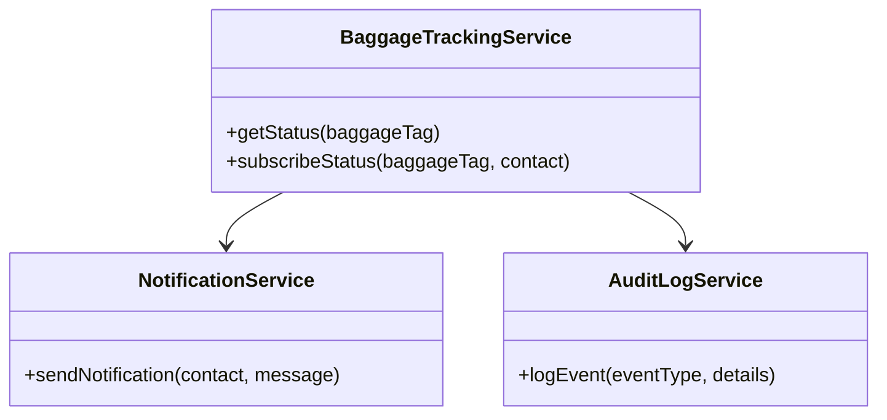
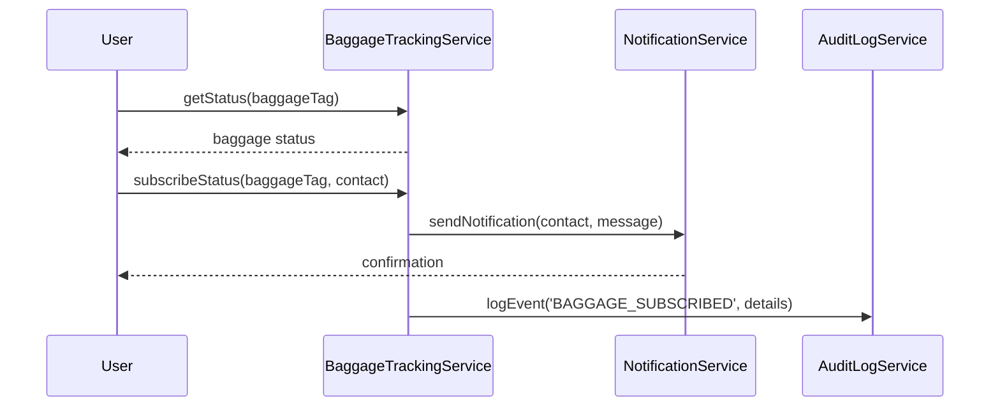
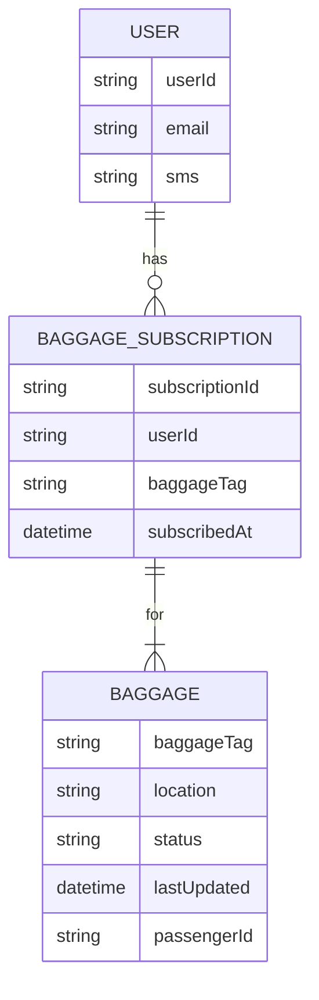

# For User Story Number [3]

1. Objective
This requirement enables passengers to track the status and location of their checked-in baggage throughout their journey using the airline's digital platform. The system provides real-time updates at key points such as check-in, loading, transfer, and arrival. It ensures secure, reliable, and timely information delivery to authorized users.

2. API Model
  2.1 Common Components/Services
    - AuthenticationService (for user authentication)
    - BaggageTrackingService (for fetching baggage status)
    - NotificationService (for sending delay/reroute notifications)
    - AuditLogService (for logging baggage status queries and notifications)

  2.2 API Details
| Operation         | REST Method | Type           | URL                              | Request (sample JSON)                                        | Response (sample JSON)                                              |
|-------------------|------------|----------------|-----------------------------------|--------------------------------------------------------------|---------------------------------------------------------------------|
| Get Baggage Status| GET        | Success/Failure| /api/baggage/status              | {"baggageTag": "BG123456"}                                  | {"baggageTag": "BG123456", "location": "LAX", "status": "LOADED"}      |
| Subscribe Baggage | POST       | Success/Failure| /api/baggage/subscribe           | {"baggageTag": "BG123456", "contact": {"email": "...", "sms": "..."}} | {"subscriptionId": "SUB002", "status": "SUBSCRIBED"}                  |

  2.3 Exceptions
| API                   | Exception Type          | Description                                         |
|-----------------------|------------------------|-----------------------------------------------------|
| /api/baggage/status   | InvalidTagException    | Baggage tag format/does not exist                   |
| /api/baggage/subscribe| AuthorizationException | Unauthorized access to baggage info                 |

3 Functional Design
  3.1 Class Diagram

  3.2 UML Sequence Diagram

  3.3 Components
| Component Name        | Description                                             | Existing/New |
|----------------------|---------------------------------------------------------|--------------|
| BaggageTrackingService | Fetches and manages baggage status updates             | New          |
| NotificationService  | Sends notifications to users                             | Existing     |
| AuditLogService      | Logs baggage status queries and notification events      | Existing     |

  3.4 Service Layer Logic and Validations
| FieldName      | Validation                                  | Error Message                          | ClassUsed           |
|---------------|---------------------------------------------|----------------------------------------|---------------------|
| baggageTag    | Must match airline format and be associated  | Invalid baggage tag                    | BaggageTrackingService |
| contact       | Must be verified (email/SMS)                 | Invalid contact details                 | NotificationService |
| user          | Must be authorized for baggage info          | Unauthorized access                    | AuthenticationService |

4 Integrations
| SystemToBeIntegrated     | IntegratedFor          | IntegrationType |
|-------------------------|------------------------|-----------------|
| Airport Baggage API     | Baggage status updates | API             |
| Notification Gateway    | SMS/Email notifications| API             |
| Audit Logging System    | Transaction logs       | API             |

5 DB Details
  5.1 ER Model

  5.2 DB Validations
- Unique constraint on baggageTag and subscriptionId.
- Foreign key relationships enforced.
- Only authorized users can access baggage info.

6 Non-Functional Requirements
  6.1 Performance
    - Real-time update latency <2 minutes.
    - Scalable notification delivery.

  6.2 Security
    6.2.1 Authentication
      - OAuth2/JWT for user authentication.
    6.2.2 Authorization
      - Only authorized users can access baggage info.

  6.3 Logging
    6.3.1 Application Logging
      - DEBUG: API request/response payloads.
      - INFO: Successful subscriptions and notifications.
      - ERROR: Invalid baggage tag, unauthorized access.
      - WARN: Suspicious baggage access attempts.
    6.3.2 Audit Log
      - Log all baggage status and notification events with timestamp, user, and details.

7 Dependencies
    - Airport/airline baggage API
    - Notification gateway
    - Audit logging system

8 Assumptions
    - Airport/airline baggage API provides real-time data.
    - Notification gateway is reliable and scalable.
    - Users are authorized for baggage info access.
