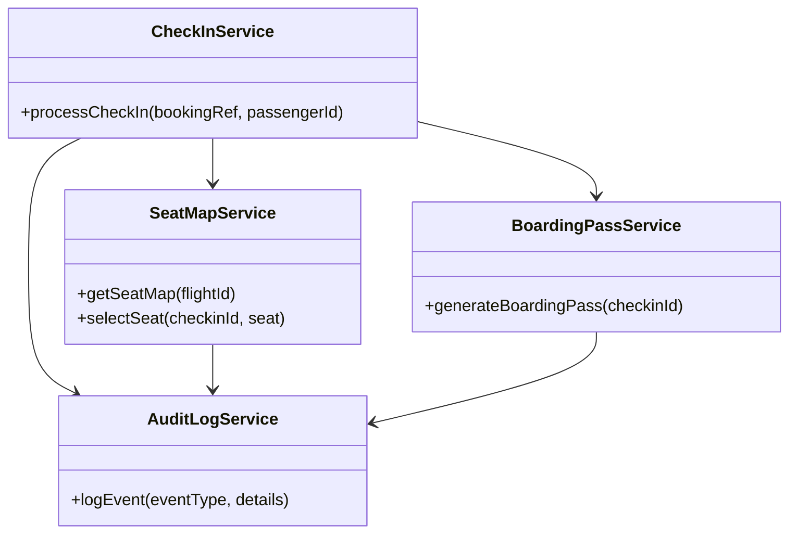
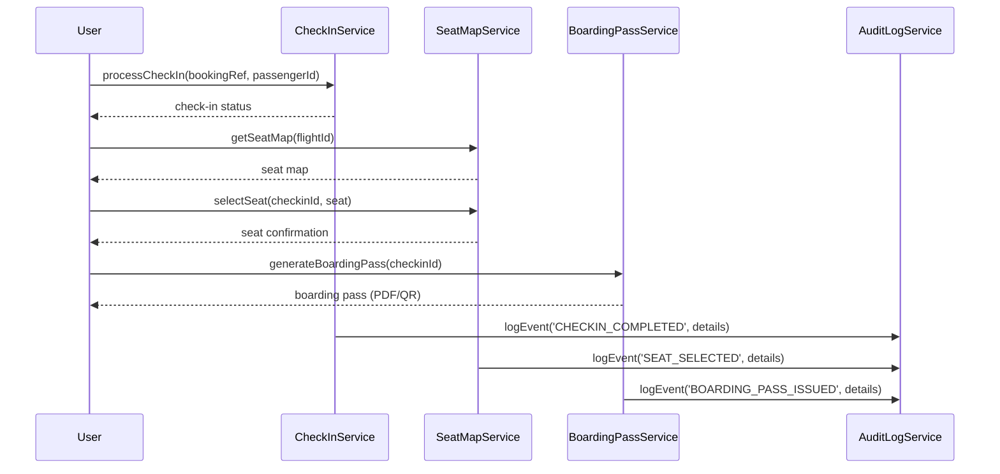
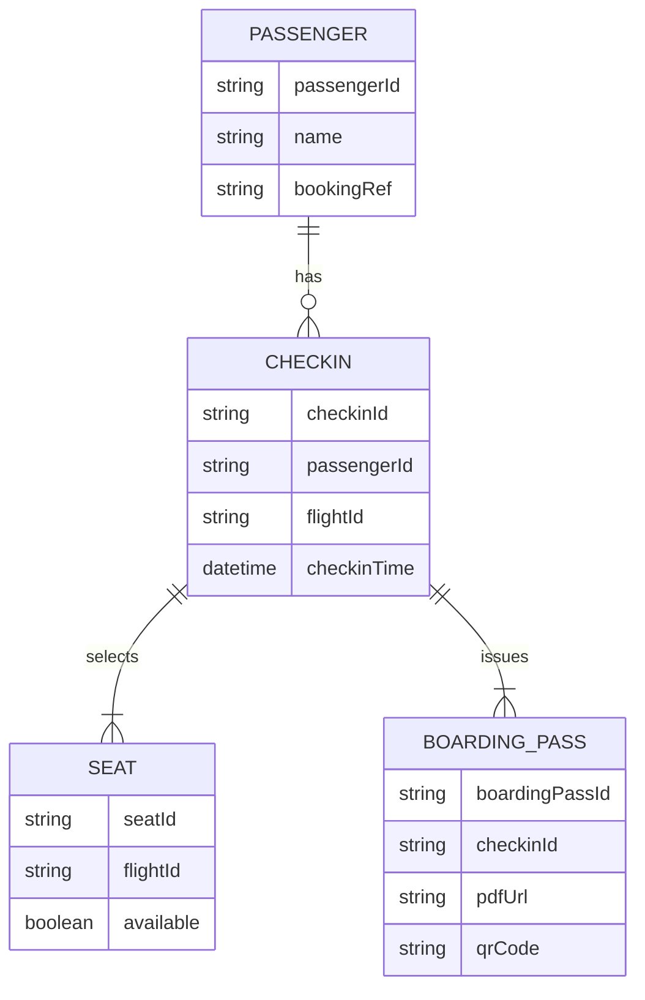

# For User Story Number [4]

1. Objective
This requirement enables passengers to check in online and select their preferred seat via a web or mobile app, streamlining the airport experience. The system provides real-time seat availability, validates check-in eligibility, and issues a digital boarding pass. It ensures secure, efficient, and user-friendly check-in and seat selection.

2. API Model
  2.1 Common Components/Services
    - AuthenticationService (for user authentication)
    - CheckInService (for check-in processing)
    - SeatMapService (for seat availability and selection)
    - BoardingPassService (for boarding pass generation)
    - AuditLogService (for logging check-in and seat selection events)

  2.2 API Details
| Operation         | REST Method | Type           | URL                              | Request (sample JSON)                                        | Response (sample JSON)                                              |
|-------------------|------------|----------------|-----------------------------------|--------------------------------------------------------------|---------------------------------------------------------------------|
| Check-In          | POST       | Success/Failure| /api/checkin                     | {"bookingRef": "BR123", "passengerId": "P001"}             | {"checkinId": "CI456", "status": "CHECKED_IN"}                      |
| Get Seat Map      | GET        | Success/Failure| /api/seats/map                    | {"flightId": "XY123"}                                      | {"seats": [{"seat": "12A", "available": true}, ...]}                |
| Select Seat       | POST       | Success/Failure| /api/seats/select                 | {"checkinId": "CI456", "seat": "12A"}                      | {"status": "SEAT_CONFIRMED", "seat": "12A"}                         |
| Get Boarding Pass | GET        | Success/Failure| /api/boardingpass                 | {"checkinId": "CI456"}                                      | {"boardingPass": "<PDF/QR>"}                                         |

  2.3 Exceptions
| API                   | Exception Type          | Description                                         |
|-----------------------|------------------------|-----------------------------------------------------|
| /api/checkin          | CheckinWindowException | Check-in not allowed outside allowed window         |
| /api/seats/select     | SeatUnavailableException| Seat already booked                                 |
| /api/boardingpass     | ValidationException    | Invalid checkinId or passenger                      |

3 Functional Design
  3.1 Class Diagram

  3.2 UML Sequence Diagram

  3.3 Components
| Component Name        | Description                                             | Existing/New |
|----------------------|---------------------------------------------------------|--------------|
| CheckInService       | Handles check-in processing and eligibility              | New          |
| SeatMapService       | Manages seat map and seat selection                      | New          |
| BoardingPassService  | Generates digital boarding passes                        | New          |
| AuditLogService      | Logs check-in, seat selection, and boarding pass events  | Existing     |

  3.4 Service Layer Logic and Validations
| FieldName      | Validation                                  | Error Message                          | ClassUsed           |
|---------------|---------------------------------------------|----------------------------------------|---------------------|
| checkinWindow | Must be within airline allowed window        | Check-in not allowed                   | CheckInService      |
| passengerId   | Must be valid and match booking              | Invalid passenger/booking              | CheckInService      |
| seat          | Must be available and not double-booked      | Seat unavailable                       | SeatMapService      |

4 Integrations
| SystemToBeIntegrated     | IntegratedFor          | IntegrationType |
|-------------------------|------------------------|-----------------|
| Airline Check-In API    | Check-in processing    | API             |
| Airline Seat Map API    | Seat map/selection     | API             |
| Boarding Pass Generator | PDF/QR generation      | API             |
| Audit Logging System    | Transaction logs       | API             |

5 DB Details
  5.1 ER Model

  5.2 DB Validations
- Unique constraint on seatId per flight.
- Foreign key relationships enforced.
- Check-in allowed only within allowed window.

6 Non-Functional Requirements
  6.1 Performance
    - Check-in process completes in <1 minute.
    - Real-time seat map updates.

  6.2 Security
    6.2.1 Authentication
      - OAuth2/JWT for user authentication.
    6.2.2 Authorization
      - Only authenticated users can check in/select seats.

  6.3 Logging
    6.3.1 Application Logging
      - DEBUG: API request/response payloads.
      - INFO: Successful check-ins, seat selections, boarding pass issuance.
      - ERROR: Invalid check-in, seat double-booking.
      - WARN: Suspicious check-in attempts.
    6.3.2 Audit Log
      - Log all check-in, seat selection, and boarding pass events with timestamp, user, and details.

7 Dependencies
    - Airline check-in and seat map APIs
    - Boarding pass generator
    - Audit logging system

8 Assumptions
    - Airline APIs provide real-time seat and check-in data.
    - Boarding pass generator supports PDF/QR output.
    - Users are authenticated and have valid bookings.
