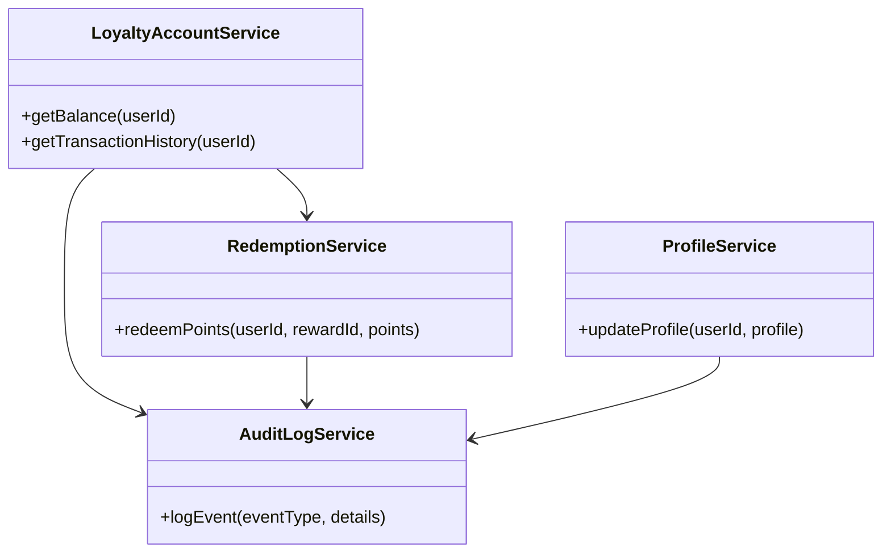
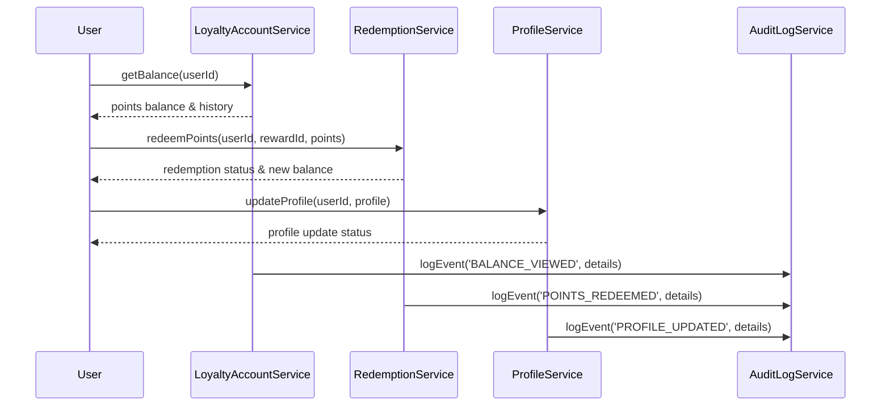
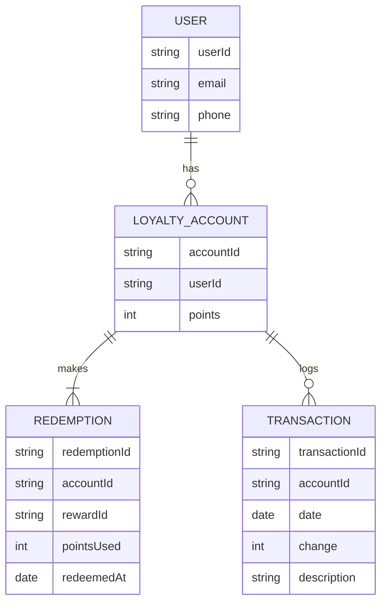

# For User Story Number [5]

1. Objective
This requirement enables frequent flyers to manage their loyalty program accounts, including viewing points balance, transaction history, and redeeming points for rewards. Users can also update their profile and view program benefits. The solution ensures secure, real-time, and scalable management of loyalty accounts and transactions.

2. API Model
  2.1 Common Components/Services
    - AuthenticationService (for user authentication)
    - LoyaltyAccountService (for points management)
    - RedemptionService (for reward redemption)
    - ProfileService (for profile updates)
    - AuditLogService (for logging loyalty transactions and redemptions)

  2.2 API Details
| Operation         | REST Method | Type           | URL                              | Request (sample JSON)                                        | Response (sample JSON)                                              |
|-------------------|------------|----------------|-----------------------------------|--------------------------------------------------------------|---------------------------------------------------------------------|
| Get Points Balance| GET        | Success/Failure| /api/loyalty/balance             | {"userId": "U12345"}                                       | {"points": 12000, "history": [{"date": "2025-10-01", "change": +500}]} |
| Redeem Points     | POST       | Success/Failure| /api/loyalty/redeem              | {"userId": "U12345", "rewardId": "RW001", "points": 5000} | {"status": "REDEEMED", "newBalance": 7000}                              |
| Update Profile    | PUT        | Success/Failure| /api/loyalty/profile             | {"userId": "U12345", "profile": {"email": "...", "phone": "..."}} | {"status": "UPDATED", "profile": {...}}                                   |

  2.3 Exceptions
| API                   | Exception Type          | Description                                         |
|-----------------------|------------------------|-----------------------------------------------------|
| /api/loyalty/balance  | AuthorizationException | Unauthorized access to loyalty account              |
| /api/loyalty/redeem   | InsufficientPointsException | Not enough points for redemption                 |
| /api/loyalty/profile  | ValidationException    | Invalid profile data                                |

3 Functional Design
  3.1 Class Diagram

  3.2 UML Sequence Diagram

  3.3 Components
| Component Name        | Description                                             | Existing/New |
|----------------------|---------------------------------------------------------|--------------|
| LoyaltyAccountService| Manages points balance and transaction history           | New          |
| RedemptionService    | Handles redemption of points for rewards                 | New          |
| ProfileService       | Manages loyalty profile updates                          | New          |
| AuditLogService      | Logs loyalty transactions and redemptions                | Existing     |

  3.4 Service Layer Logic and Validations
| FieldName      | Validation                                  | Error Message                          | ClassUsed           |
|---------------|---------------------------------------------|----------------------------------------|---------------------|
| userId        | Must be authenticated and authorized         | Unauthorized access                    | LoyaltyAccountService|
| points        | Must be sufficient for redemption            | Insufficient points                    | RedemptionService   |
| profile       | Must be valid format                         | Invalid profile data                   | ProfileService      |

4 Integrations
| SystemToBeIntegrated     | IntegratedFor          | IntegrationType |
|-------------------------|------------------------|-----------------|
| Loyalty Program API     | Points management      | API             |
| Rewards Catalog API     | Reward redemption      | API             |
| Audit Logging System    | Transaction logs       | API             |

5 DB Details
  5.1 ER Model

  5.2 DB Validations
- Unique constraint on accountId, transactionId, redemptionId.
- Foreign key relationships enforced.
- Points balance updated in real-time after redemption.

6 Non-Functional Requirements
  6.1 Performance
    - Real-time points balance updates.
    - Scalable to millions of users.

  6.2 Security
    6.2.1 Authentication
      - OAuth2/JWT for user authentication.
    6.2.2 Authorization
      - Only authenticated users can access/update loyalty accounts.

  6.3 Logging
    6.3.1 Application Logging
      - DEBUG: API request/response payloads.
      - INFO: Points balance views, redemptions, profile updates.
      - ERROR: Unauthorized access, insufficient points.
      - WARN: Suspicious redemption attempts.
    6.3.2 Audit Log
      - Log all loyalty transactions, redemptions, and profile updates with timestamp, user, and details.

7 Dependencies
    - Loyalty program management system
    - Rewards catalog API
    - Audit logging system

8 Assumptions
    - Loyalty program API supports real-time updates.
    - Rewards catalog is up-to-date and available.
    - Users are authenticated and authorized for account access.
