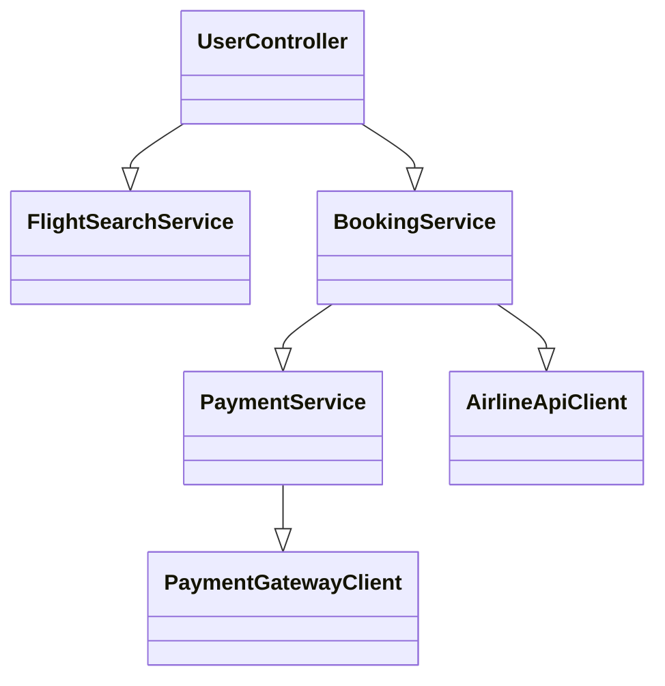
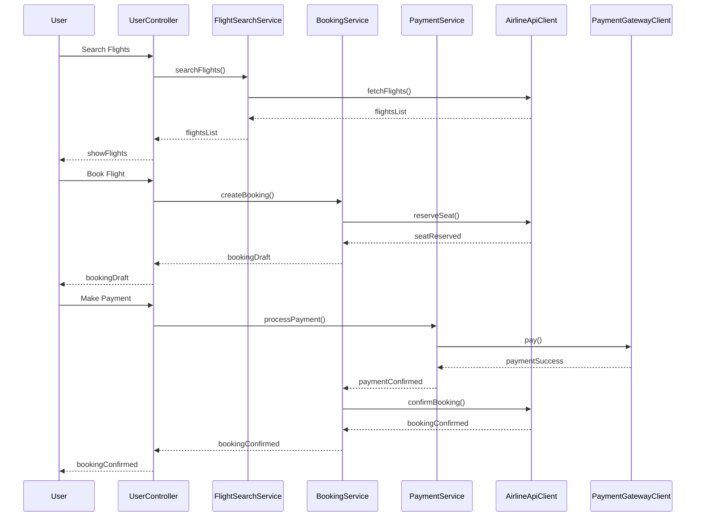
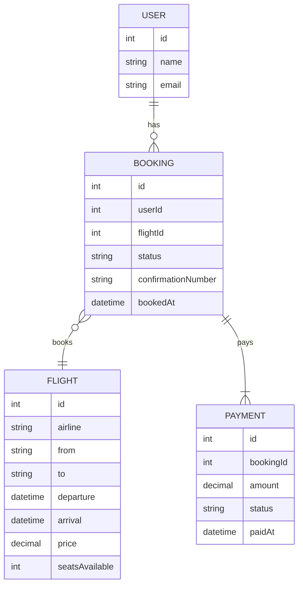

# For User Story Number [1]
1. Objective
This requirement enables travelers to search, select, and book air transport tickets online. It provides a seamless booking experience, including flight search, price comparison, secure payment, and booking confirmation. The system ensures real-time availability and secure transactions for users.

2. API Model
  2.1 Common Components/Services
  - AuthenticationService (existing): Handles user authentication and session management.
  - PaymentService (existing): Integrates with payment gateways (Stripe, PayPal).
  - FlightSearchService (new): Queries partner airline APIs for available flights.
  - BookingService (new): Manages booking process and confirmation.

  2.2 API Details
| Operation | REST Method | Type    | URL                        | Request (JSON)                                                                                       | Response (JSON)                                                                                      |
|-----------|-------------|---------|----------------------------|------------------------------------------------------------------------------------------------------|------------------------------------------------------------------------------------------------------|
| Search    | GET         | Success | /api/flights/search        | {"date":"2025-10-10","from":"JFK","to":"LAX","class":"Economy"}                              | [{"flightId":123,"airline":"AA","price":350.00,"seatsAvailable":5,"departure":"10:00","arrival":"13:00"}] |
| Book      | POST        | Success | /api/bookings              | {"flightId":123,"userId":1,"passengerDetails":[...],"paymentInfo":{...}}                       | {"bookingId":456,"status":"CONFIRMED","amount":350.00,"confirmationNumber":"ABC123"}        |
| Pay       | POST        | Success | /api/payments              | {"bookingId":456,"paymentMethod":"CARD","cardDetails":{...}}                                    | {"paymentId":789,"status":"SUCCESS","timestamp":"2025-10-03T06:20:44Z"}                      |
| Confirm   | GET         | Success | /api/bookings/{id}/confirm | N/A                                                                                                  | {"bookingId":456,"status":"CONFIRMED","confirmationNumber":"ABC123"}                          |

  2.3 Exceptions
| API                | Exception Type         | Description                                      |
|--------------------|-----------------------|--------------------------------------------------|
| /api/flights/search| InvalidInputException | Invalid search parameters                        |
| /api/bookings      | SeatUnavailableException | Selected seat is no longer available           |
| /api/payments      | PaymentFailedException | Payment declined or failed                      |
| /api/bookings/{id}/confirm | BookingNotFoundException | Booking ID not found                      |

3 Functional Design
  3.1 Class Diagram

  3.2 UML Sequence Diagram

  3.3 Components
| Component Name         | Description                                              | Existing/New |
|-----------------------|----------------------------------------------------------|--------------|
| UserController        | Handles user requests for search, booking, payment       | New          |
| FlightSearchService   | Searches flights via airline APIs                        | New          |
| BookingService        | Manages booking, seat reservation, and confirmation      | New          |
| PaymentService        | Handles payment processing                               | Existing     |
| AirlineApiClient      | Integrates with external airline APIs                    | New          |
| PaymentGatewayClient  | Integrates with payment gateways                         | Existing     |

  3.4 Service Layer Logic and Validations
| FieldName        | Validation                                   | Error Message                       | ClassUsed            |
|------------------|----------------------------------------------|-------------------------------------|----------------------|
| date             | Must be a valid date, not in the past        | Invalid date                        | FlightSearchService  |
| from/to          | Must be valid IATA airport codes             | Invalid location                    | FlightSearchService  |
| paymentInfo      | Must be PCI DSS compliant, valid card info   | Invalid payment information         | PaymentService       |
| seatAvailability | Must check real-time seat availability       | Seat no longer available            | BookingService       |
| userAuth         | Must be authenticated user                   | Unauthorized                        | UserController       |

4 Integrations
| SystemToBeIntegrated | IntegratedFor         | IntegrationType |
|----------------------|----------------------|-----------------|
| Airline APIs         | Flight search, booking| API             |
| Payment Gateway      | Payment processing    | API             |

5 DB Details
  5.1 ER Model

  5.2 DB Validations
- Unique constraint on booking confirmation number
- Foreign key constraints between Booking, User, Flight, and Payment
- Payment status must be SUCCESS before booking status is CONFIRMED

6 Non-Functional Requirements
  6.1 Performance
  - Booking process must complete within 5 seconds under normal load
  - API responses should be cached where appropriate (flight search results)

  6.2 Security
    6.2.1 Authentication
    - JWT-based authentication for all user APIs
    - OAuth2 integration for third-party logins if required
    6.2.2 Authorization
    - Only authenticated users can book flights
    - Role-based access for admin endpoints

  6.3 Logging
    6.3.1 Application Logging
    - DEBUG: API request/response payloads (excluding sensitive data)
    - INFO: Successful bookings, payments
    - WARN: Payment retries, seat unavailability
    - ERROR: Failed bookings, payment failures
    6.3.2 Audit Log
    - Log all booking and payment actions with user ID, timestamp, and status

7 Dependencies
- Partner airline APIs for flight data and booking
- Payment gateway (Stripe, PayPal) for payments
- Email/SMS service for confirmation notifications

8 Assumptions
- All partner airline APIs are available and reliable
- Payment gateway is PCI DSS compliant
- User authentication is handled via JWT
