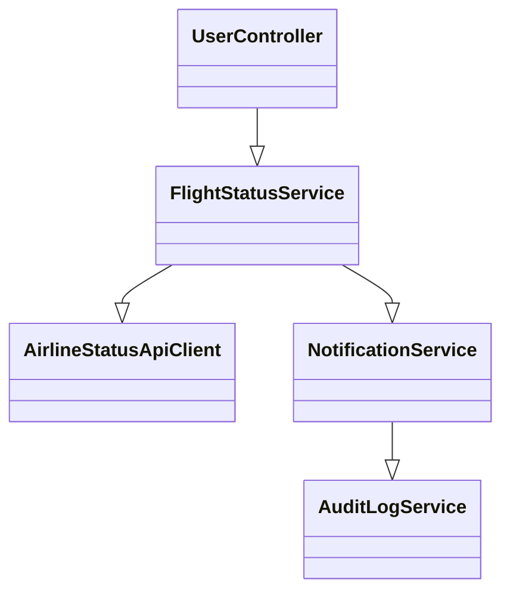
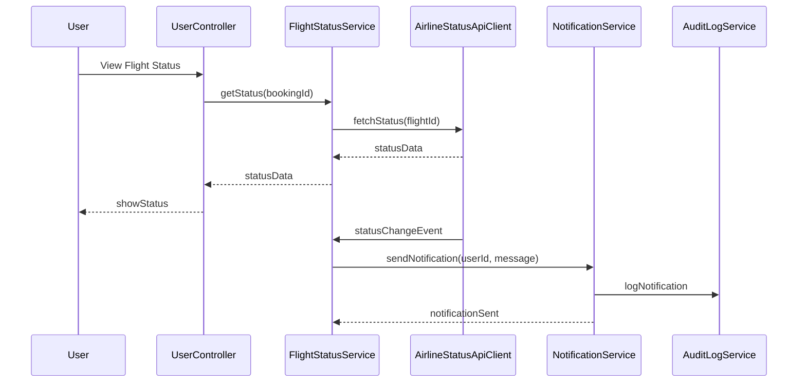
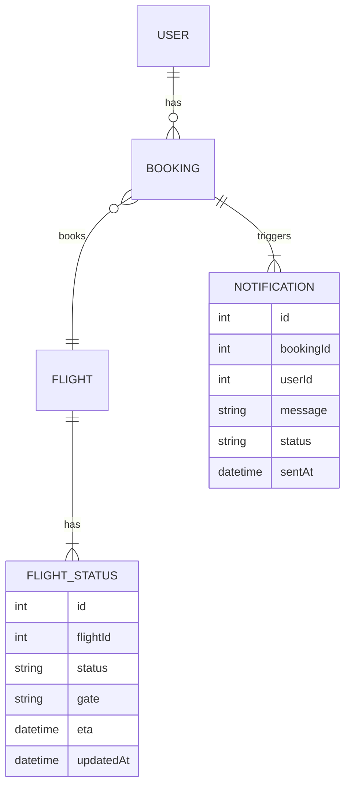

# For User Story Number [2]
1. Objective
This requirement enables travelers to track the real-time status of their booked flights, including delays, gate changes, and cancellations. The system provides timely and accurate updates through the booking dashboard and proactive notifications. It ensures synchronization with airline systems and reliable delivery of status changes to users.

2. API Model
  2.1 Common Components/Services
  - AuthenticationService (existing): Handles user authentication and session management.
  - FlightStatusService (new): Fetches and synchronizes real-time flight status from airline APIs.
  - NotificationService (existing): Sends notifications via email, SMS, or push.
  - AuditLogService (existing): Logs status updates and notifications for audit.

  2.2 API Details
| Operation | REST Method | Type    | URL                              | Request (JSON)                                         | Response (JSON)                                         |
|-----------|-------------|---------|----------------------------------|--------------------------------------------------------|--------------------------------------------------------|
| GetStatus | GET         | Success | /api/flights/{bookingId}/status  | N/A                                                   | {"flightId":123,"status":"DELAYED","gate":"A12","eta":"14:30"} |
| Notify    | POST        | Success | /api/notifications/flight-status | {"bookingId":123,"userId":1,"message":"Flight delayed"} | {"notificationId":456,"status":"SENT","timestamp":"2025-10-03T06:20:44Z"} |

  2.3 Exceptions
| API                                 | Exception Type             | Description                                   |
|-------------------------------------|----------------------------|-----------------------------------------------|
| /api/flights/{bookingId}/status     | BookingNotFoundException   | Booking ID not found or not valid             |
| /api/flights/{bookingId}/status     | UnauthorizedException      | User not authorized for booking               |
| /api/notifications/flight-status    | NotificationFailedException| Notification could not be delivered           |

3 Functional Design
  3.1 Class Diagram

  3.2 UML Sequence Diagram

  3.3 Components
| Component Name         | Description                                              | Existing/New |
|-----------------------|----------------------------------------------------------|--------------|
| UserController        | Handles user requests for flight status                  | New          |
| FlightStatusService   | Fetches and synchronizes flight status                   | New          |
| AirlineStatusApiClient| Integrates with airline status APIs                      | New          |
| NotificationService   | Sends notifications to users                             | Existing     |
| AuditLogService       | Logs all status updates and notifications                | Existing     |

  3.4 Service Layer Logic and Validations
| FieldName        | Validation                                   | Error Message                       | ClassUsed            |
|------------------|----------------------------------------------|-------------------------------------|----------------------|
| bookingId        | Must be valid and belong to user             | Invalid booking                     | FlightStatusService  |
| userAuth         | Must be authenticated user                   | Unauthorized                        | UserController       |
| notification     | Must confirm delivery (email/SMS/push)       | Notification delivery failed        | NotificationService  |
| statusSync       | Must match airline system status             | Status not synchronized             | FlightStatusService  |

4 Integrations
| SystemToBeIntegrated | IntegratedFor         | IntegrationType |
|----------------------|----------------------|-----------------|
| Airline Status APIs  | Real-time flight status| API            |
| Notification Service | User notifications    | API             |

5 DB Details
  5.1 ER Model

  5.2 DB Validations
- Foreign key constraints for Booking, Flight, and User
- Notification status must be SENT for successful delivery
- Flight status updates must have a timestamp

6 Non-Functional Requirements
  6.1 Performance
  - Status updates must be reflected within 1 minute of change
  - Notification delivery to 99% of users within 2 minutes

  6.2 Security
    6.2.1 Authentication
    - JWT-based authentication for all user APIs
    6.2.2 Authorization
    - Only users with valid bookings can access status

  6.3 Logging
    6.3.1 Application Logging
    - DEBUG: API request/response payloads (excluding sensitive data)
    - INFO: Status updates, notification sent
    - WARN: Notification retries, API fallback
    - ERROR: Notification failures, API errors
    6.3.2 Audit Log
    - Log all status changes and notifications with user ID, timestamp, and status

7 Dependencies
- Airline status APIs for real-time updates
- Notification service (Twilio, Firebase) for messaging

8 Assumptions
- Airline status APIs provide timely and accurate data
- Notification service is reliable and scalable
- User authentication is handled via JWT
