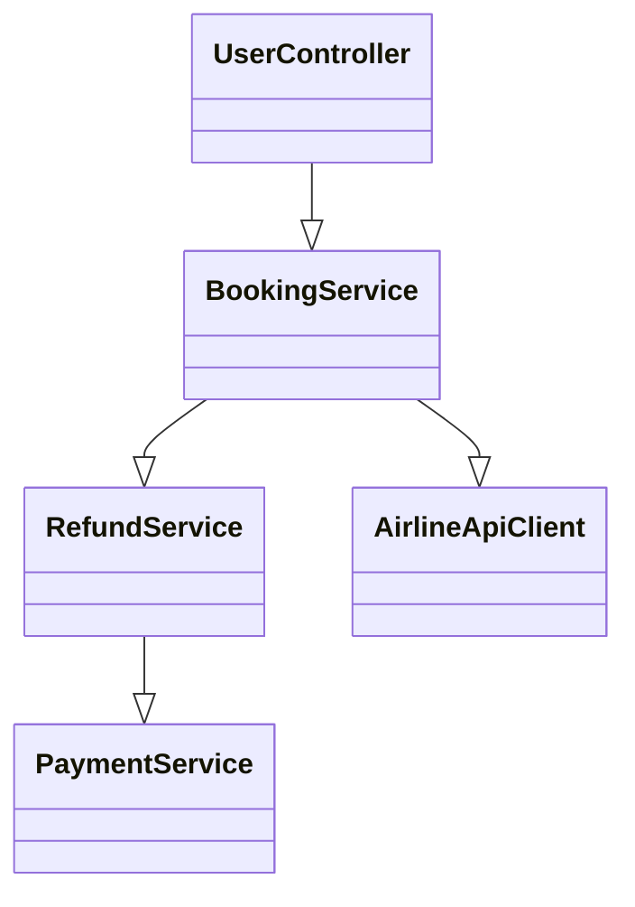
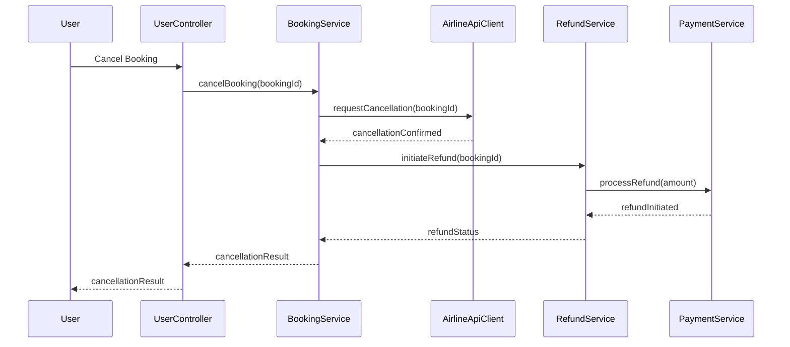
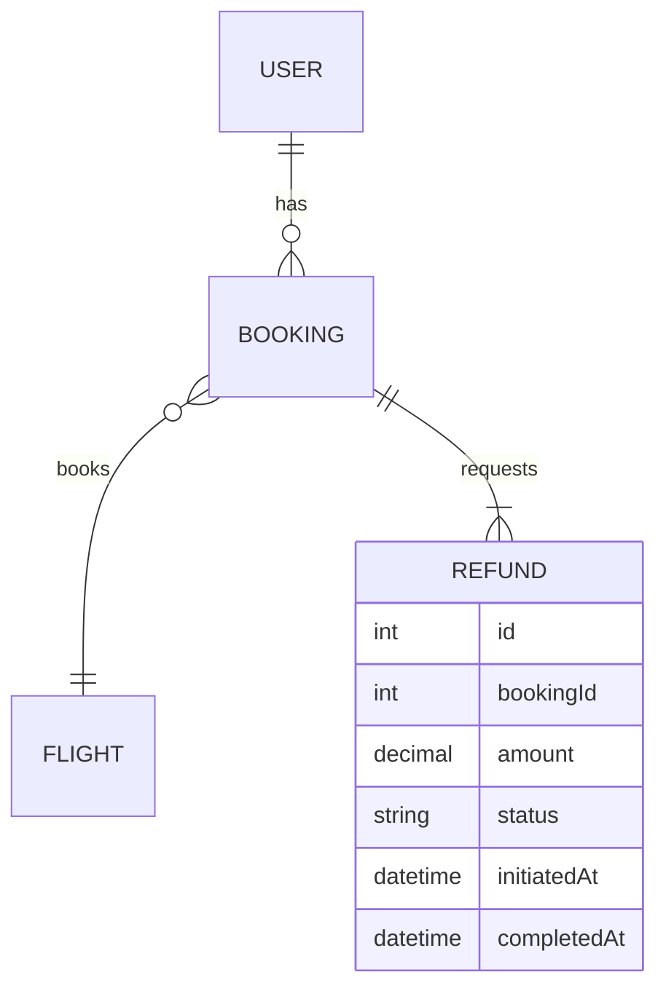

# For User Story Number [3]
1. Objective
This requirement enables travelers to cancel booked air tickets and request refunds according to airline policies. The system provides visibility into refund eligibility, applicable fees, and processes refunds securely. It ensures compliance with financial regulations and provides timely updates to users.

2. API Model
  2.1 Common Components/Services
  - AuthenticationService (existing): Handles user authentication and session management.
  - BookingService (existing): Manages booking and cancellation.
  - RefundService (new): Calculates refund eligibility and initiates refunds.
  - AirlineApiClient (existing): Integrates with airline APIs for cancellation.
  - PaymentService (existing): Processes refund transactions.

  2.2 API Details
| Operation   | REST Method | Type    | URL                               | Request (JSON)                                                                 | Response (JSON)                                                               |
|-------------|-------------|---------|-----------------------------------|--------------------------------------------------------------------------------|-------------------------------------------------------------------------------|
| Cancel      | POST        | Success | /api/bookings/{bookingId}/cancel  | {"bookingId":123,"userId":1}                                                 | {"bookingId":123,"status":"CANCELLED","refundEligible":true,"refundAmount":100.00} |
| Refund      | POST        | Success | /api/refunds                      | {"bookingId":123,"userId":1,"amount":100.00}                                | {"refundId":456,"status":"INITIATED","timestamp":"2025-10-03T06:20:44Z"}         |
| Policy      | GET         | Success | /api/bookings/{bookingId}/policy  | N/A                                                                            | {"bookingId":123,"refundable":true,"fee":20.00,"policyText":"..."}                |

  2.3 Exceptions
| API                                 | Exception Type             | Description                                   |
|-------------------------------------|----------------------------|-----------------------------------------------|
| /api/bookings/{bookingId}/cancel    | BookingNotFoundException   | Booking ID not found or not eligible          |
| /api/bookings/{bookingId}/cancel    | UnauthorizedException      | User not authorized for booking               |
| /api/refunds                        | RefundNotAllowedException  | Refund not allowed by airline policy          |
| /api/refunds                        | RefundFailedException      | Refund transaction failed                     |

3 Functional Design
  3.1 Class Diagram

  3.2 UML Sequence Diagram

  3.3 Components
| Component Name         | Description                                              | Existing/New |
|-----------------------|----------------------------------------------------------|--------------|
| UserController        | Handles user requests for cancellation and refund        | New          |
| BookingService        | Manages booking and cancellation logic                   | Existing     |
| RefundService         | Calculates eligibility and initiates refunds             | New          |
| AirlineApiClient      | Integrates with airline APIs for cancellation            | Existing     |
| PaymentService        | Processes refund transactions                            | Existing     |

  3.4 Service Layer Logic and Validations
| FieldName        | Validation                                   | Error Message                       | ClassUsed            |
|------------------|----------------------------------------------|-------------------------------------|----------------------|
| bookingId        | Must be valid and eligible for cancellation  | Invalid or ineligible booking       | BookingService       |
| userAuth         | Must be authenticated user                   | Unauthorized                        | UserController       |
| refundAmount     | Must match airline policy calculation        | Incorrect refund amount             | RefundService        |
| refundStatus     | Must be logged and auditable                 | Refund transaction failed           | RefundService        |

4 Integrations
| SystemToBeIntegrated | IntegratedFor         | IntegrationType |
|----------------------|----------------------|-----------------|
| Airline APIs         | Booking cancellation  | API             |
| Payment Gateway      | Refund processing     | API             |

5 DB Details
  5.1 ER Model

  5.2 DB Validations
- Foreign key constraints for Booking and Refund
- Refund status must be INITIATED or COMPLETED
- Refund amount must not exceed booking amount

6 Non-Functional Requirements
  6.1 Performance
  - Refund initiation must occur within 2 minutes of cancellation
  - System must handle high volumes of cancellation requests

  6.2 Security
    6.2.1 Authentication
    - JWT-based authentication for all user APIs
    6.2.2 Authorization
    - Only users with valid bookings can cancel and request refund

  6.3 Logging
    6.3.1 Application Logging
    - DEBUG: API request/response payloads (excluding sensitive data)
    - INFO: Cancellations, refund initiation
    - WARN: Refund retries, policy mismatches
    - ERROR: Refund failures, API errors
    6.3.2 Audit Log
    - Log all cancellation and refund actions with user ID, timestamp, and status

7 Dependencies
- Airline APIs for booking cancellation
- Payment gateway for refund processing

8 Assumptions
- Airline APIs provide up-to-date cancellation and refund policies
- Payment gateway supports refund transactions
- User authentication is handled via JWT
