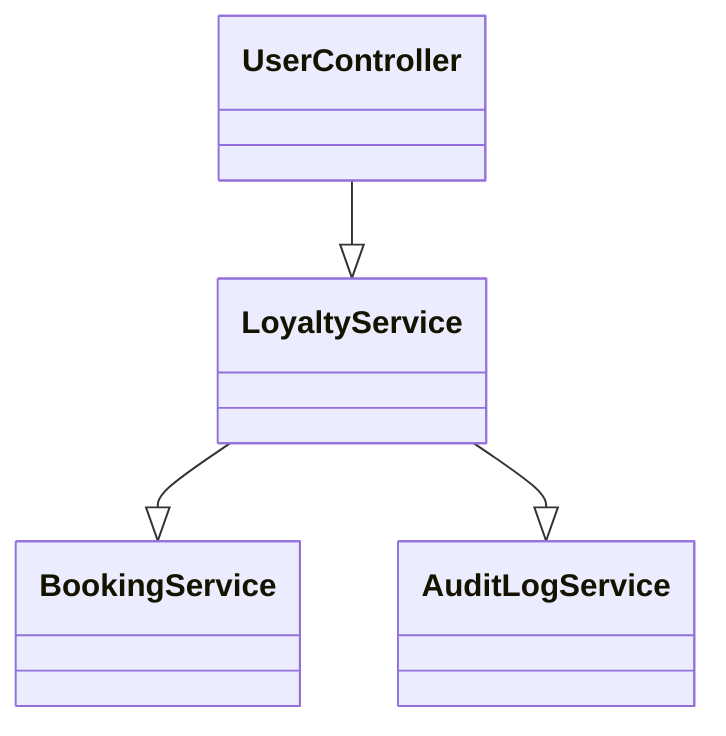
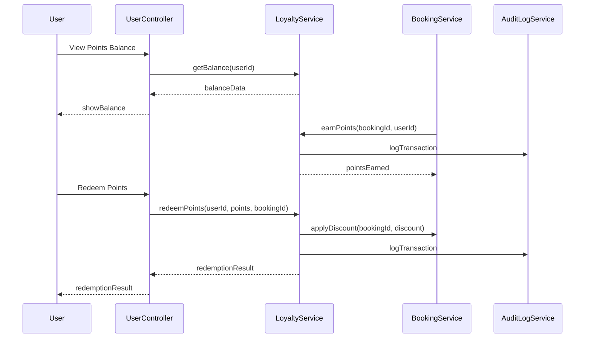
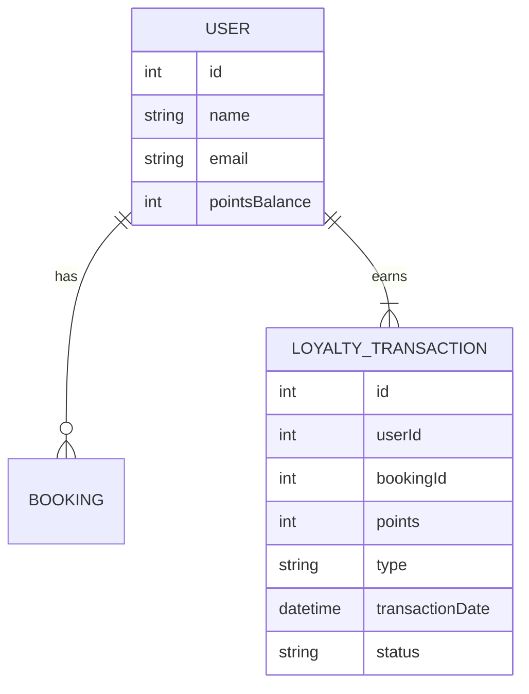

# For User Story Number [4]
1. Objective
This requirement enables frequent flyers to earn loyalty points on bookings, view their points balance and transaction history, and redeem points for discounts or rewards. The system ensures accurate, real-time tracking and secure redemption of loyalty points. All loyalty transactions are logged for audit and analytics.

2. API Model
  2.1 Common Components/Services
  - AuthenticationService (existing): Handles user authentication and session management.
  - LoyaltyService (new): Manages point accrual, balance, and redemption.
  - BookingService (existing): Triggers point accrual on eligible bookings.
  - AuditLogService (existing): Logs loyalty transactions for audit.

  2.2 API Details
| Operation    | REST Method | Type    | URL                              | Request (JSON)                                                                 | Response (JSON)                                                               |
|--------------|-------------|---------|----------------------------------|--------------------------------------------------------------------------------|-------------------------------------------------------------------------------|
| EarnPoints   | POST        | Success | /api/loyalty/earn                | {"bookingId":123,"userId":1}                                                 | {"userId":1,"pointsEarned":100,"balance":1500}                            |
| GetBalance   | GET         | Success | /api/loyalty/balance/{userId}    | N/A                                                                            | {"userId":1,"balance":1500,"transactions":[{"date":"2025-10-03","points":100,"type":"EARN"}]} |
| RedeemPoints | POST        | Success | /api/loyalty/redeem              | {"userId":1,"points":500,"bookingId":123}                                  | {"userId":1,"pointsRedeemed":500,"discount":50.00,"balance":1000}        |

  2.3 Exceptions
| API                        | Exception Type             | Description                                   |
|----------------------------|----------------------------|-----------------------------------------------|
| /api/loyalty/earn          | BookingNotEligibleException| Booking not eligible for points               |
| /api/loyalty/redeem        | InsufficientPointsException| User does not have enough points              |
| /api/loyalty/redeem        | RedemptionFailedException  | Redemption failed due to system error         |

3 Functional Design
  3.1 Class Diagram

  3.2 UML Sequence Diagram

  3.3 Components
| Component Name         | Description                                              | Existing/New |
|-----------------------|----------------------------------------------------------|--------------|
| UserController        | Handles user requests for loyalty features               | New          |
| LoyaltyService        | Manages accrual, balance, and redemption of points       | New          |
| BookingService        | Triggers point accrual and applies discounts             | Existing     |
| AuditLogService       | Logs loyalty transactions                                | Existing     |

  3.4 Service Layer Logic and Validations
| FieldName        | Validation                                   | Error Message                       | ClassUsed            |
|------------------|----------------------------------------------|-------------------------------------|----------------------|
| bookingId        | Must be eligible for points                  | Booking not eligible                | LoyaltyService       |
| userAuth         | Must be authenticated user                   | Unauthorized                        | UserController       |
| points           | Must be positive and <= user balance         | Insufficient points                 | LoyaltyService       |
| redemption       | Must comply with airline rules and expiry    | Redemption not allowed              | LoyaltyService       |

4 Integrations
| SystemToBeIntegrated | IntegratedFor         | IntegrationType |
|----------------------|----------------------|-----------------|
| Loyalty Program Engine| Points management    | API             |
| Booking Service      | Trigger accrual, apply discount | API     |

5 DB Details
  5.1 ER Model

  5.2 DB Validations
- Foreign key constraints for User and Booking
- Points balance must not go negative
- Transaction status must be SUCCESS or FAILED

6 Non-Functional Requirements
  6.1 Performance
  - Points balance updates must be reflected within 1 minute of booking
  - System must handle high volumes of loyalty transactions

  6.2 Security
    6.2.1 Authentication
    - JWT-based authentication for all user APIs
    6.2.2 Authorization
    - Only authenticated users can view/redeem points

  6.3 Logging
    6.3.1 Application Logging
    - DEBUG: API request/response payloads (excluding sensitive data)
    - INFO: Points earned, redeemed
    - WARN: Redemption retries, expiry events
    - ERROR: Failed loyalty transactions
    6.3.2 Audit Log
    - Log all loyalty transactions with user ID, timestamp, and status

7 Dependencies
- Loyalty program engine or in-house logic
- Booking service for accrual and discount application

8 Assumptions
- Loyalty rules and expiry are defined and enforced
- User authentication is handled via JWT
