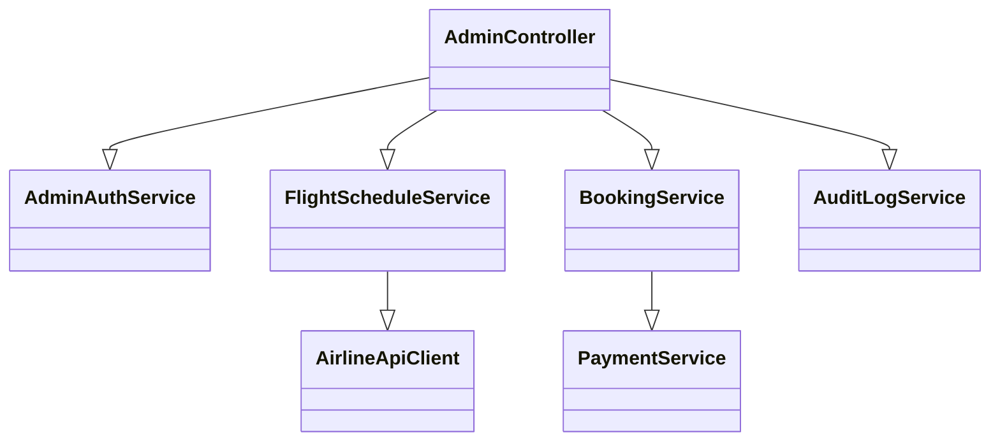
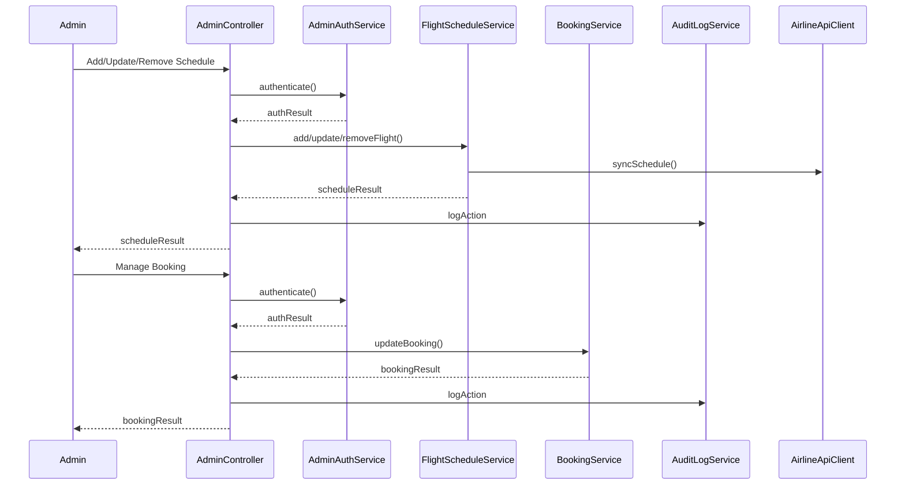
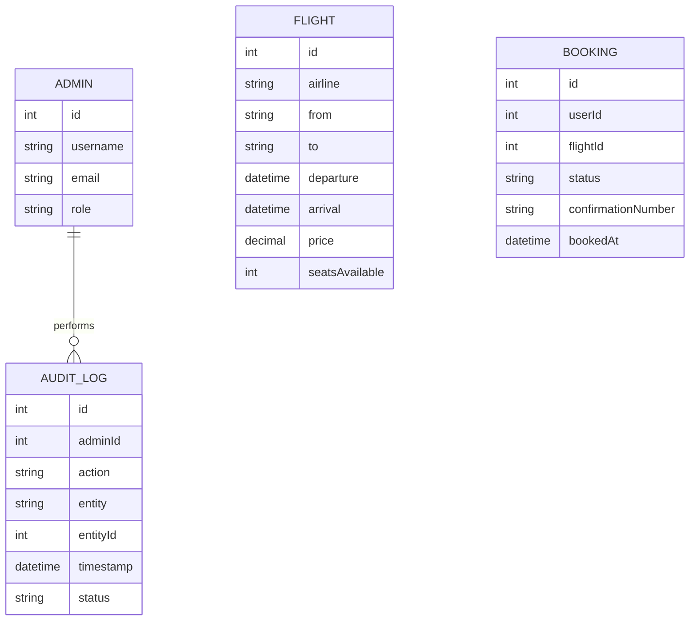

# For User Story Number [5]
1. Objective
This requirement enables admin users to securely manage flight schedules and bookings, including adding, updating, or removing schedules, and handling booking-related customer issues. The system enforces role-based access, ensures real-time updates, and maintains audit trails for all admin actions. Data consistency and integrity are ensured across all integrated systems.

2. API Model
  2.1 Common Components/Services
  - AdminAuthService (new): Handles admin authentication and multi-factor verification.
  - FlightScheduleService (new): Manages CRUD operations for flight schedules.
  - BookingService (existing): Manages bookings, cancellations, and refunds.
  - AuditLogService (existing): Logs all admin actions for compliance.

  2.2 API Details
| Operation      | REST Method | Type    | URL                               | Request (JSON)                                                                 | Response (JSON)                                                               |
|---------------|-------------|---------|-----------------------------------|--------------------------------------------------------------------------------|-------------------------------------------------------------------------------|
| AddSchedule   | POST        | Success | /api/admin/flights                | {"airline":"AA","from":"JFK","to":"LAX","departure":"2025-10-10T10:00","arrival":"2025-10-10T13:00","price":350.00,"seatsAvailable":100} | {"flightId":123,"status":"ADDED"}                                          |
| UpdateSchedule| PUT         | Success | /api/admin/flights/{flightId}     | {"departure":"2025-10-10T12:00","price":375.00}                            | {"flightId":123,"status":"UPDATED"}                                       |
| RemoveSchedule| DELETE      | Success | /api/admin/flights/{flightId}     | N/A                                                                            | {"flightId":123,"status":"REMOVED"}                                       |
| ManageBooking | PUT         | Success | /api/admin/bookings/{bookingId}   | {"status":"CANCELLED","refund":true}                                       | {"bookingId":456,"status":"CANCELLED","refundStatus":"INITIATED"}      |
| ViewBookings  | GET         | Success | /api/admin/bookings?filter=active | N/A                                                                            | [{"bookingId":456,"userId":1,"status":"CONFIRMED"}]                      |

  2.3 Exceptions
| API                        | Exception Type             | Description                                   |
|----------------------------|----------------------------|-----------------------------------------------|
| /api/admin/flights         | UnauthorizedException      | User is not an admin                          |
| /api/admin/flights         | ScheduleConflictException  | Schedule conflicts with existing flights      |
| /api/admin/flights         | ValidationException        | Incomplete or invalid schedule data           |
| /api/admin/bookings        | BookingNotFoundException   | Booking ID not found                          |
| /api/admin/bookings        | RefundFailedException      | Refund transaction failed                     |

3 Functional Design
  3.1 Class Diagram

  3.2 UML Sequence Diagram

  3.3 Components
| Component Name         | Description                                              | Existing/New |
|-----------------------|----------------------------------------------------------|--------------|
| AdminController       | Handles admin requests for schedule and booking mgmt     | New          |
| AdminAuthService      | Manages admin authentication and MFA                     | New          |
| FlightScheduleService | CRUD operations for flight schedules                     | New          |
| BookingService        | Manages bookings, cancellations, refunds                 | Existing     |
| AuditLogService       | Logs all admin actions                                   | Existing     |
| AirlineApiClient      | Syncs schedules with airline partners                    | Existing     |
| PaymentService        | Processes refunds                                        | Existing     |

  3.4 Service Layer Logic and Validations
| FieldName        | Validation                                   | Error Message                       | ClassUsed            |
|------------------|----------------------------------------------|-------------------------------------|----------------------|
| adminAuth        | Must be authenticated admin with MFA          | Unauthorized                        | AdminAuthService     |
| scheduleData     | Must be complete and conflict-free            | Invalid or conflicting schedule     | FlightScheduleService|
| bookingId        | Must be valid and exist                       | Booking not found                   | BookingService       |
| refundStatus     | Must be logged and auditable                  | Refund transaction failed           | BookingService       |

4 Integrations
| SystemToBeIntegrated | IntegratedFor         | IntegrationType |
|----------------------|----------------------|-----------------|
| Airline APIs         | Schedule sync        | API             |
| Payment Gateway      | Refund processing    | API             |

5 DB Details
  5.1 ER Model

  5.2 DB Validations
- Foreign key constraints for Admin, Flight, Booking, and AuditLog
- Schedule updates must not create overlapping/conflicting flights
- All admin actions must be logged

6 Non-Functional Requirements
  6.1 Performance
  - Admin actions must be processed within 2 seconds
  - Real-time updates for all schedule and booking changes

  6.2 Security
    6.2.1 Authentication
    - Multi-factor authentication for all admin APIs
    6.2.2 Authorization
    - Only authorized admin users can access management features

  6.3 Logging
    6.3.1 Application Logging
    - DEBUG: API request/response payloads (excluding sensitive data)
    - INFO: Schedule changes, booking management
    - WARN: Schedule conflicts, failed updates
    - ERROR: Failed admin actions, refund failures
    6.3.2 Audit Log
    - Log all admin actions with admin ID, timestamp, entity, and status

7 Dependencies
- Airline APIs for schedule synchronization
- Payment gateway for refund processing

8 Assumptions
- Admins are provisioned and roles are managed securely
- Airline partners support real-time schedule sync
- All admin actions are reversible if needed
