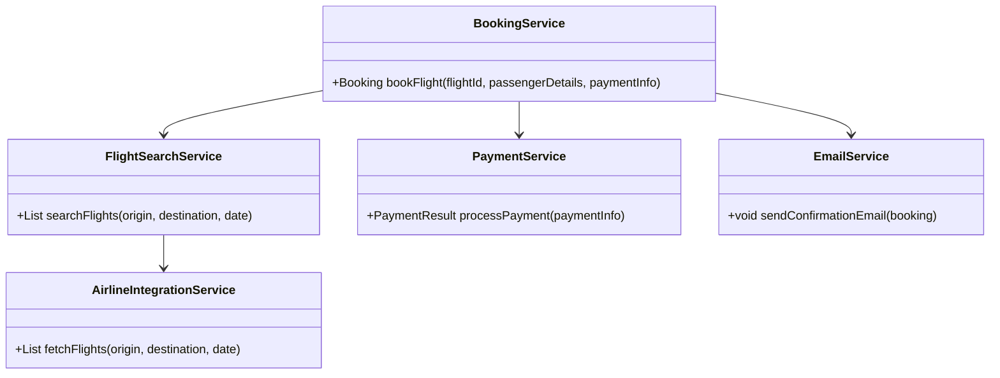
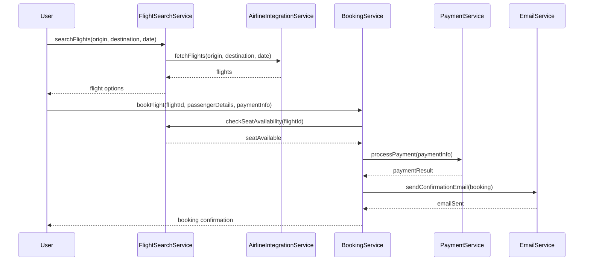
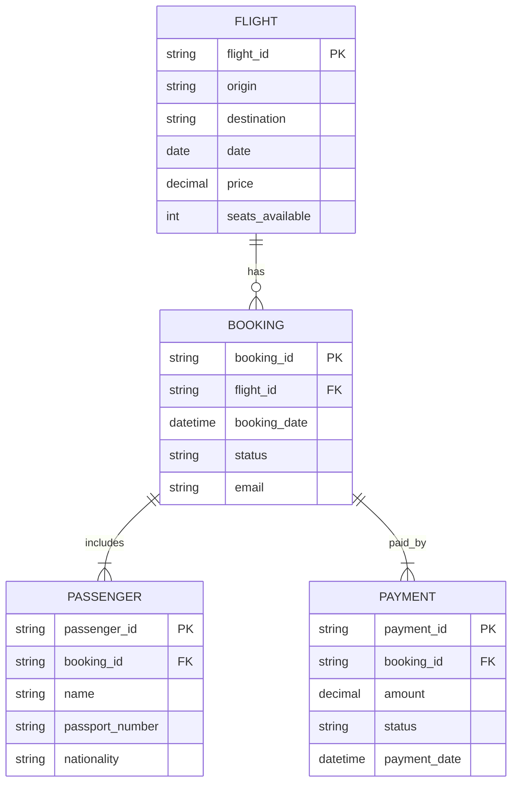

# For User Story Number [1]

1. Objective
This feature enables travelers to search for, compare, and book air transport tickets online. It provides real-time flight information, pricing, and seat availability, allowing users to select preferred flights, enter passenger details, and securely complete payment. The system ensures a seamless and secure booking experience with confirmation sent via email.

2. API Model
  2.1 Common Components/Services
  - FlightSearchService (existing/new)
  - BookingService (new)
  - PaymentService (existing)
  - EmailService (existing)
  - AirlineIntegrationService (existing)

  2.2 API Details
| Operation | REST Method | Type | URL | Request | Response |
|-----------|-------------|------|-----|---------|----------|
| Search Flights | GET | Success/Failure | /api/flights/search?origin={origin}&destination={destination}&date={date} | N/A | { "flights": [ { "flightId": "", "price": 0, "duration": "", "seatsAvailable": 0 } ] } |
| View Flight Details | GET | Success/Failure | /api/flights/{flightId} | N/A | { "flightId": "", "price": 0, "duration": "", "seatsAvailable": 0, "airline": "", "departure": "", "arrival": "" } |
| Book Ticket | POST | Success/Failure | /api/bookings | { "flightId": "", "passengerDetails": { ... }, "paymentInfo": { ... } } | { "bookingId": "", "status": "CONFIRMED", "email": "" } |
| Payment Processing | POST | Success/Failure | /api/payments | { "bookingId": "", "paymentInfo": { ... } } | { "paymentId": "", "status": "SUCCESS" } |

  2.3 Exceptions
  - InvalidAirportCodeException
  - PastDateException
  - SeatUnavailableException
  - PaymentFailedException
  - EmailSendFailureException

3. Functional Design
  3.1 Class Diagram

  3.2 UML Sequence Diagram

  3.3 Components
| Component Name | Description | Existing/New |
|----------------|-------------|--------------|
| FlightSearchService | Handles flight search and filtering | New |
| BookingService | Manages booking and validation | New |
| PaymentService | Handles payment processing | Existing |
| EmailService | Sends confirmation emails | Existing |
| AirlineIntegrationService | Integrates with airline APIs | Existing |

  3.4 Service Layer Logic as per the user story requirement and Validations
| FieldName | Validation | Error Message | ClassUsed |
|-----------|-----------|--------------|-----------|
| origin | Valid IATA airport code | Invalid origin airport code | FlightSearchService |
| destination | Valid IATA airport code | Invalid destination airport code | FlightSearchService |
| date | Not in the past | Travel date cannot be in the past | FlightSearchService |
| passengerDetails | Complete and accurate | Passenger details incomplete | BookingService |
| seatAvailability | Must be available | No seats available | BookingService |

4. Integrations
| SystemToBeIntegrated | IntegratedFor | IntegrationType |
|----------------------|--------------|-----------------|
| Airline APIs | Flight search, seat availability | API |
| Stripe | Payment processing | API |
| Email Service (SMTP/3rd party) | Booking confirmation | API |

5. DB Details
  5.1 ER Model

  5.2 DB Validations
  - Unique constraint on booking_id
  - Foreign key constraints between booking, passenger, and payment
  - Seats available >= 0

6. Non-Functional Requirements
  6.1 Performance
    - Flight search API must respond within 2 seconds.
    - Caching of frequent flight search queries at API layer.
  6.2 Security
    6.2.1 Authentication
      - OAuth2/JWT for API authentication.
      - HTTPS for all endpoints.
    6.2.2 Authorization
      - Role-based access for booking management.
  6.3 Logging
    6.3.1 Application Logging
      - INFO: All booking attempts, successful payments, and confirmations.
      - ERROR: Payment failures, API errors, email failures.
      - DEBUG: Flight search query parameters.
    6.3.2 Audit Log
      - Log all booking transactions and payment events for audit.

7. Dependencies
  - Airline APIs for flight data
  - Stripe for payment
  - Email service for confirmations

8. Assumptions
  - All airline APIs are available and reliable.
  - Payment gateway (Stripe) is PCI DSS compliant.
  - Email service is configured and operational.
