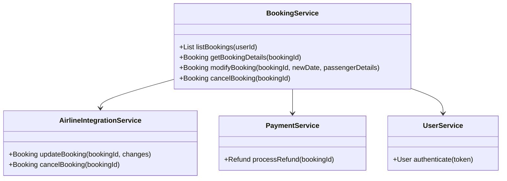
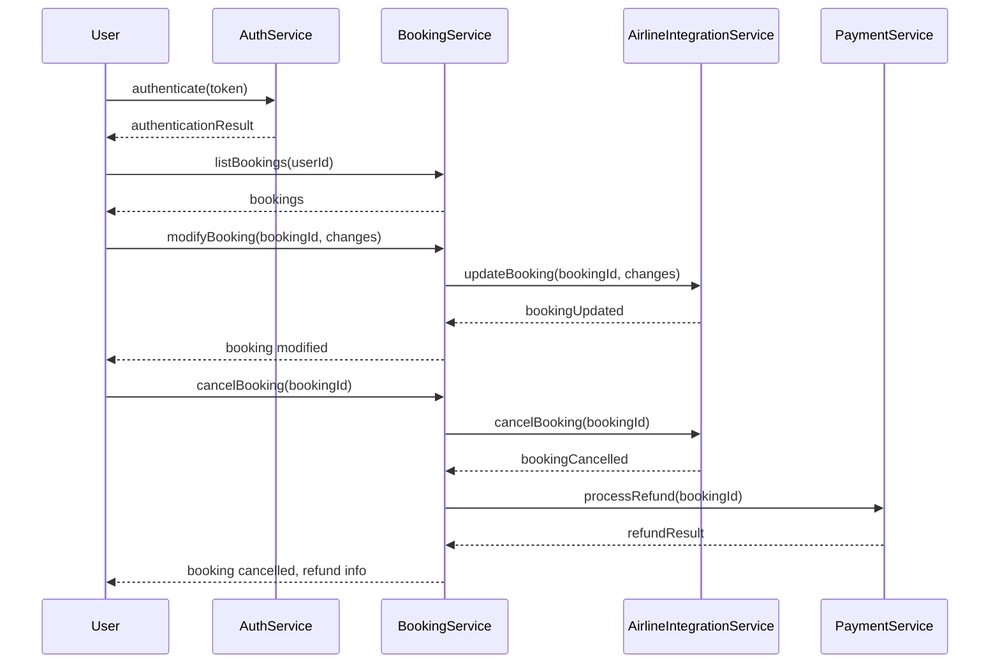
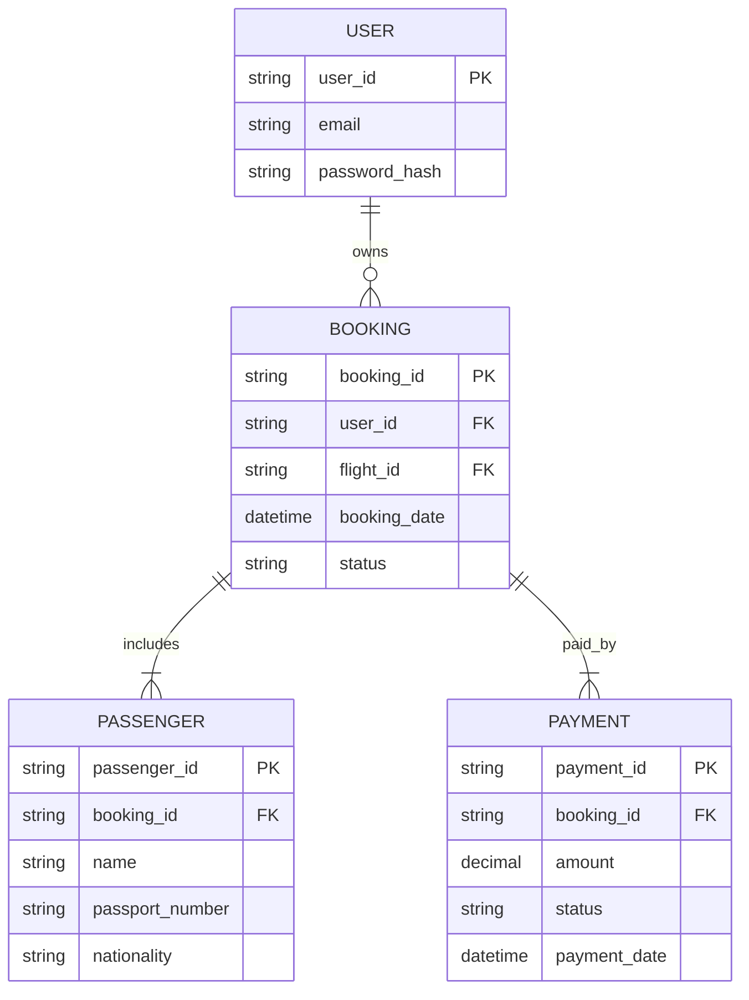

# For User Story Number [2]

1. Objective
This feature allows travelers to view and manage their air transport bookings, including making changes or cancellations as permitted. Users can see all relevant booking information and perform modifications or cancellations in accordance with airline policies. The system ensures secure access, processes refunds as per fare rules, and provides confirmation for all actions.

2. API Model
  2.1 Common Components/Services
  - BookingService (existing)
  - UserService (existing)
  - AirlineIntegrationService (existing)
  - PaymentService (existing)
  - AuthService (existing)

  2.2 API Details
| Operation | REST Method | Type | URL | Request | Response |
|-----------|-------------|------|-----|---------|----------|
| List Bookings | GET | Success/Failure | /api/bookings | N/A | { "bookings": [ { "bookingId": "", "flightId": "", "status": "", "date": "", "passengerDetails": { ... } } ] } |
| View Booking Details | GET | Success/Failure | /api/bookings/{bookingId} | N/A | { "bookingId": "", "flightId": "", "status": "", "date": "", "passengerDetails": { ... }, "refundEligible": true } |
| Modify Booking | PUT | Success/Failure | /api/bookings/{bookingId} | { "newDate": "", "passengerDetails": { ... } } | { "bookingId": "", "status": "MODIFIED" } |
| Cancel Booking | DELETE | Success/Failure | /api/bookings/{bookingId} | N/A | { "bookingId": "", "status": "CANCELLED", "refund": { "amount": 0, "status": "PENDING" } } |

  2.3 Exceptions
  - BookingModificationWindowException
  - BookingNotFoundException
  - UnauthorizedAccessException
  - CancellationPolicyException
  - RefundProcessingException

3. Functional Design
  3.1 Class Diagram

  3.2 UML Sequence Diagram

  3.3 Components
| Component Name | Description | Existing/New |
|----------------|-------------|--------------|
| BookingService | Manages bookings, modifications, and cancellations | Existing |
| UserService | Handles user authentication and authorization | Existing |
| AirlineIntegrationService | Communicates with airline APIs for booking updates | Existing |
| PaymentService | Processes refunds for cancellations | Existing |
| AuthService | Handles authentication tokens | Existing |

  3.4 Service Layer Logic as per the user story requirement and Validations
| FieldName | Validation | Error Message | ClassUsed |
|-----------|-----------|--------------|-----------|
| bookingId | Must exist and belong to user | Booking not found or unauthorized | BookingService |
| modificationWindow | Within allowed window | Modification not allowed | BookingService |
| cancellationPolicy | Must comply with airline rules | Cancellation not permitted | BookingService |
| userAuthentication | Valid token required | User not authenticated | AuthService |

4. Integrations
| SystemToBeIntegrated | IntegratedFor | IntegrationType |
|----------------------|--------------|-----------------|
| Airline APIs | Booking modification/cancellation | API |
| Payment Gateway | Refund processing | API |
| Auth Service | User authentication | API |

5. DB Details
  5.1 ER Model

  5.2 DB Validations
  - Foreign key constraints between user, booking, passenger, and payment
  - Booking status must be consistent with modification/cancellation
  - Refund amount must not exceed payment amount

6. Non-Functional Requirements
  6.1 Performance
    - Booking management actions must complete within 3 seconds.
    - Indexing on booking and user tables for fast lookup.
  6.2 Security
    6.2.1 Authentication
      - OAuth2/JWT for API authentication.
      - HTTPS for all endpoints.
    6.2.2 Authorization
      - Only booking owners can modify/cancel their bookings.
  6.3 Logging
    6.3.1 Application Logging
      - INFO: All booking changes, cancellations, and refunds.
      - ERROR: Failed modifications, cancellations, or refunds.
      - DEBUG: API request/response payloads.
    6.3.2 Audit Log
      - Log all changes and cancellations for compliance.

7. Dependencies
  - Airline APIs for booking management
  - Payment gateway for refunds
  - Auth service for user authentication

8. Assumptions
  - Airline APIs provide real-time booking modification/cancellation support.
  - Refunds are processed as per airline and payment gateway rules.
  - User authentication is secure and reliable.
