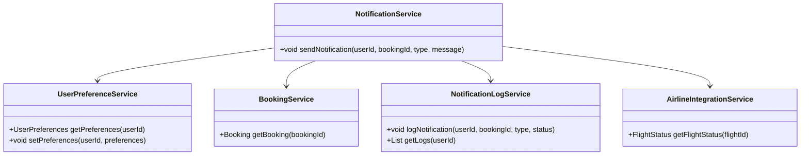
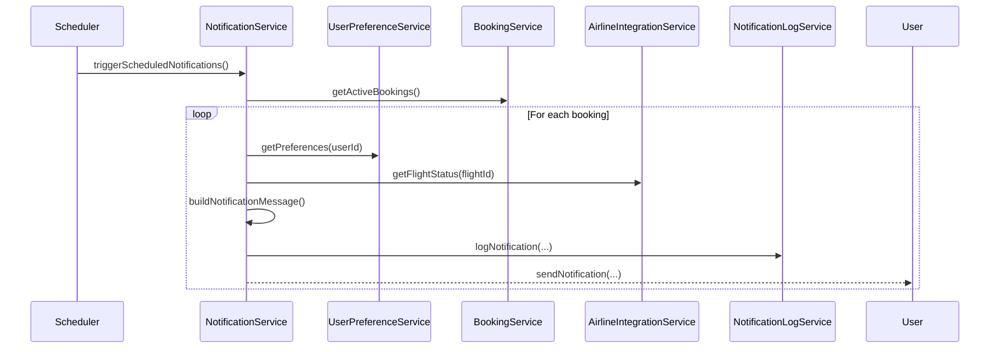
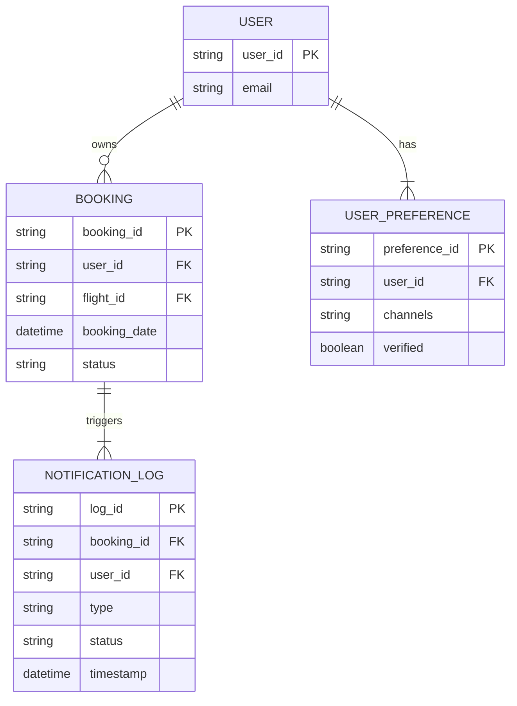

# For User Story Number [3]

1. Objective
This feature enables travelers to receive timely notifications about their flight status and schedule, including reminders, gate changes, delays, and cancellations. Users can select their preferred notification channels (email, SMS, push). The system ensures notifications are delivered promptly and logged for audit.

2. API Model
  2.1 Common Components/Services
  - NotificationService (new)
  - UserPreferenceService (existing)
  - BookingService (existing)
  - AirlineIntegrationService (existing)
  - NotificationLogService (new)

  2.2 API Details
| Operation | REST Method | Type | URL | Request | Response |
|-----------|-------------|------|-----|---------|----------|
| Set Notification Preferences | POST | Success/Failure | /api/users/{userId}/notifications | { "channels": ["EMAIL", "SMS", "PUSH"], "verified": true } | { "status": "SAVED" } |
| Get Notification Preferences | GET | Success/Failure | /api/users/{userId}/notifications | N/A | { "channels": ["EMAIL", "SMS"], "verified": true } |
| Send Notification | POST | Success/Failure | /api/notifications | { "userId": "", "bookingId": "", "type": "REMINDER", "message": "..." } | { "status": "SENT" } |
| Get Notification Log | GET | Success/Failure | /api/notifications/log?userId={userId} | N/A | { "notifications": [ { "type": "REMINDER", "timestamp": "", "status": "SENT" } ] } |

  2.3 Exceptions
  - NotificationPreferenceNotSetException
  - NotificationDeliveryException
  - BookingNotActiveException
  - NotificationLogException

3. Functional Design
  3.1 Class Diagram

  3.2 UML Sequence Diagram

  3.3 Components
| Component Name | Description | Existing/New |
|----------------|-------------|--------------|
| NotificationService | Sends notifications to users | New |
| UserPreferenceService | Manages notification preferences | Existing |
| BookingService | Retrieves booking details | Existing |
| AirlineIntegrationService | Fetches real-time flight status | Existing |
| NotificationLogService | Logs all sent notifications | New |

  3.4 Service Layer Logic as per the user story requirement and Validations
| FieldName | Validation | Error Message | ClassUsed |
|-----------|-----------|--------------|-----------|
| notificationPreferences | Must be set and verified | Notification preferences not set or verified | UserPreferenceService |
| bookingStatus | Must be active | Notification only for active bookings | BookingService |
| notificationLog | Must be written | Notification log failure | NotificationLogService |

4. Integrations
| SystemToBeIntegrated | IntegratedFor | IntegrationType |
|----------------------|--------------|-----------------|
| Airline APIs | Real-time flight status | API |
| Email/SMS/Push Providers | Notification delivery | API |

5. DB Details
  5.1 ER Model

  5.2 DB Validations
  - Notification logs must be written for every sent notification
  - Only active bookings trigger notifications
  - User preferences must be verified before sending

6. Non-Functional Requirements
  6.1 Performance
    - Notifications must be delivered within 1 minute of event detection.
    - Optimized queries for notification log retrieval.
  6.2 Security
    6.2.1 Authentication
      - OAuth2/JWT for API authentication.
      - HTTPS for all endpoints.
    6.2.2 Authorization
      - Only users can access their own notification logs/preferences.
  6.3 Logging
    6.3.1 Application Logging
      - INFO: All notification sends and failures.
      - ERROR: Notification delivery or log failures.
      - DEBUG: Notification payloads.
    6.3.2 Audit Log
      - Log all sent notifications for 1 year for audit.

7. Dependencies
  - Airline APIs for flight status
  - Email/SMS/Push providers for notifications

8. Assumptions
  - User preferences are set and verified before notification delivery.
  - Notification providers are reliable and available.
  - Flight status APIs provide real-time updates.
