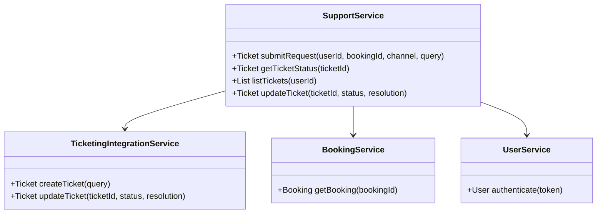
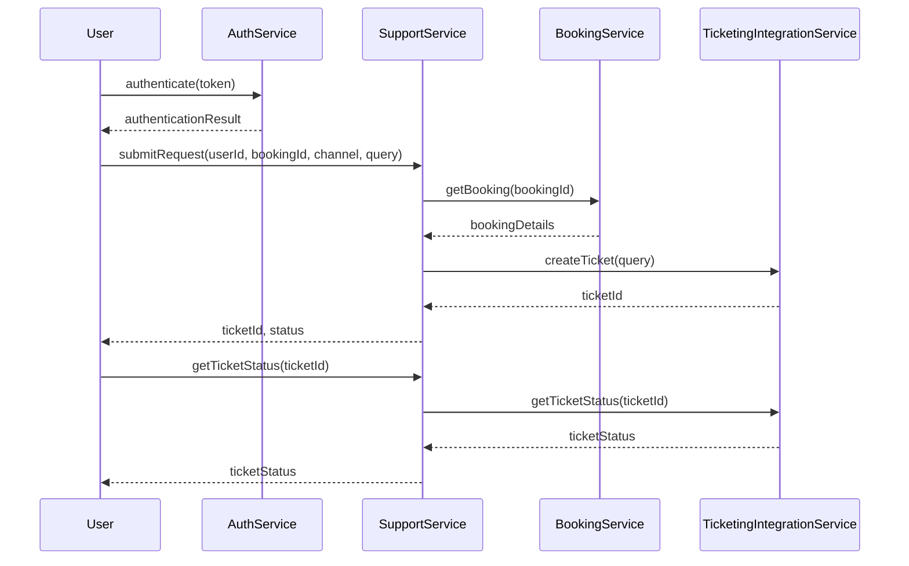
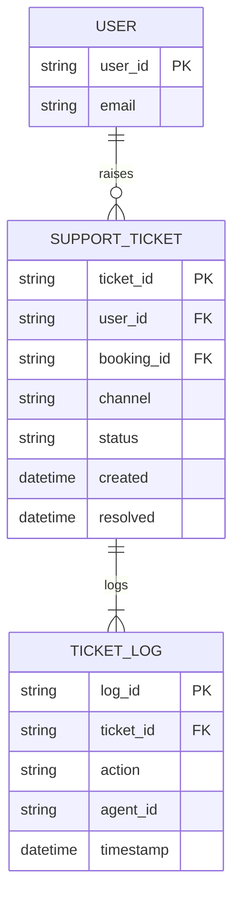

# For User Story Number [4]

1. Objective
This feature allows travelers to contact customer support for their air transport bookings via chat, email, or phone. Users can submit queries, receive a ticket number, and track the status and resolution of their requests. Support agents can access booking details to assist users and all interactions are logged and tracked until resolution.

2. API Model
  2.1 Common Components/Services
  - SupportService (new)
  - BookingService (existing)
  - UserService (existing)
  - TicketingIntegrationService (new)
  - AuthService (existing)

  2.2 API Details
| Operation | REST Method | Type | URL | Request | Response |
|-----------|-------------|------|-----|---------|----------|
| Submit Support Request | POST | Success/Failure | /api/support/requests | { "userId": "", "bookingId": "", "channel": "CHAT", "query": "..." } | { "ticketId": "", "status": "OPEN" } |
| Get Support Ticket Status | GET | Success/Failure | /api/support/tickets/{ticketId} | N/A | { "ticketId": "", "status": "IN_PROGRESS", "resolution": "..." } |
| List Support Tickets | GET | Success/Failure | /api/support/tickets?userId={userId} | N/A | { "tickets": [ { "ticketId": "", "status": "RESOLVED", "created": "..." } ] } |
| Agent Update Ticket | PUT | Success/Failure | /api/support/tickets/{ticketId} | { "status": "RESOLVED", "resolution": "..." } | { "ticketId": "", "status": "RESOLVED" } |

  2.3 Exceptions
  - UnauthorizedSupportRequestException
  - TicketNotFoundException
  - TicketUpdateException
  - SLABreachException

3. Functional Design
  3.1 Class Diagram

  3.2 UML Sequence Diagram

  3.3 Components
| Component Name | Description | Existing/New |
|----------------|-------------|--------------|
| SupportService | Handles support requests and ticket tracking | New |
| BookingService | Retrieves booking details | Existing |
| UserService | Handles user authentication | Existing |
| TicketingIntegrationService | Integrates with third-party support/ticketing | New |
| AuthService | Handles authentication tokens | Existing |

  3.4 Service Layer Logic as per the user story requirement and Validations
| FieldName | Validation | Error Message | ClassUsed |
|-----------|-----------|--------------|-----------|
| userAuthentication | Must be authenticated | User not authenticated | AuthService |
| bookingId | Must belong to user | Unauthorized support request | SupportService |
| query | Must be present | Query cannot be empty | SupportService |
| ticketStatus | Must be updated until resolution | Ticket not updated | TicketingIntegrationService |
| sla | Response within SLA | SLA breach | SupportService |

4. Integrations
| SystemToBeIntegrated | IntegratedFor | IntegrationType |
|----------------------|--------------|-----------------|
| Ticketing Platform (e.g., Zendesk) | Support ticket creation/tracking | API |
| Booking Service | Retrieve booking details | API |
| Auth Service | User authentication | API |

5. DB Details
  5.1 ER Model

  5.2 DB Validations
  - Support tickets must be linked to authenticated users
  - Ticket logs must be written for every action
  - SLA response times must be tracked

6. Non-Functional Requirements
  6.1 Performance
    - Support requests must be acknowledged within 1 minute.
    - Ticket lookup and status retrieval optimized for speed.
  6.2 Security
    6.2.1 Authentication
      - OAuth2/JWT for API authentication.
      - HTTPS for all endpoints.
    6.2.2 Authorization
      - Only users can access their own tickets.
      - Agents can access tickets assigned to them.
  6.3 Logging
    6.3.1 Application Logging
      - INFO: All support requests, ticket updates, and resolutions.
      - ERROR: Ticket creation/update failures, SLA breaches.
      - DEBUG: Support request payloads.
    6.3.2 Audit Log
      - Log all ticket actions for 2 years for audit.

7. Dependencies
  - Ticketing platform (e.g., Zendesk)
  - Booking service for booking details
  - Auth service for user authentication

8. Assumptions
  - Ticketing platform APIs are reliable and available.
  - Booking service provides up-to-date booking details.
  - SLA definitions are clearly established and monitored.
