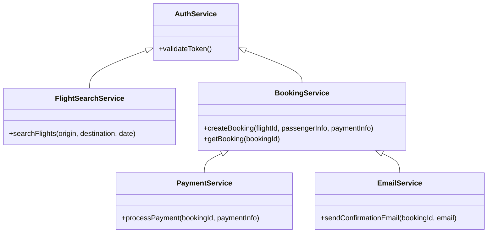
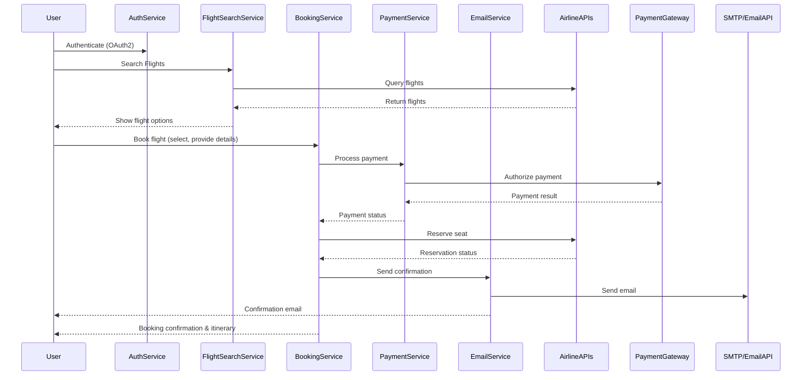

# For User Story Number [1]

1. Objective
The objective is to enable travelers to search, compare, and book air transport tickets online. The solution must support multiple airlines, secure payment options, and provide confirmation and itinerary details upon successful booking. The system should ensure a seamless, secure, and performant user experience.

2. API Model
  2.1 Common Components/Services
  - Authentication Service (OAuth2)
  - Airline Integration Service
  - Payment Gateway Service
  - Email Notification Service
  - Booking Service

  2.2 API Details
| Operation   | REST Method | Type    | URL                                | Request (Sample JSON)                                                                 | Response (Sample JSON)                                                                 |
|-------------|-------------|---------|-------------------------------------|---------------------------------------------------------------------------------------|----------------------------------------------------------------------------------------|
| Search      | GET         | Success | /api/flights/search                 | {"origin": "JFK", "destination": "LAX", "departureDate": "2025-11-01"}         | [{"flightId": "F123", "airline": "Delta", "price": 350, "departureTime": "10:00"}] |
| Book        | POST        | Success | /api/bookings                       | {"flightId": "F123", "passengerInfo": {...}, "paymentInfo": {...}}                | {"bookingId": "B456", "status": "CONFIRMED", "itinerary": {...}}                  |
| Book        | POST        | Failure | /api/bookings                       | {"flightId": "F123", "passengerInfo": {...}, "paymentInfo": {...}}                | {"error": "Payment authorization failed."}                                           |
| Payment     | POST        | Success | /api/payments                       | {"bookingId": "B456", "paymentInfo": {...}}                                        | {"paymentStatus": "SUCCESS", "transactionId": "T789"}                              |
| Payment     | POST        | Failure | /api/payments                       | {"bookingId": "B456", "paymentInfo": {...}}                                        | {"error": "Card declined."}                                                          |
| Confirmation| GET         | Success | /api/bookings/{bookingId}/confirm   |                                                                                       | {"bookingId": "B456", "status": "CONFIRMED", "itinerary": {...}}                  |

  2.3 Exceptions
  - FlightNotFoundException: Thrown if no flights match search criteria.
  - PaymentAuthorizationException: Thrown if payment fails.
  - BookingOverbookedException: Thrown if seat is no longer available.
  - InvalidInputException: Thrown if required fields are missing or invalid.

3 Functional Design
  3.1 Class Diagram


  3.2 UML Sequence Diagram


  3.3 Components
| Component Name         | Description                                              | Existing/New |
|-----------------------|----------------------------------------------------------|--------------|
| AuthService           | Handles user authentication and token validation         | Existing     |
| FlightSearchService   | Manages flight search and airline API integration        | New          |
| BookingService        | Handles booking creation, seat reservation, and status   | New          |
| PaymentService        | Handles payment processing and gateway integration       | New          |
| EmailService          | Sends booking confirmation and itinerary via email       | Existing     |

  3.4 Service Layer Logic and Validations
| FieldName        | Validation                                      | Error Message                        | ClassUsed           |
|------------------|------------------------------------------------|--------------------------------------|---------------------|
| origin           | Must not be empty                               | Origin is required                   | FlightSearchService |
| destination      | Must not be empty                               | Destination is required              | FlightSearchService |
| departureDate    | Must be a valid future date                     | Invalid departure date               | FlightSearchService |
| passengerInfo    | All required fields must be present             | Passenger info incomplete            | BookingService      |
| paymentInfo      | Valid card, authorized, PCI compliant           | Payment information invalid          | PaymentService      |
| bookingId        | Must exist and be valid                         | Booking not found                    | BookingService      |

4 Integrations
| SystemToBeIntegrated | IntegratedFor         | IntegrationType |
|----------------------|----------------------|-----------------|
| Airline APIs         | Flight search, booking| API (REST/GraphQL) |
| Payment Gateway      | Payment processing    | API (REST)      |
| Email Service        | Confirmation/Itinerary| API/SMTP        |

5 DB Details
  5.1 ER Model
```mermaid
erDiagram
    USER ||--o{ BOOKING : makes
    BOOKING ||--|{ PASSENGER : includes
    BOOKING ||--|{ PAYMENT : has
    BOOKING }|..|{ FLIGHT : reserves
    USER {
        user_id PK
        email
        name
        password_hash
    }
    BOOKING {
        booking_id PK
        user_id FK
        flight_id FK
        status
        created_at
    }
    PASSENGER {
        passenger_id PK
        booking_id FK
        name
        age
        passport_number
    }
    PAYMENT {
        payment_id PK
        booking_id FK
        amount
        status
        transaction_id
        paid_at
    }
    FLIGHT {
        flight_id PK
        airline
        origin
        destination
        departure_time
        arrival_time
        price
    }
```

  5.2 DB Validations
  - Unique constraint on booking_id, payment_id, passenger_id, flight_id.
  - Foreign key constraints between BOOKING, USER, FLIGHT, PASSENGER, and PAYMENT.
  - Not null constraints on all required fields.

6 Non-Functional Requirements
  6.1 Performance
  - API response time for search <2s under 1000+ concurrent users.
  - Caching of frequent search queries at API layer.
  - Asynchronous email sending.

  6.2 Security
    6.2.1 Authentication
    - OAuth2 authentication for all endpoints.
    - Integration with IAM provider.
    6.2.2 Authorization
    - Role-based access (traveler, admin).
    - Only authenticated users can book.
  6.3 Logging
    6.3.1 Application Logging
    - DEBUG: API requests/responses (masked sensitive data), integration calls.
    - INFO: Successful bookings, payments, confirmations.
    - ERROR: Failed bookings, payment errors, integration failures.
    - WARN: Slow API responses, retry attempts.
    6.3.2 Audit Log
    - Log all booking and payment activities with user, timestamp, and status.

7 Dependencies
  - Airline APIs must be available and reliable.
  - Payment gateway must be PCI-compliant and available.
  - Email service must support high throughput.

8 Assumptions
  - All airlines support real-time booking and seat reservation APIs.
  - Payment gateway supports all required payment methods.
  - Users have valid email addresses for confirmations.
