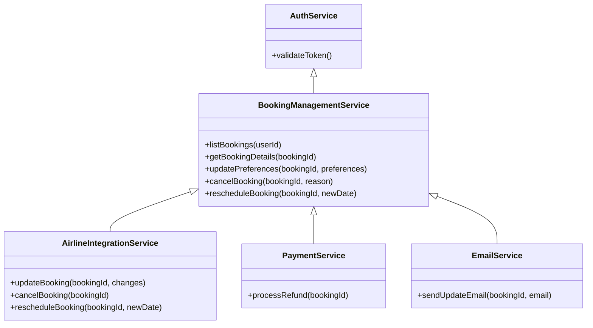
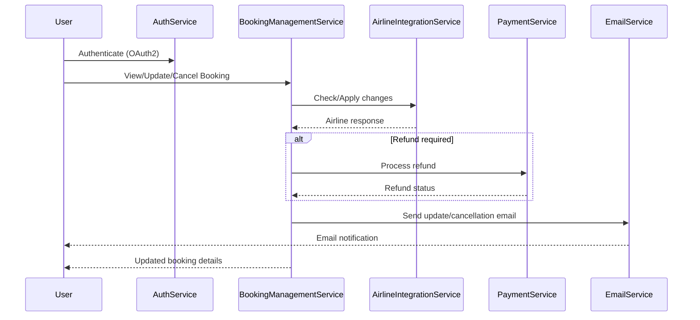

# For User Story Number [2]

1. Objective
Enable travelers to view, update, or cancel their air transport bookings online. The system must provide real-time booking details, allow preference updates and cancellations as per airline rules, and ensure all changes are reflected promptly and securely. All actions should be auditable and compliant with airline and payment policies.

2. API Model
  2.1 Common Components/Services
  - Authentication Service (OAuth2)
  - Booking Management Service
  - Airline Integration Service
  - Payment Gateway Service
  - Email Notification Service

  2.2 API Details
| Operation   | REST Method | Type    | URL                                         | Request (Sample JSON)                                             | Response (Sample JSON)                                              |
|-------------|-------------|---------|----------------------------------------------|-------------------------------------------------------------------|---------------------------------------------------------------------|
| List        | GET         | Success | /api/bookings                               |                                                                 | [{"bookingId": "B456", "flight": {...}, "status": "CONFIRMED"}]  |
| Details     | GET         | Success | /api/bookings/{bookingId}                   |                                                                 | {"bookingId": "B456", "flight": {...}, "passenger": {...}}        |
| Update      | PUT         | Success | /api/bookings/{bookingId}/preferences       | {"seat": "12A", "meal": "Vegetarian"}                          | {"bookingId": "B456", "status": "UPDATED", "preferences": {...}} |
| Cancel      | POST        | Success | /api/bookings/{bookingId}/cancel            | {"reason": "Change of plans"}                                   | {"bookingId": "B456", "status": "CANCELLED", "refund": 100}     |
| Reschedule  | POST        | Success | /api/bookings/{bookingId}/reschedule        | {"newDate": "2025-12-01"}                                      | {"bookingId": "B456", "status": "RESCHEDULED", "fees": 50}      |
| Update      | PUT         | Failure | /api/bookings/{bookingId}/preferences       | {"seat": "99Z"}                                                | {"error": "Seat not available."}                                  |
| Cancel      | POST        | Failure | /api/bookings/{bookingId}/cancel            | {"reason": "Change of plans"}                                   | {"error": "Cancellation not allowed as per fare rules."}           |

  2.3 Exceptions
  - BookingNotFoundException: Thrown if booking ID is invalid.
  - UnauthorizedAccessException: Thrown if user is not authenticated or not owner.
  - AirlineRuleViolationException: Thrown if update/cancel is not allowed.
  - RefundProcessingException: Thrown if refund fails.

3 Functional Design
  3.1 Class Diagram


  3.2 UML Sequence Diagram


  3.3 Components
| Component Name             | Description                                               | Existing/New |
|---------------------------|-----------------------------------------------------------|--------------|
| AuthService               | Handles user authentication and token validation          | Existing     |
| BookingManagementService  | Manages booking view, update, cancel, reschedule          | New          |
| AirlineIntegrationService | Integrates with airline APIs for booking management       | New          |
| PaymentService            | Handles refunds and payment adjustments                   | Existing     |
| EmailService              | Sends notifications for booking changes                   | Existing     |

  3.4 Service Layer Logic and Validations
| FieldName        | Validation                                      | Error Message                                 | ClassUsed                |
|------------------|------------------------------------------------|-----------------------------------------------|--------------------------|
| bookingId        | Must exist and belong to user                   | Booking not found or unauthorized             | BookingManagementService |
| seat             | Must be available and allowed by airline        | Seat not available                            | AirlineIntegrationService|
| meal             | Must be valid option                            | Invalid meal preference                       | AirlineIntegrationService|
| cancellation     | Allowed only if fare rules permit               | Cancellation not allowed                      | AirlineIntegrationService|
| refund           | Calculated as per airline/payment policy        | Refund processing failed                      | PaymentService           |

4 Integrations
| SystemToBeIntegrated | IntegratedFor           | IntegrationType |
|----------------------|------------------------|-----------------|
| Airline APIs         | Booking management     | API (REST)      |
| Payment Gateway      | Refunds                | API (REST)      |
| Email Service        | Notifications          | API/SMTP        |

5 DB Details
  5.1 ER Model
```mermaid
erDiagram
    USER ||--o{ BOOKING : owns
    BOOKING ||--|{ PREFERENCE : has
    BOOKING ||--|{ PAYMENT : has
    BOOKING ||--|{ AUDIT_LOG : logs
    USER {
        user_id PK
        email
        name
        password_hash
    }
    BOOKING {
        booking_id PK
        user_id FK
        flight_id FK
        status
        created_at
    }
    PREFERENCE {
        preference_id PK
        booking_id FK
        seat
        meal
    }
    PAYMENT {
        payment_id PK
        booking_id FK
        amount
        status
        transaction_id
        paid_at
    }
    AUDIT_LOG {
        log_id PK
        booking_id FK
        action
        timestamp
        user_id FK
    }
```

  5.2 DB Validations
  - Foreign key constraints between BOOKING, USER, PREFERENCE, PAYMENT, AUDIT_LOG.
  - Not null constraints on all required fields.
  - Booking status must be valid (enum: CONFIRMED, CANCELLED, RESCHEDULED).

6 Non-Functional Requirements
  6.1 Performance
  - All changes reflected within 5 seconds.
  - Optimistic locking for concurrent updates.

  6.2 Security
    6.2.1 Authentication
    - OAuth2 authentication for all endpoints.
    6.2.2 Authorization
    - Role-based access control (user can only manage own bookings).
  6.3 Logging
    6.3.1 Application Logging
    - DEBUG: API requests/responses, airline integration calls.
    - INFO: Booking updates, cancellations, refunds.
    - ERROR: Failed updates, airline API errors, refund failures.
    - WARN: Fare rule violations, retry attempts.
    6.3.2 Audit Log
    - Log all changes to bookings with user, timestamp, action, and status.

7 Dependencies
  - Airline APIs must support real-time booking management.
  - Payment gateway must support refunds and adjustments.

8 Assumptions
  - Airline fare rules are accessible via API and up-to-date.
  - Users are authenticated and authorized for their bookings.
