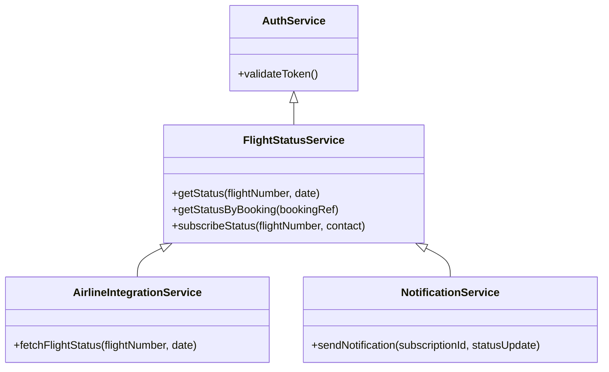
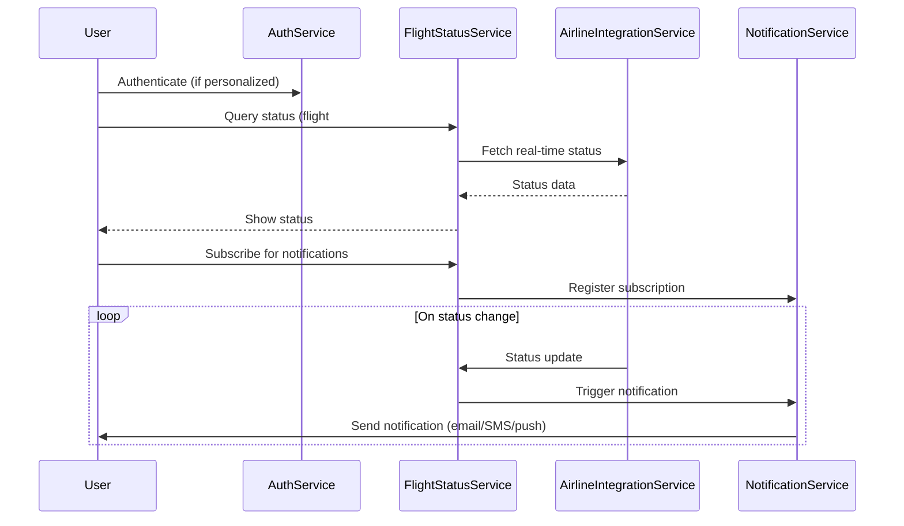

# For User Story Number [3]

1. Objective
Enable travelers to check the real-time status of their flights, including delays, gate changes, and cancellations. The system should provide up-to-date information and notifications for status changes. All status queries and alerts must be accurate, timely, and auditable.

2. API Model
  2.1 Common Components/Services
  - Authentication Service (for personalized notifications)
  - Flight Status Service
  - Notification Service (email/SMS/push)
  - Airline/Airport Integration Service

  2.2 API Details
| Operation   | REST Method | Type    | URL                                       | Request (Sample JSON)                                      | Response (Sample JSON)                                                  |
|-------------|-------------|---------|--------------------------------------------|------------------------------------------------------------|-------------------------------------------------------------------------|
| Status      | GET         | Success | /api/flights/status                       | {"flightNumber": "DL123", "date": "2025-11-01"}         | {"flightNumber": "DL123", "status": "DELAYED", "gate": "A10", "departureTime": "12:30"} |
| Status      | GET         | Success | /api/flights/status                       | {"bookingRef": "B456"}                                   | {"flightNumber": "DL123", "status": "ON TIME", ...}                                   |
| Subscribe   | POST        | Success | /api/flights/status/subscribe             | {"flightNumber": "DL123", "contact": "user@email.com"}  | {"subscriptionId": "S789", "status": "SUBSCRIBED"}                                |
| Status      | GET         | Failure | /api/flights/status                       | {"flightNumber": "INVALID"}                              | {"error": "Flight not found."}                                             |

  2.3 Exceptions
  - FlightNotFoundException: Thrown if flight number or booking reference is invalid.
  - NotificationOptInException: Thrown if user has not opted in for notifications.
  - DataSourceException: Thrown if airline/airport API is unavailable.

3 Functional Design
  3.1 Class Diagram


  3.2 UML Sequence Diagram


  3.3 Components
| Component Name             | Description                                               | Existing/New |
|---------------------------|-----------------------------------------------------------|--------------|
| AuthService               | Handles user authentication for personalized notifications| Existing     |
| FlightStatusService       | Manages status queries and subscriptions                  | New          |
| AirlineIntegrationService | Fetches real-time status from airline/airport APIs        | New          |
| NotificationService       | Sends notifications on status changes                     | Existing     |

  3.4 Service Layer Logic and Validations
| FieldName        | Validation                                      | Error Message                                 | ClassUsed                |
|------------------|------------------------------------------------|-----------------------------------------------|--------------------------|
| flightNumber     | Must exist and be valid                         | Flight not found                              | AirlineIntegrationService|
| bookingRef       | Must exist and be valid                         | Booking reference invalid                     | FlightStatusService      |
| contact          | Must be valid email/SMS/push token              | Invalid contact information                   | NotificationService      |
| timeZone         | Must be supported and valid                     | Invalid time zone                             | FlightStatusService      |
| notificationOpt  | Must be true to receive notifications           | Not opted in for notifications                | NotificationService      |

4 Integrations
| SystemToBeIntegrated | IntegratedFor           | IntegrationType |
|----------------------|------------------------|-----------------|
| Airline/Airport APIs | Flight status updates  | API (REST)      |
| Notification Service | Status change alerts   | API (REST/SMTP/SMS/Push) |

5 DB Details
  5.1 ER Model
```mermaid
erDiagram
    USER ||--o{ SUBSCRIPTION : has
    SUBSCRIPTION ||--|{ FLIGHT_STATUS : tracks
    USER {
        user_id PK
        email
        name
        password_hash
    }
    SUBSCRIPTION {
        subscription_id PK
        user_id FK
        flight_number
        contact
        opt_in
        created_at
    }
    FLIGHT_STATUS {
        status_id PK
        flight_number
        status
        gate
        departure_time
        arrival_time
        updated_at
    }
```

  5.2 DB Validations
  - Foreign key constraints between SUBSCRIPTION and USER.
  - Not null constraints on all required fields.
  - Unique constraint on subscription_id and status_id.

6 Non-Functional Requirements
  6.1 Performance
  - Status updates reflected within 1 minute of source change.
  - Scalable to 10,000+ queries per hour.
  - Caching for frequent status queries.

  6.2 Security
    6.2.1 Authentication
    - Required for personalized notifications.
    6.2.2 Authorization
    - Only subscribed users receive notifications for their flights.
  6.3 Logging
    6.3.1 Application Logging
    - DEBUG: Status poll requests/responses, notification triggers.
    - INFO: Successful subscriptions, status changes.
    - ERROR: API failures, notification delivery failures.
    - WARN: Delayed updates, retry attempts.
    6.3.2 Audit Log
    - Log all status queries and notifications with user, timestamp, and status.

7 Dependencies
  - Airline/airport APIs must provide real-time status.
  - Notification service must support high throughput and retries.

8 Assumptions
  - All flight status data is available from authoritative sources.
  - Users provide valid contact information for notifications.
