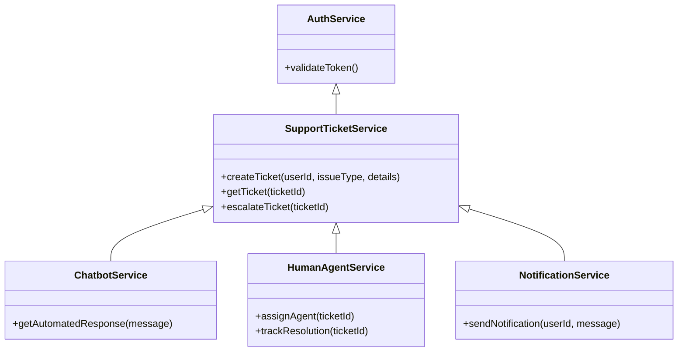
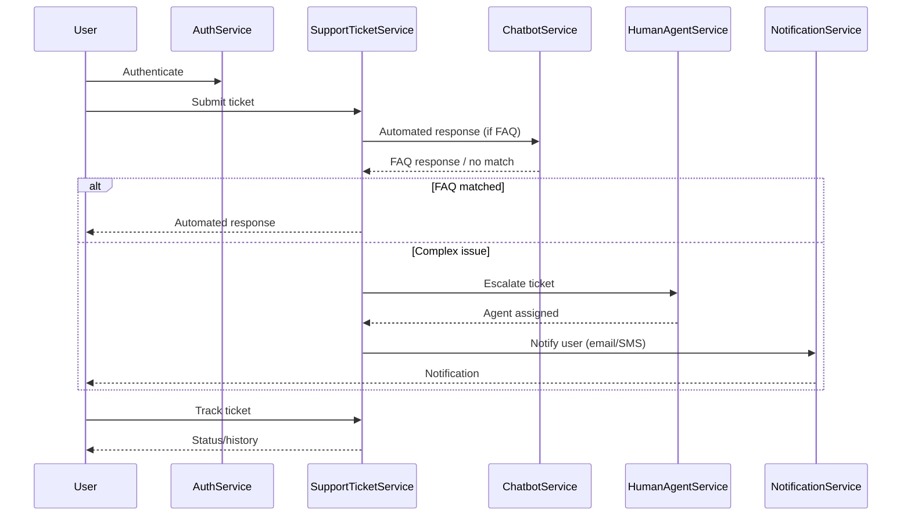

# For User Story Number [4]

1. Objective
Provide travelers with multi-channel access to customer support for air transport needs, including issue reporting, assistance requests, and status tracking. The system should offer automated responses for common queries and escalate complex issues to human agents, ensuring timely and auditable resolution. All interactions must be secure, accurate, and compliant with data privacy regulations.

2. API Model
  2.1 Common Components/Services
  - Authentication Service
  - Support Ticket Service
  - Chatbot/NLP Engine
  - Human Agent Assignment Service
  - Notification Service (email/SMS)

  2.2 API Details
| Operation   | REST Method | Type    | URL                                         | Request (Sample JSON)                                             | Response (Sample JSON)                                              |
|-------------|-------------|---------|----------------------------------------------|-------------------------------------------------------------------|---------------------------------------------------------------------|
| Submit      | POST        | Success | /api/support/tickets                        | {"userId": "U123", "issueType": "Lost Baggage", "details": "..."} | {"ticketId": "T456", "status": "OPEN", "reference": "REF789"}  |
| Track       | GET         | Success | /api/support/tickets/{ticketId}             |                                                                 | {"ticketId": "T456", "status": "IN PROGRESS", "history": [...] } |
| Chat        | POST        | Success | /api/support/chat                           | {"userId": "U123", "message": "How to change my seat?"}           | {"response": "You can update your seat in the bookings section."}   |
| Escalate    | POST        | Success | /api/support/tickets/{ticketId}/escalate    |                                                                 | {"ticketId": "T456", "status": "ESCALATED", "agent": "A001"}   |
| Submit      | POST        | Failure | /api/support/tickets                        | {"userId": "U123", "issueType": "", "details": "..."}           | {"error": "Issue type required."}                                   |

  2.3 Exceptions
  - TicketNotFoundException: Thrown if ticket ID is invalid.
  - InvalidInputException: Thrown if required fields are missing.
  - EscalationTimeoutException: Thrown if escalation is not resolved within SLA.
  - ChatbotNoMatchException: Thrown if automated response cannot be found.

3 Functional Design
  3.1 Class Diagram


  3.2 UML Sequence Diagram


  3.3 Components
| Component Name             | Description                                               | Existing/New |
|---------------------------|-----------------------------------------------------------|--------------|
| AuthService               | Handles user authentication                               | Existing     |
| SupportTicketService      | Manages ticket creation, tracking, escalation             | New          |
| ChatbotService            | Provides automated FAQ responses using NLP                | New          |
| HumanAgentService         | Assigns human agents and tracks escalations               | New          |
| NotificationService       | Sends notifications for ticket updates                    | Existing     |

  3.4 Service Layer Logic and Validations
| FieldName        | Validation                                      | Error Message                                 | ClassUsed                |
|------------------|------------------------------------------------|-----------------------------------------------|--------------------------|
| userId           | Must be authenticated and valid                 | User not authenticated                        | AuthService              |
| issueType        | Must not be empty and valid                     | Issue type required                           | SupportTicketService      |
| details          | Must not be empty                               | Details required                              | SupportTicketService      |
| ticketId         | Must exist and belong to user                   | Ticket not found or unauthorized              | SupportTicketService      |
| escalation       | SLA compliance, must be tracked                 | Escalation not resolved within SLA            | HumanAgentService        |

4 Integrations
| SystemToBeIntegrated | IntegratedFor           | IntegrationType |
|----------------------|------------------------|-----------------|
| Chatbot/NLP Engine   | Automated FAQ responses| API (REST)      |
| Email/SMS Gateway    | Ticket notifications   | API/SMTP/SMS    |
| Ticketing System API | Human agent workflow   | API (REST)      |

5 DB Details
  5.1 ER Model
```mermaid
erDiagram
    USER ||--o{ SUPPORT_TICKET : raises
    SUPPORT_TICKET ||--|{ TICKET_HISTORY : logs
    SUPPORT_TICKET ||--|{ ESCALATION : escalates
    USER {
        user_id PK
        email
        name
        password_hash
    }
    SUPPORT_TICKET {
        ticket_id PK
        user_id FK
        issue_type
        details
        status
        created_at
    }
    TICKET_HISTORY {
        history_id PK
        ticket_id FK
        action
        timestamp
        agent_id
    }
    ESCALATION {
        escalation_id PK
        ticket_id FK
        agent_id
        escalated_at
        resolved_at
        sla_met
    }
```

  5.2 DB Validations
  - Foreign key constraints between SUPPORT_TICKET, USER, TICKET_HISTORY, ESCALATION.
  - Not null constraints on all required fields.
  - SLA compliance field (sla_met) must be boolean and tracked.

6 Non-Functional Requirements
  6.1 Performance
  - Chat response time <1 min.
  - 24/7 system availability.
  - Automated FAQ accuracy >90%.

  6.2 Security
    6.2.1 Authentication
    - User authentication required for all support requests.
    6.2.2 Authorization
    - Users can only access their own tickets.
    - GDPR-compliant data handling.
  6.3 Logging
    6.3.1 Application Logging
    - DEBUG: Ticket creation, chat requests, escalation triggers.
    - INFO: Ticket status changes, agent assignments.
    - ERROR: Failed escalations, integration errors.
    - WARN: SLA breaches, retry attempts.
    6.3.2 Audit Log
    - Log all support interactions with user, timestamp, action, and status.

7 Dependencies
  - Chatbot/NLP engine must support FAQ matching.
  - Ticketing system API must support escalation and agent assignment.
  - Email/SMS gateway must support high throughput.

8 Assumptions
  - Users are authenticated and provide valid contact details.
  - FAQ database is regularly updated for accuracy.
