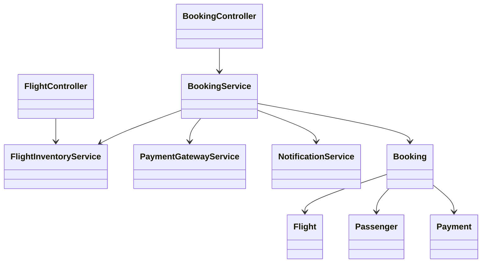
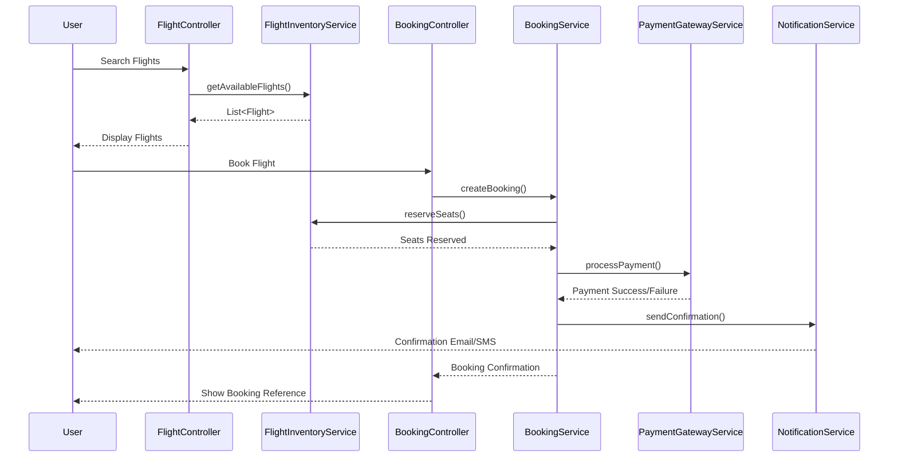
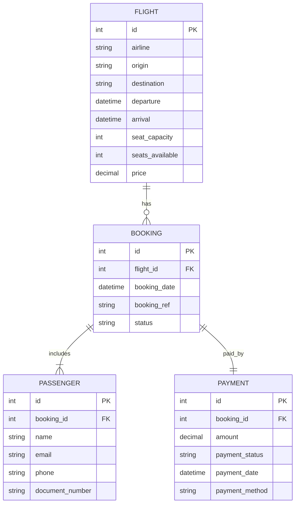

# For User Story Number [1]

1. Objective
The objective is to enable travelers to search, select, and book air transport tickets online via a web platform. The system must provide real-time flight availability, pricing, and booking confirmation. This ensures a convenient, secure, and efficient booking experience for users from anywhere.

2. API Model
  2.1 Common Components/Services
  - FlightInventoryService (integration with airline APIs)
  - PaymentGatewayService (integration with PCI DSS compliant payment provider)
  - BookingService (handles booking logic)
  - NotificationService (handles email/SMS confirmations)

  2.2 API Details
| Operation   | REST Method | Type     | URL                      | Request (Sample)                                                                 | Response (Sample)                                                                |
|-------------|-------------|----------|--------------------------|----------------------------------------------------------------------------------|----------------------------------------------------------------------------------|
| Search      | GET         | Success  | /api/flights/search      | {"origin":"JFK","destination":"LAX","date":"2025-10-10","passengers":2}           | [{"flightId":1,"airline":"AA","departure":"10:00","arrival":"13:00","price":300}] |
| View        | GET         | Success  | /api/flights/{id}        | N/A                                                                              | {"flightId":1,"airline":"AA","departure":"10:00","arrival":"13:00","price":300}   |
| Book        | POST        | Success  | /api/bookings            | {"flightId":1,"passengerDetails":[...],"paymentInfo":{...}}                      | {"bookingRef":"ABC123","status":"CONFIRMED","details":{...}}                        |
| Book        | POST        | Failure  | /api/bookings            | {"flightId":1,"passengerDetails":[...],"paymentInfo":{...}}                      | {"error":"Payment authorization failed"}                                         |

  2.3 Exceptions
  - FlightNotAvailableException: Returned if selected flight has no available seats.
  - PaymentFailedException: Returned if payment authorization fails.
  - ValidationException: Returned if mandatory fields are missing or invalid.

3 Functional Design
  3.1 Class Diagram

  3.2 UML Sequence Diagram

  3.3 Components
| Component Name           | Description                                                        | Existing/New |
|-------------------------|--------------------------------------------------------------------|--------------|
| FlightController        | Handles flight search/view endpoints                                | New          |
| BookingController       | Handles booking endpoints                                           | New          |
| FlightInventoryService  | Integrates with airline APIs for real-time flight data              | New          |
| BookingService          | Manages booking logic, seat reservation, and payment coordination   | New          |
| PaymentGatewayService   | Handles payment authorization and processing                        | New          |
| NotificationService     | Sends booking confirmation via email/SMS                            | New          |
| Flight                  | Entity representing a flight                                       | New          |
| Booking                 | Entity representing a booking                                      | New          |
| Passenger               | Entity representing a passenger                                    | New          |
| Payment                 | Entity representing a payment transaction                          | New          |

  3.4 Service Layer Logic and Validations
| FieldName         | Validation                                              | Error Message                        | ClassUsed             |
|-------------------|---------------------------------------------------------|--------------------------------------|-----------------------|
| origin            | Not null, valid airport code                            | Origin is required                   | FlightController      |
| destination       | Not null, valid airport code                            | Destination is required              | FlightController      |
| date              | Not null, valid date                                    | Date is required                     | FlightController      |
| passengerDetails  | Not empty, valid structure                              | Passenger details required           | BookingController     |
| paymentInfo       | Valid structure, passes payment gateway authorization    | Invalid payment information          | PaymentGatewayService |
| flightId          | Flight exists and has available seats                   | Flight not available                 | FlightInventoryService|

4 Integrations
| SystemToBeIntegrated | IntegratedFor          | IntegrationType |
|----------------------|-----------------------|-----------------|
| Airline APIs         | Real-time flight data | API             |
| Payment Gateway      | Payment processing    | API             |
| Email/SMS Provider   | Booking confirmation  | API             |

5 DB Details
  5.1 ER Model

  5.2 DB Validations
  - Unique constraint on booking_ref in BOOKING
  - Foreign key constraints between BOOKING, FLIGHT, PASSENGER, PAYMENT
  - Non-null constraints on all mandatory fields

6 Non-Functional Requirements
  6.1 Performance
  - API response time for booking must be < 5 seconds under normal load
  - Use caching for static flight data (e.g., airlines, airports)

  6.2 Security
    6.2.1 Authentication
    - All APIs must be protected via OAuth2/JWT tokens
    6.2.2 Authorization
    - Only authenticated users can book flights
    - Role-based access for admin endpoints (not in this user story)

  6.3 Logging
    6.3.1 Application Logging
    - DEBUG: API requests/responses (excluding sensitive data)
    - INFO: Successful bookings, searches
    - ERROR: Payment failures, booking errors
    - WARN: Suspicious activity, repeated failed attempts
    6.3.2 Audit Log
    - Log all booking attempts (success/failure) with user, timestamp, and action

7 Dependencies
  - Airline APIs (Amadeus, Sabre)
  - Payment Gateway (PCI DSS compliant)
  - Email/SMS provider

8 Assumptions
  - All airline APIs provide real-time seat and pricing data
  - Payment gateway is available and PCI DSS compliant
  - Email/SMS delivery is reliable and near-instant
