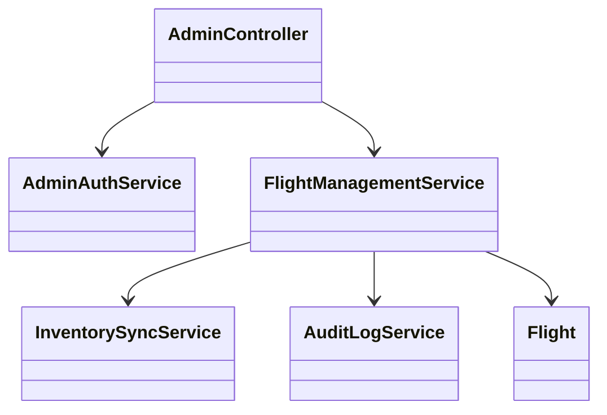
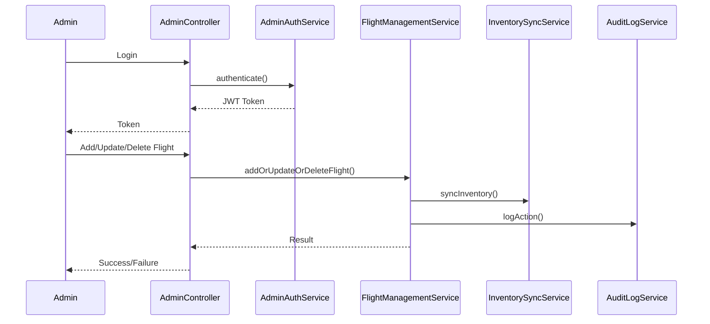
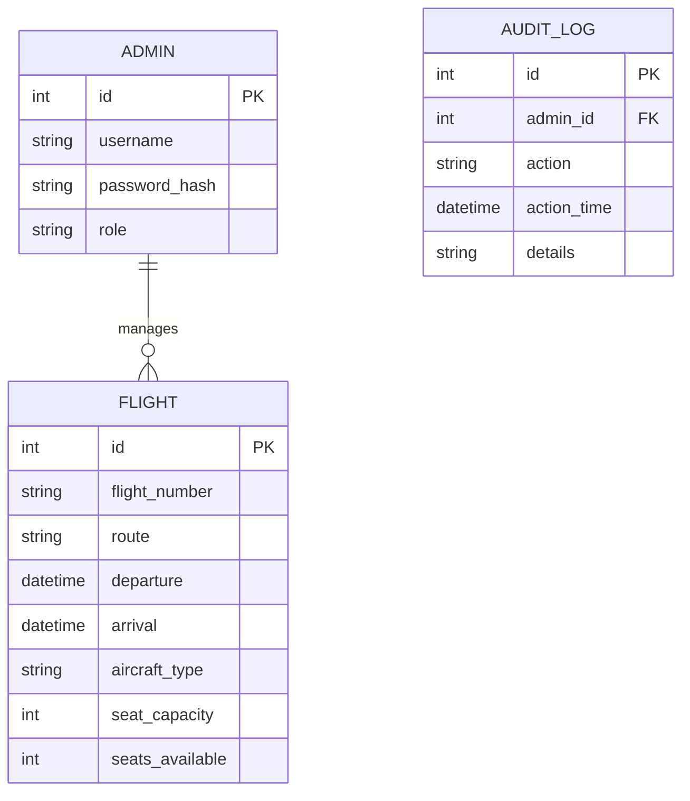

# For User Story Number [2]

1. Objective
The objective is to provide airline administrators with a secure portal to manage flight schedules and seat inventory. The system must allow real-time addition, update, and removal of flights, and ensure immediate synchronization with the booking engine. This ensures up-to-date availability for travelers and maximizes seat utilization.

2. API Model
  2.1 Common Components/Services
  - AdminAuthService (handles admin authentication and authorization)
  - FlightManagementService (handles CRUD operations for flights)
  - InventorySyncService (ensures real-time updates to booking system)
  - AuditLogService (logs all admin actions)

  2.2 API Details
| Operation   | REST Method | Type     | URL                          | Request (Sample)                                                                                   | Response (Sample)                                                                 |
|-------------|-------------|----------|------------------------------|----------------------------------------------------------------------------------------------------|-----------------------------------------------------------------------------------|
| Login       | POST        | Success  | /api/admin/login             | {"username":"admin","password":"secret"}                                                      | {"token":"jwt-token","role":"ADMIN"}                                         |
| Add Flight  | POST        | Success  | /api/admin/flights           | {"flightNumber":"AA123","route":"JFK-LAX","departure":"2025-10-10T10:00","arrival":"2025-10-10T13:00","aircraftType":"A320","seatCapacity":180} | {"flightId":1,"status":"ADDED"}                                               |
| Update Flight| PUT        | Success  | /api/admin/flights/{id}      | {"departure":"2025-10-10T11:00","seatCapacity":200}                                            | {"flightId":1,"status":"UPDATED"}                                            |
| Delete Flight| DELETE     | Success  | /api/admin/flights/{id}      | N/A                                                                                                | {"flightId":1,"status":"DELETED"}                                            |
| Update Seats| PATCH      | Success  | /api/admin/flights/{id}/seats| {"seatsAvailable":150}                                                                             | {"flightId":1,"seatsAvailable":150,"status":"UPDATED"}                      |

  2.3 Exceptions
  - UnauthorizedException: Returned if user is not authorized.
  - FlightNotFoundException: Returned if flight does not exist.
  - ValidationException: Returned if flight details are incomplete or invalid.
  - OverbookingException: Returned if seat updates result in overbooking.

3 Functional Design
  3.1 Class Diagram

  3.2 UML Sequence Diagram

  3.3 Components
| Component Name         | Description                                                  | Existing/New |
|-----------------------|--------------------------------------------------------------|--------------|
| AdminController       | Handles admin endpoints for flight management                | New          |
| AdminAuthService      | Authenticates and authorizes admin users                     | New          |
| FlightManagementService| Manages CRUD operations for flights and seat inventory      | New          |
| InventorySyncService  | Synchronizes flight and seat data with booking system        | New          |
| AuditLogService       | Logs all admin actions for auditing                          | New          |
| Flight                | Entity representing a flight                                | New          |

  3.4 Service Layer Logic and Validations
| FieldName      | Validation                                 | Error Message                  | ClassUsed             |
|---------------|--------------------------------------------|-------------------------------|-----------------------|
| username      | Not null, exists in admin DB                | Username is required          | AdminAuthService      |
| password      | Not null, matches stored hash               | Invalid credentials           | AdminAuthService      |
| flightNumber  | Not null, unique per day                    | Flight number required        | FlightManagementService|
| route         | Not null, valid airport codes               | Invalid route                 | FlightManagementService|
| departure     | Not null, valid datetime                    | Invalid departure time        | FlightManagementService|
| arrival       | Not null, valid datetime                    | Invalid arrival time          | FlightManagementService|
| aircraftType  | Not null                                   | Aircraft type required        | FlightManagementService|
| seatCapacity  | > 0, integer                                | Invalid seat capacity         | FlightManagementService|
| seatsAvailable| >= 0, <= seatCapacity, integer              | Overbooking not allowed       | FlightManagementService|

4 Integrations
| SystemToBeIntegrated | IntegratedFor             | IntegrationType |
|----------------------|--------------------------|-----------------|
| Airline Core Systems | Sync flight schedules    | API             |
| Booking Engine       | Real-time seat inventory | API             |
| Audit Log System     | Compliance/auditing      | API/File        |

5 DB Details
  5.1 ER Model

  5.2 DB Validations
  - Unique constraint on flight_number + departure date
  - Non-null constraints on all mandatory fields
  - Foreign key constraints between ADMIN, FLIGHT, AUDIT_LOG

6 Non-Functional Requirements
  6.1 Performance
  - Changes to flights and seats must propagate to booking system within 2 seconds
  - Support for concurrent admin updates

  6.2 Security
    6.2.1 Authentication
    - Admin login via JWT/OAuth2
    6.2.2 Authorization
    - Only users with ADMIN role can access admin endpoints

  6.3 Logging
    6.3.1 Application Logging
    - DEBUG: Admin API requests/responses (excluding sensitive data)
    - INFO: Flight additions, updates, deletions
    - ERROR: Failed updates, unauthorized access
    - WARN: Suspicious admin activity
    6.3.2 Audit Log
    - Log all admin actions with user, timestamp, action, and details

7 Dependencies
  - Airline core systems
  - Booking engine
  - Audit log system

8 Assumptions
  - Admins are pre-registered in the system
  - Airline core systems and booking engine are available and responsive
