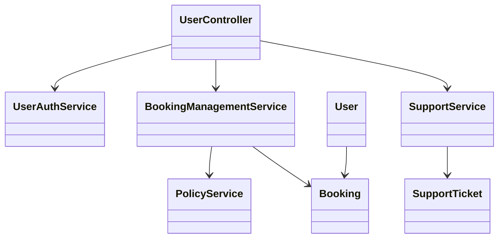
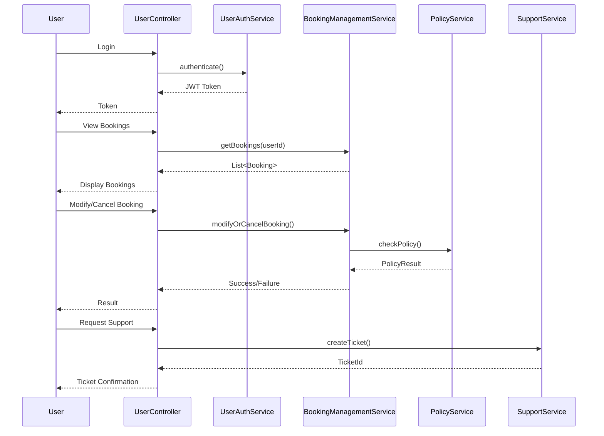
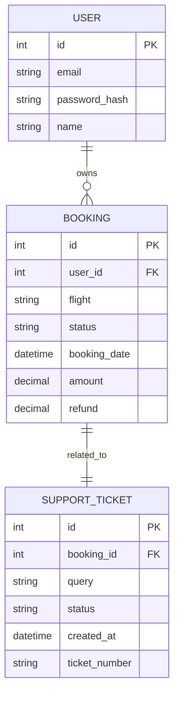

# For User Story Number [3]

1. Objective
The objective is to provide customers with a secure and user-friendly portal to view, manage, and request support for their air transport bookings. The system must allow authenticated users to view booking history, modify or cancel bookings as per policy, and submit support requests. This ensures customer empowerment and streamlined support for post-booking needs.

2. API Model
  2.1 Common Components/Services
  - UserAuthService (handles user authentication and session management)
  - BookingManagementService (handles viewing, modification, and cancellation of bookings)
  - SupportService (handles support ticket creation and tracking)
  - PolicyService (fetches policies, fees, and refund information)

  2.2 API Details
| Operation         | REST Method | Type     | URL                               | Request (Sample)                                                      | Response (Sample)                                                                 |
|-------------------|-------------|----------|-----------------------------------|------------------------------------------------------------------------|-----------------------------------------------------------------------------------|
| Login             | POST        | Success  | /api/user/login                   | {"email":"user@example.com","password":"secret"}                        | {"token":"jwt-token","userId":123}                                            |
| View Bookings     | GET         | Success  | /api/user/bookings                | Header: Authorization: Bearer token                                    | [{"bookingId":1,"flight":"AA123","status":"CONFIRMED",...}]               |
| View Booking      | GET         | Success  | /api/user/bookings/{id}           | Header: Authorization: Bearer token                                    | {"bookingId":1,"flight":"AA123","status":"CONFIRMED",...}                 |
| Modify Booking    | PUT         | Success  | /api/user/bookings/{id}           | {"newDate":"2025-10-12","passengerChanges":[...]}                     | {"bookingId":1,"status":"MODIFIED","fees":50}                              |
| Cancel Booking    | DELETE      | Success  | /api/user/bookings/{id}           | Header: Authorization: Bearer token                                    | {"bookingId":1,"status":"CANCELLED","refund":100}                           |
| Request Support   | POST        | Success  | /api/user/support                 | {"bookingId":1,"query":"Need help with refund"}                          | {"ticketId":"SUP-1234","status":"OPEN"}                                    |

  2.3 Exceptions
  - UnauthorizedException: Returned if user is not authenticated.
  - BookingNotFoundException: Returned if booking does not exist or does not belong to user.
  - PolicyViolationException: Returned if modification/cancellation not allowed as per policy.
  - ValidationException: Returned if request data is invalid.

3 Functional Design
  3.1 Class Diagram

  3.2 UML Sequence Diagram

  3.3 Components
| Component Name           | Description                                                        | Existing/New |
|-------------------------|--------------------------------------------------------------------|--------------|
| UserController          | Handles user endpoints for booking management and support           | New          |
| UserAuthService         | Authenticates and manages user sessions                            | New          |
| BookingManagementService| Handles viewing, modification, and cancellation of bookings         | New          |
| SupportService          | Handles support ticket creation and tracking                       | New          |
| PolicyService           | Provides policy, fee, and refund information                       | New          |
| Booking                 | Entity representing a booking                                      | New          |
| SupportTicket           | Entity representing a support request                              | New          |
| User                    | Entity representing a user                                         | New          |

  3.4 Service Layer Logic and Validations
| FieldName        | Validation                                      | Error Message                       | ClassUsed                |
|------------------|-------------------------------------------------|-------------------------------------|--------------------------|
| email            | Not null, valid email format                     | Email is required                   | UserAuthService          |
| password         | Not null, matches stored hash                    | Invalid credentials                 | UserAuthService          |
| bookingId        | Exists, belongs to user                          | Booking not found                   | BookingManagementService |
| newDate          | Valid date, allowed by policy                    | Modification not allowed            | PolicyService            |
| passengerChanges | Valid structure, allowed by policy               | Invalid passenger changes           | PolicyService            |
| supportQuery     | Not null, min length                             | Support query required              | SupportService           |

4 Integrations
| SystemToBeIntegrated | IntegratedFor          | IntegrationType |
|----------------------|-----------------------|-----------------|
| Airline Booking API  | Booking management    | API             |
| Support System       | Support ticketing     | API             |
| Policy Engine        | Policy/fee calculation| API             |

5 DB Details
  5.1 ER Model

  5.2 DB Validations
  - Unique constraint on ticket_number in SUPPORT_TICKET
  - Foreign key constraints between USER, BOOKING, SUPPORT_TICKET
  - Non-null constraints on all mandatory fields

6 Non-Functional Requirements
  6.1 Performance
  - All booking changes must be processed within 3 seconds
  - Support queries acknowledged within 1 minute

  6.2 Security
    6.2.1 Authentication
    - User login via OAuth2/JWT
    6.2.2 Authorization
    - Only authenticated users can access their bookings

  6.3 Logging
    6.3.1 Application Logging
    - DEBUG: User API requests/responses (excluding sensitive data)
    - INFO: Booking modifications, cancellations, support requests
    - ERROR: Policy violations, unauthorized access
    - WARN: Suspicious user activity
    6.3.2 Audit Log
    - Log all user actions with user, timestamp, action, and details

7 Dependencies
  - Airline booking API
  - Support system
  - Policy engine

8 Assumptions
  - Users are pre-registered or can self-register
  - Airline booking API and support system are available and responsive
