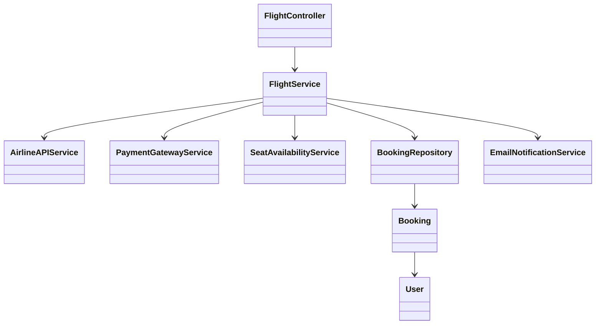
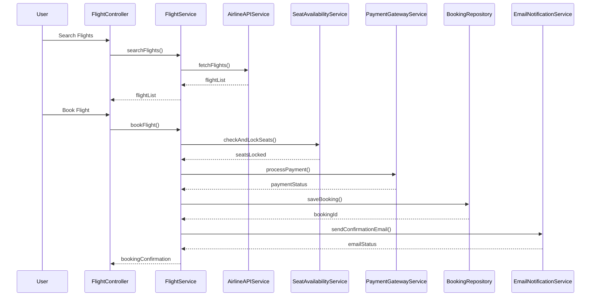
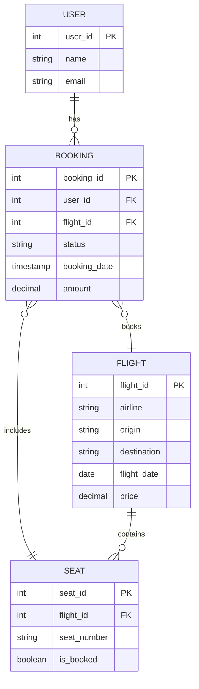

# For User Story Number [1]

1. Objective
This requirement enables travelers to search, compare, and book air transport tickets online, supporting multiple airlines and real-time availability. It ensures users can select seats, add special requests, and receive confirmation upon successful booking. The solution focuses on convenience, security, and reliability for online ticket purchases.

2. API Model
  2.1 Common Components/Services
  - AirlineAPIService (integration with airline APIs)
  - PaymentGatewayService (payment processing)
  - EmailNotificationService (confirmation emails)
  - SeatAvailabilityService (seat selection and locking)

  2.2 API Details
| Operation   | REST Method | Type    | URL                        | Request (Sample)                                                                 | Response (Sample)                                                                 |
|-------------|-------------|---------|----------------------------|----------------------------------------------------------------------------------|-----------------------------------------------------------------------------------|
| Search      | GET         | Success | /api/flights/search        | {"origin":"JFK","destination":"LAX","date":"2025-10-10"}                  | [{"flightId":1,"airline":"Delta","price":300,"seats":["12A","12B"]}]   |
| Book        | POST        | Success | /api/flights/book          | {"flightId":1,"userId":100,"seats":["12A"],"paymentInfo":{...}}           | {"bookingId":5001,"status":"CONFIRMED","emailSent":true}                   |
| Book        | POST        | Failure | /api/flights/book          | {"flightId":1,"userId":100,"seats":["12A"],"paymentInfo":{...}}           | {"error":"Seat not available"}                                                 |
| Confirm     | GET         | Success | /api/flights/booking/{id}  | -                                                                                | {"bookingId":5001,"status":"CONFIRMED","details":{...}}                    |

  2.3 Exceptions
  - FlightNotFoundException
  - PaymentFailedException
  - SeatUnavailableException
  - ValidationException

3. Functional Design
  3.1 Class Diagram

  3.2 UML Sequence Diagram

  3.3 Components
| Component Name           | Description                                         | Existing/New |
|-------------------------|-----------------------------------------------------|--------------|
| FlightController        | REST controller for flight search and booking        | New          |
| FlightService           | Core business logic for flight operations            | New          |
| AirlineAPIService       | Handles airline API integration                      | New          |
| PaymentGatewayService   | Handles payment processing and validation            | New          |
| SeatAvailabilityService | Manages seat selection and locking                   | New          |
| BookingRepository       | Data access for bookings                             | New          |
| EmailNotificationService| Sends confirmation emails                            | New          |
| Booking                 | Entity for booking details                           | New          |
| User                    | Entity for user details                              | Existing     |

  3.4 Service Layer Logic and Validations
| FieldName     | Validation                                 | Error Message                  | ClassUsed                |
|-------------- |--------------------------------------------|-------------------------------|--------------------------|
| origin        | Must not be empty                           | Origin is required            | FlightService            |
| destination   | Must not be empty                           | Destination is required       | FlightService            |
| date          | Must not be empty, valid date format        | Date is required/invalid      | FlightService            |
| paymentInfo   | Must be valid and authorized                | Payment failed                | PaymentGatewayService    |
| seats         | Must be available at booking time           | Seat not available            | SeatAvailabilityService  |

4. Integrations
| SystemToBeIntegrated | IntegratedFor         | IntegrationType |
|---------------------|----------------------|-----------------|
| Airline APIs        | Flight data, seats   | API             |
| Payment Gateway     | Payment processing   | API             |
| Email Service       | Confirmation emails  | API             |

5. DB Details
  5.1 ER Model

  5.2 DB Validations
  - Unique constraint on (flight_id, seat_number) in SEAT
  - Foreign key constraints for all FK fields

6. Non-Functional Requirements
  6.1 Performance
    - Caching of frequent flight searches at API layer
    - Asynchronous email sending
    - Response time <2 seconds for search/booking
  6.2 Security
    6.2.1 Authentication
      - OAuth2/JWT authentication for all APIs
    6.2.2 Authorization
      - Role-based access for booking endpoints
    - PCI DSS compliant payment processing
    - Data encrypted in transit (TLS) and at rest
  6.3 Logging
    6.3.1 Application Logging
      - DEBUG: API requests/responses (masked sensitive data)
      - INFO: Successful bookings, payments
      - ERROR: Payment failures, booking errors
      - WARN: Suspicious activity
    6.3.2 Audit Log
      - All booking and payment transactions logged with user and timestamp

7. Dependencies
  - Airline APIs (external)
  - Payment gateway (external)
  - Email service (external)

8. Assumptions
  - All airlines support real-time API integration
  - Payment gateway is PCI DSS compliant
  - User email is verified before booking