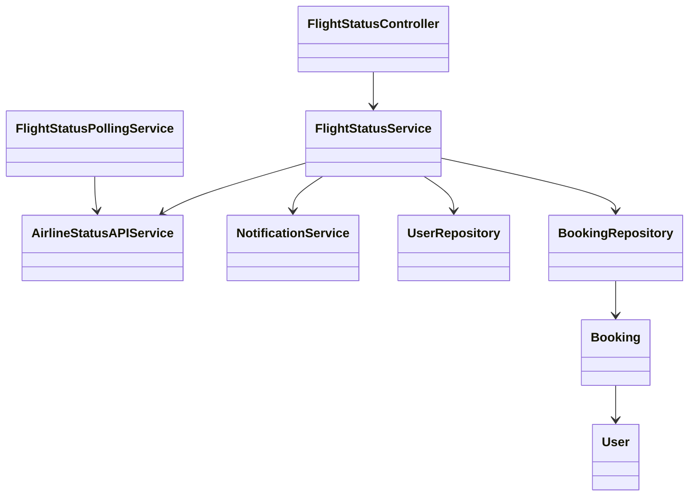
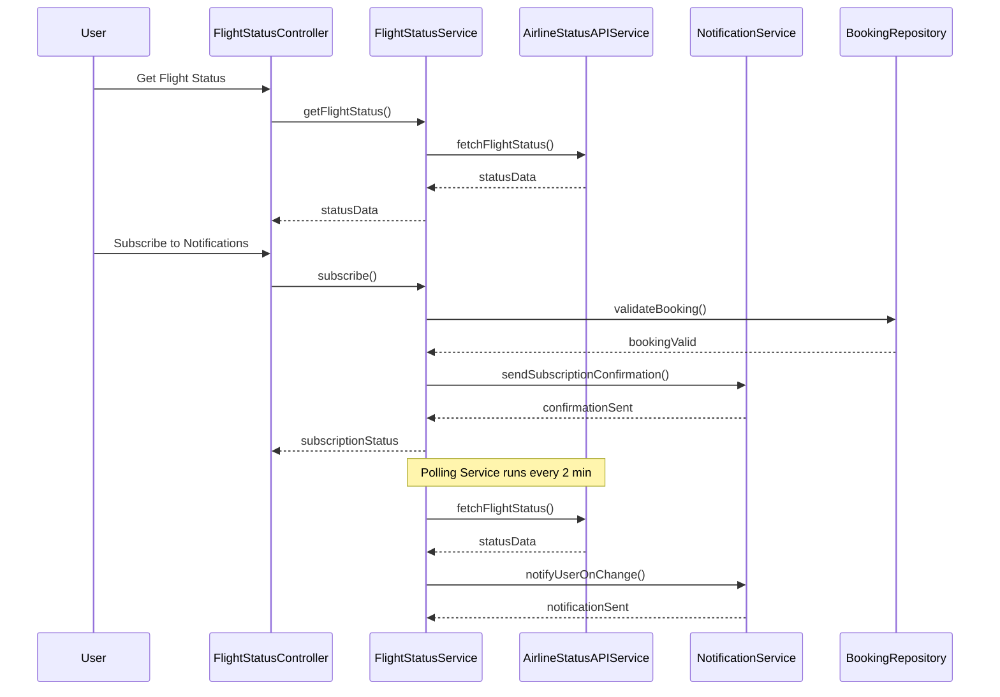
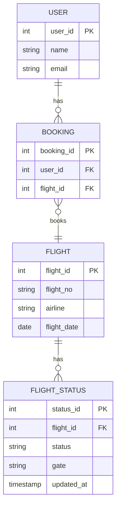

# For User Story Number [2]

1. Objective
This requirement enables travelers to track their booked flight status in real-time, including updates on delays, gate changes, and cancellations. Users can view status by entering a flight number and receive timely push/email notifications for significant changes. The solution ensures accurate, reliable, and prompt information delivery to enhance user experience and travel planning.

2. API Model
  2.1 Common Components/Services
  - AirlineStatusAPIService (integration with airline status APIs)
  - NotificationService (push/email notifications)
  - FlightStatusPollingService (scheduled polling logic)
  - UserAuthenticationService (OAuth2 authentication)

  2.2 API Details
| Operation   | REST Method | Type    | URL                               | Request (Sample)                                  | Response (Sample)                                                    |
|-------------|-------------|---------|-----------------------------------|---------------------------------------------------|-----------------------------------------------------------------------|
| Get Status  | GET         | Success | /api/flights/status/{flightNo}    | -                                                 | {"flightNo":"DL123","status":"DELAYED","gate":"A5","eta":"12:30"} |
| Subscribe   | POST        | Success | /api/flights/subscribe            | {"userId":100,"flightNo":"DL123","channel":"push"} | {"subscribed":true,"flightNo":"DL123"}                                |
| Notify      | POST        | Success | /api/notifications/send           | {"userId":100,"message":"Gate changed to B2"}      | {"notified":true}                                                    |
| Get Status  | GET         | Failure | /api/flights/status/{flightNo}    | -                                                 | {"error":"Flight not found"}                                         |

  2.3 Exceptions
  - FlightNotFoundException
  - NotificationFailedException
  - UnauthorizedAccessException
  - ValidationException

3. Functional Design
  3.1 Class Diagram

  3.2 UML Sequence Diagram

  3.3 Components
| Component Name             | Description                                         | Existing/New |
|---------------------------|-----------------------------------------------------|--------------|
| FlightStatusController    | REST controller for flight status operations         | New          |
| FlightStatusService       | Core logic for status retrieval and notifications    | New          |
| AirlineStatusAPIService   | Handles airline status API integration               | New          |
| NotificationService       | Sends push/email notifications                       | New          |
| FlightStatusPollingService| Schedules and polls airline APIs for updates         | New          |
| UserRepository            | Data access for user details                        | Existing     |
| BookingRepository         | Data access for booking details                     | Existing     |
| User                      | Entity for user details                             | Existing     |
| Booking                   | Entity for booking details                          | Existing     |

  3.4 Service Layer Logic and Validations
| FieldName   | Validation                                | Error Message                  | ClassUsed                |
|-------------|-------------------------------------------|-------------------------------|--------------------------|
| flightNo    | Must be valid and exist in system          | Flight not found              | FlightStatusService      |
| userId      | Must have a valid booking for notifications| No valid booking              | BookingRepository        |
| channel     | Must be push or email                      | Invalid notification channel  | NotificationService      |

4. Integrations
| SystemToBeIntegrated | IntegratedFor           | IntegrationType |
|---------------------|------------------------|-----------------|
| Airline Status APIs | Real-time flight status | API             |
| Firebase            | Push notifications      | API             |
| Email Service       | Email notifications     | API             |

5. DB Details
  5.1 ER Model

  5.2 DB Validations
  - Foreign key constraints for all FK fields
  - Unique constraint on (flight_id, updated_at) in FLIGHT_STATUS

6. Non-Functional Requirements
  6.1 Performance
    - Polling interval: every 2 minutes
    - Notification delivery within 1 minute of status change
    - Optimized polling to reduce mobile battery usage
  6.2 Security
    6.2.1 Authentication
      - OAuth2 authentication for all APIs
    6.2.2 Authorization
      - Only users with valid bookings can subscribe to notifications
    - Data privacy for user flight information
  6.3 Logging
    6.3.1 Application Logging
      - DEBUG: API requests/responses (masked sensitive data)
      - INFO: Status updates, notifications sent
      - ERROR: Notification failures, API errors
      - WARN: Repeated polling failures
    6.3.2 Audit Log
      - All status changes and notifications logged with user and timestamp

7. Dependencies
  - Airline status APIs (external)
  - Firebase (external)
  - Email service (external)

8. Assumptions
  - Airline status APIs provide near real-time data
  - User device supports push notifications
  - User email is verified