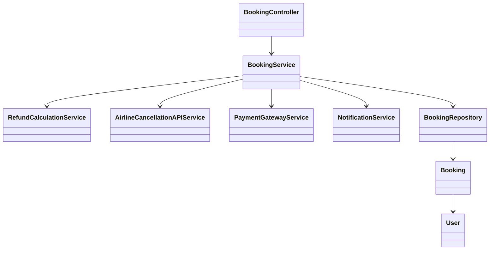
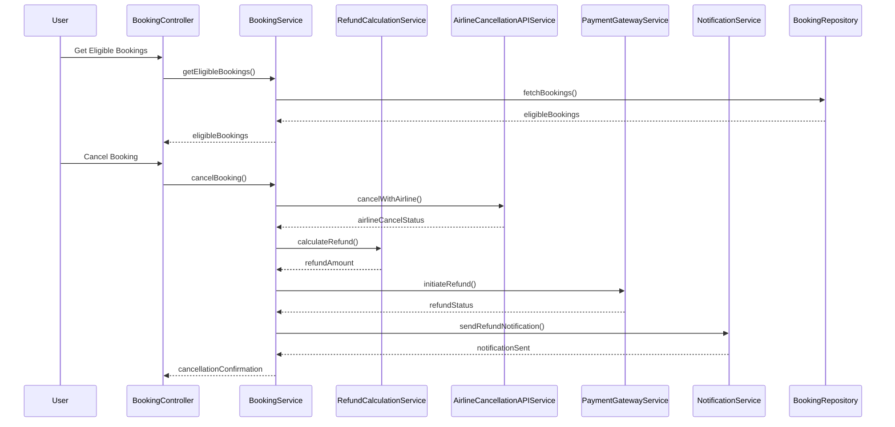
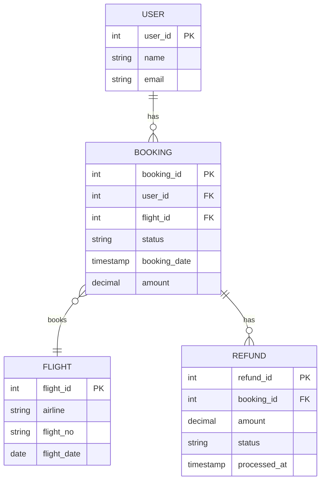

# For User Story Number [3]

1. Objective
This requirement allows travelers to cancel their booked flights and request refunds through the application, with refund amounts calculated automatically based on airline policies. Users can view eligible bookings, see refund timelines, and receive notifications on refund status. The solution ensures compliance, transparency, and timely processing of cancellations and refunds.

2. API Model
  2.1 Common Components/Services
  - BookingService (booking management)
  - RefundCalculationService (refund logic)
  - AirlineCancellationAPIService (airline API integration)
  - PaymentGatewayService (refund processing)
  - NotificationService (email/SMS notifications)

  2.2 API Details
| Operation   | REST Method | Type    | URL                                  | Request (Sample)                                              | Response (Sample)                                                    |
|-------------|-------------|---------|--------------------------------------|---------------------------------------------------------------|-----------------------------------------------------------------------|
| Get Eligible| GET         | Success | /api/bookings/eligible-cancel/{userId}| -                                                            | [{"bookingId":5001,"flightNo":"DL123","eligible":true}]           |
| Cancel      | POST        | Success | /api/bookings/cancel                 | {"bookingId":5001,"userId":100}                             | {"refundAmount":150,"policy":"Non-refundable after 24h"}            |
| Refund      | POST        | Success | /api/bookings/refund                 | {"bookingId":5001,"userId":100}                             | {"status":"Refund Initiated","refundId":8001}                      |
| Cancel      | POST        | Failure | /api/bookings/cancel                 | {"bookingId":5002,"userId":100}                             | {"error":"Booking not eligible for cancellation"}                    |

  2.3 Exceptions
  - BookingNotEligibleException
  - RefundCalculationException
  - PaymentRefundFailedException
  - ValidationException

3. Functional Design
  3.1 Class Diagram

  3.2 UML Sequence Diagram

  3.3 Components
| Component Name                | Description                                         | Existing/New |
|------------------------------|-----------------------------------------------------|--------------|
| BookingController            | REST controller for booking cancellation/refund      | New          |
| BookingService               | Core logic for cancellation and refund               | New          |
| RefundCalculationService     | Calculates refund as per airline policy              | New          |
| AirlineCancellationAPIService| Integrates with airline cancellation/refund API      | New          |
| PaymentGatewayService        | Processes refund to original payment method          | New          |
| NotificationService          | Sends email/SMS notifications                       | New          |
| BookingRepository            | Data access for bookings                             | Existing     |
| Booking                      | Entity for booking details                          | Existing     |
| User                         | Entity for user details                             | Existing     |

  3.4 Service Layer Logic and Validations
| FieldName   | Validation                                   | Error Message                        | ClassUsed                |
|-------------|----------------------------------------------|--------------------------------------|--------------------------|
| bookingId   | Must be eligible for cancellation            | Booking not eligible for cancellation| BookingService           |
| userId      | Must match booking owner                     | Unauthorized cancellation            | BookingService           |
| refund      | Must match airline policy calculation        | Refund calculation error             | RefundCalculationService |
| refundTime  | Must process within promised timeline        | Refund delayed                       | PaymentGatewayService    |

4. Integrations
| SystemToBeIntegrated | IntegratedFor           | IntegrationType |
|---------------------|------------------------|-----------------|
| Airline APIs        | Cancellation/refund    | API             |
| Payment Gateway     | Refund processing      | API             |
| Email/SMS Service   | Notifications          | API             |

5. DB Details
  5.1 ER Model

  5.2 DB Validations
  - Foreign key constraints for all FK fields
  - Refund only for eligible bookings

6. Non-Functional Requirements
  6.1 Performance
    - Refund processing within 5 business days
    - Asynchronous notification sending
  6.2 Security
    6.2.1 Authentication
      - OAuth2/JWT authentication for all APIs
    6.2.2 Authorization
      - Only booking owner can cancel/refund
    - Data encrypted in transit and at rest
    - GDPR compliance for user data
  6.3 Logging
    6.3.1 Application Logging
      - DEBUG: API requests/responses (masked sensitive data)
      - INFO: Successful cancellations, refunds
      - ERROR: Refund/payment failures
      - WARN: Delayed refunds
    6.3.2 Audit Log
      - All refund transactions logged with user and timestamp

7. Dependencies
  - Airline cancellation/refund APIs (external)
  - Payment gateway (external)
  - Email/SMS service (external)

8. Assumptions
  - Airline APIs return real-time cancellation/refund eligibility
  - Payment gateway supports refund to original payment method
  - User contact details are up to date