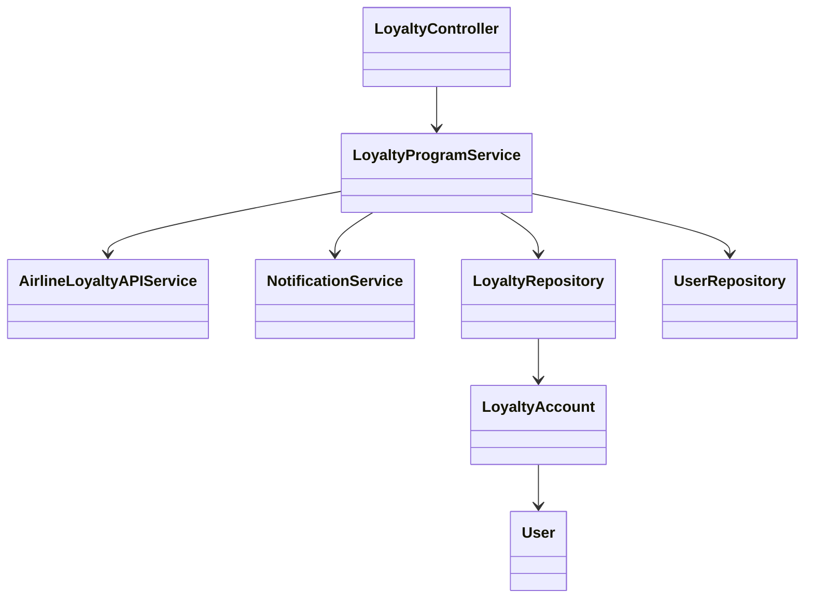
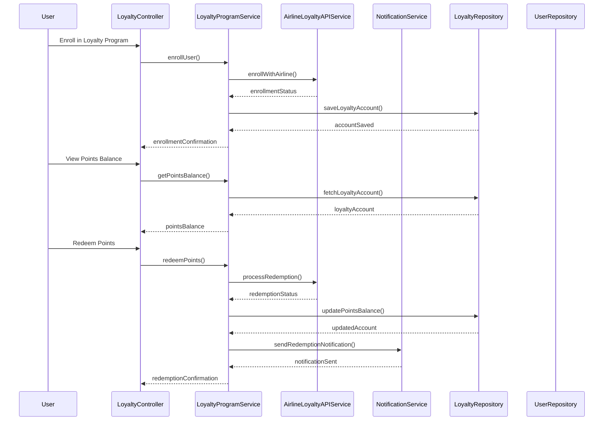
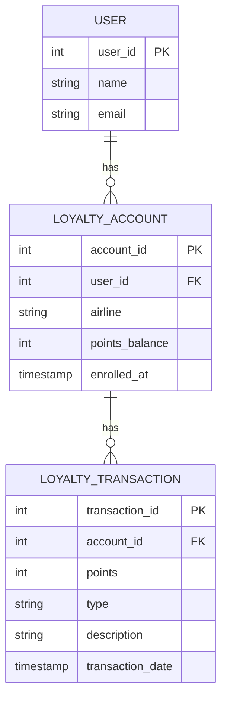

# For User Story Number [4]

1. Objective
This requirement allows frequent flyers to enroll in, view, and manage their airline loyalty program points through the application. Users can check their points balance, transaction history, and redeem points for flights or upgrades, while receiving notifications for expiring points and new offers. The solution ensures secure, real-time, and compliant management of loyalty benefits.

2. API Model
  2.1 Common Components/Services
  - LoyaltyProgramService (loyalty logic)
  - AirlineLoyaltyAPIService (integration with airline loyalty APIs)
  - NotificationService (notifications for offers/expiring points)
  - UserAuthenticationService (authentication and authorization)

  2.2 API Details
| Operation   | REST Method | Type    | URL                                  | Request (Sample)                                                | Response (Sample)                                                    |
|-------------|-------------|---------|--------------------------------------|-----------------------------------------------------------------|-----------------------------------------------------------------------|
| Enroll      | POST        | Success | /api/loyalty/enroll                  | {"userId":100,"airline":"Delta"}                              | {"enrolled":true,"programId":2001}                                 |
| Balance     | GET         | Success | /api/loyalty/balance/{userId}        | -                                                               | {"points":15000,"history":[{"date":"2025-10-01","points":500}]} |
| Redeem      | POST        | Success | /api/loyalty/redeem                  | {"userId":100,"points":10000,"rewardType":"flight"}           | {"status":"Redeemed","remainingPoints":5000}                      |
| Redeem      | POST        | Failure | /api/loyalty/redeem                  | {"userId":100,"points":20000,"rewardType":"upgrade"}           | {"error":"Insufficient points or not eligible"}                     |

  2.3 Exceptions
  - LoyaltyEnrollmentException
  - PointsRedemptionException
  - UnauthorizedAccessException
  - ValidationException

3. Functional Design
  3.1 Class Diagram

  3.2 UML Sequence Diagram

  3.3 Components
| Component Name                | Description                                         | Existing/New |
|------------------------------|-----------------------------------------------------|--------------|
| LoyaltyController            | REST controller for loyalty operations               | New          |
| LoyaltyProgramService        | Core logic for loyalty program management            | New          |
| AirlineLoyaltyAPIService     | Integrates with airline loyalty APIs                 | New          |
| NotificationService          | Sends notifications for offers/expiring points       | New          |
| LoyaltyRepository            | Data access for loyalty accounts                     | New          |
| UserRepository               | Data access for user details                        | Existing     |
| LoyaltyAccount               | Entity for loyalty account details                   | New          |
| User                         | Entity for user details                             | Existing     |

  3.4 Service Layer Logic and Validations
| FieldName   | Validation                                   | Error Message                        | ClassUsed                |
|-------------|----------------------------------------------|--------------------------------------|--------------------------|
| userId      | Must be a valid loyalty member                | Unauthorized or not enrolled         | LoyaltyProgramService    |
| points      | Must be sufficient and eligible for redemption| Insufficient points or not eligible  | LoyaltyProgramService    |
| rewardType  | Must be valid as per airline rules            | Invalid reward type                  | AirlineLoyaltyAPIService |

4. Integrations
| SystemToBeIntegrated | IntegratedFor           | IntegrationType |
|---------------------|------------------------|-----------------|
| Airline Loyalty APIs| Points management      | API             |
| Email/SMS Service   | Notifications          | API             |

5. DB Details
  5.1 ER Model

  5.2 DB Validations
  - Foreign key constraints for all FK fields
  - Points balance must not go negative

6. Non-Functional Requirements
  6.1 Performance
    - Points balance updates within 1 minute of transaction
    - Asynchronous notification sending
  6.2 Security
    6.2.1 Authentication
      - OAuth2/JWT authentication for all APIs
    6.2.2 Authorization
      - Only loyalty members can access/modify points
    - Data encrypted in transit and at rest
    - GDPR compliance for user data
  6.3 Logging
    6.3.1 Application Logging
      - DEBUG: API requests/responses (masked sensitive data)
      - INFO: Enrollment, redemption, balance updates
      - ERROR: Redemption/enrollment failures
      - WARN: Suspicious redemption attempts
    6.3.2 Audit Log
      - All loyalty transactions logged with user and timestamp

7. Dependencies
  - Airline loyalty APIs (external)
  - Email/SMS service (external)

8. Assumptions
  - Airline APIs provide real-time points and transaction data
  - User contact details are up to date
  - Redemption rules are enforced by airline APIs