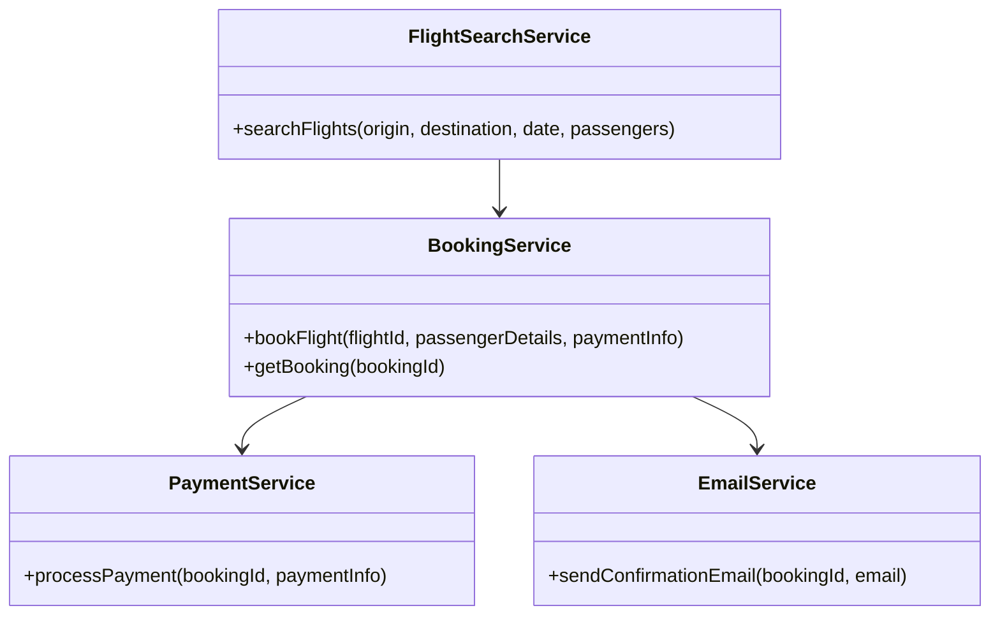
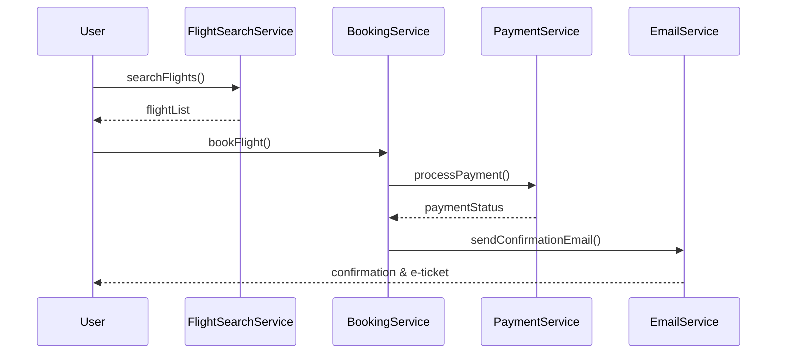
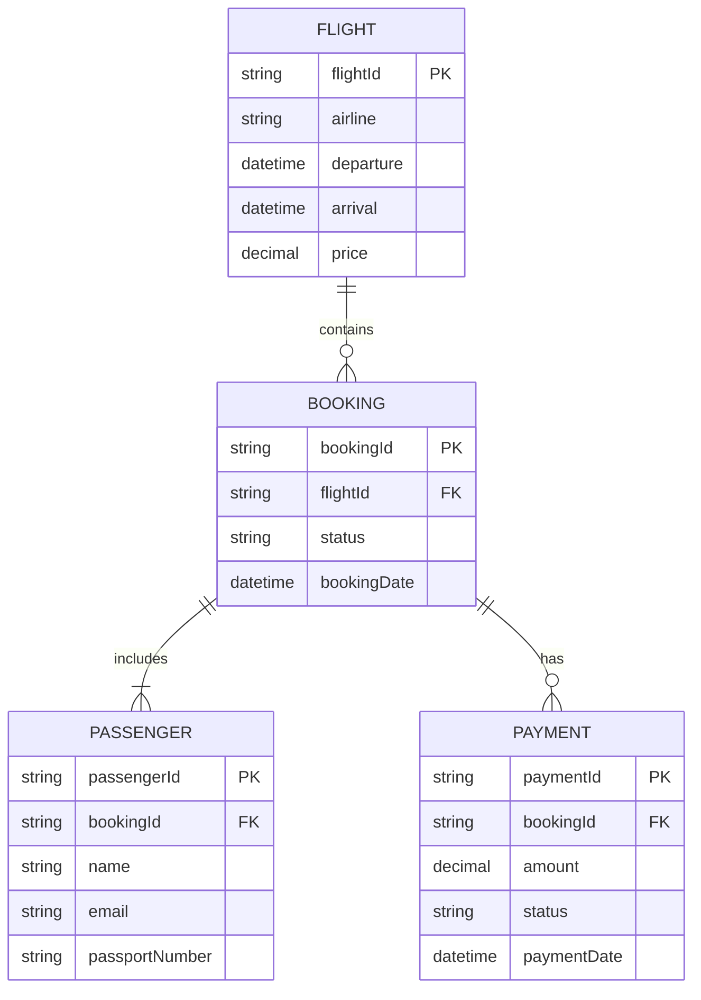

# For User Story Number [1]

1. Objective
The objective is to enable passengers to search for available flights, compare options, and book air transport tickets online. The system should allow users to enter travel details, view available flights, select preferred options, and complete the booking process securely. Upon successful booking, users receive confirmation and an e-ticket via email.

2. API Model
  2.1 Common Components/Services
    - Authentication Service (JWT/OAuth2)
    - Flight Search Service
    - Booking Service
    - Payment Service (PCI-compliant)
    - Email Notification Service

  2.2 API Details
| Operation        | REST Method | Type         | URL                        | Request (JSON)                                  | Response (JSON)                                  |
|------------------|------------|--------------|----------------------------|-------------------------------------------------|---------------------------------------------------|
| Search Flights   | GET        | Success/Fail | /api/flights/search        | {"origin": "JFK", "destination": "LAX", "date": "2025-10-10", "passengers": 2} | [{"flightId": "F123", "airline": "Delta", "departure": "10:00", "arrival": "13:00", "price": 350.0}, ...] |
| Book Flight      | POST       | Success/Fail | /api/bookings              | {"flightId": "F123", "passengerDetails": [{...}], "paymentInfo": {...}} | {"bookingId": "B456", "status": "CONFIRMED", "eTicket": "..."} |
| Payment Process  | POST       | Success/Fail | /api/payments/process      | {"bookingId": "B456", "paymentInfo": {...}} | {"paymentStatus": "SUCCESS", "transactionId": "T789"} |
| Get Booking      | GET        | Success/Fail | /api/bookings/{bookingId}  | N/A                                             | {"bookingId": "B456", "status": "CONFIRMED", "details": {...}} |

  2.3 Exceptions
| API                | Exception Type         | Error Message                                 |
|--------------------|-----------------------|-----------------------------------------------|
| Search Flights     | InvalidInputException | "Origin and destination must be valid codes." |
| Book Flight        | PaymentFailedException | "Payment processing failed."                  |
| Book Flight        | ValidationException   | "Passenger details are invalid."              |
| Payment Process    | PaymentFailedException | "Payment could not be processed."            |
| Get Booking        | BookingNotFoundException | "Booking not found."                        |

3 Functional Design
  3.1 Class Diagram

  3.2 UML Sequence Diagram

  3.3 Components
| Component Name        | Description                                         | Existing/New |
|----------------------|-----------------------------------------------------|--------------|
| FlightSearchService  | Handles flight search queries                        | New          |
| BookingService       | Manages booking operations                          | New          |
| PaymentService       | Integrates with payment gateway for transactions    | New          |
| EmailService         | Sends booking confirmation and e-ticket             | Existing     |

  3.4 Service Layer Logic & Validations
| FieldName     | Validation                                         | Error Message                                 | ClassUsed           |
|---------------|----------------------------------------------------|-----------------------------------------------|---------------------|
| origin        | Not empty, valid airport code                      | "Invalid origin airport code."                | FlightSearchService |
| destination   | Not empty, valid airport code                      | "Invalid destination airport code."           | FlightSearchService |
| date          | Must be in the future, valid format                | "Invalid travel date."                        | FlightSearchService |
| paymentInfo   | Valid card details, PCI compliance                 | "Invalid payment information."                | PaymentService      |
| passengerDetails | All required fields present, valid formats      | "Invalid passenger details."                  | BookingService      |

4 Integrations
| SystemToBeIntegrated | IntegratedFor         | IntegrationType |
|---------------------|----------------------|-----------------|
| Airline APIs/GDS    | Flight search, booking| API             |
| Payment Gateway     | Payment processing    | API             |
| Email Service       | Confirmation emails   | API             |

5 DB Details
  5.1 ER Model

  5.2 DB Validations
- Ensure bookingId and flightId are unique and foreign key constraints are enforced.
- Payment status must be updated atomically with booking status.

6 Non-Functional Requirements
  6.1 Performance
    - Support at least 1000 concurrent users.
    - Booking process completes within 5 seconds under normal load.
    - Consider caching flight search results for popular routes.

  6.2 Security
    6.2.1 Authentication
      - Use JWT/OAuth2 for user authentication.
      - Integrate with IAM if required.
    6.2.2 Authorization
      - Role-based access for booking and payment APIs.

  6.3 Logging
    6.3.1 Application Logging
      - Log all API requests/responses at INFO level.
      - Log errors at ERROR level.
      - Log payment attempts at WARN level.
    6.3.2 Audit Log
      - Log all booking transactions and status changes for audit.

7 Dependencies
  - Airline APIs/GDS
  - PCI-compliant payment gateway
  - Email service provider

8 Assumptions
  - All airline APIs/GDS are available and reliable.
  - Payment gateway is PCI-compliant and supports required payment methods.
  - Email service is configured for e-ticket delivery.
