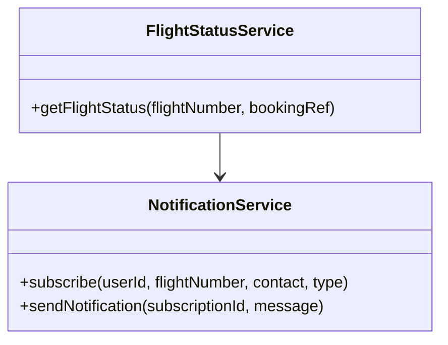
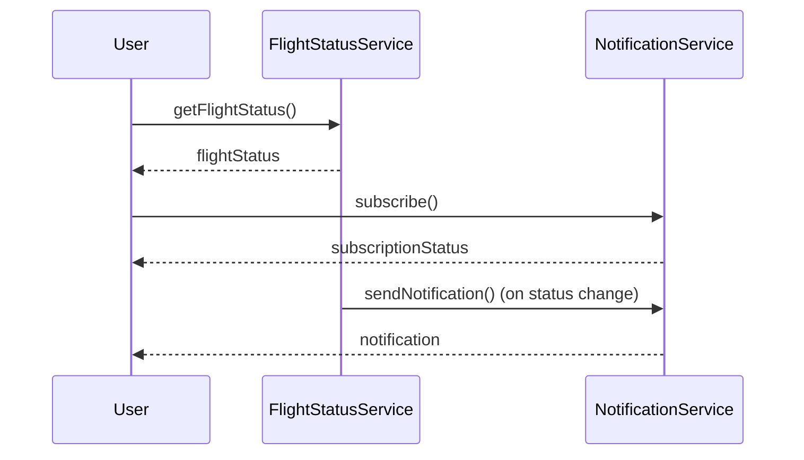
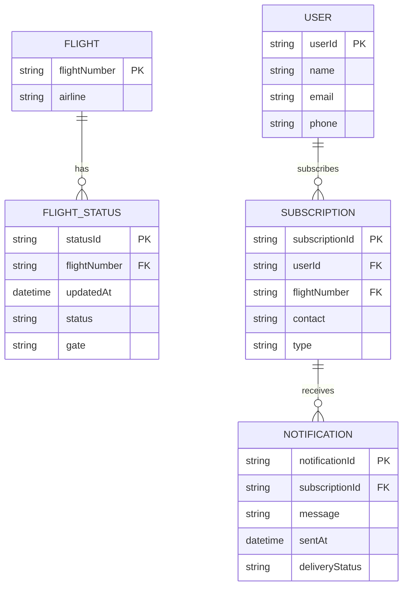

# For User Story Number [2]

1. Objective
The objective is to enable passengers to track the status of their flights in real-time, including updates on departure/arrival times, delays, gate changes, and cancellations. Users should be able to search for flight status using flight number or booking reference and receive timely notifications about any changes. This ensures that passengers are always informed and can adjust their travel plans accordingly.

2. API Model
  2.1 Common Components/Services
    - Authentication Service (JWT/OAuth2)
    - Flight Status Service
    - Notification Service (Email/SMS/Push)

  2.2 API Details
| Operation            | REST Method | Type         | URL                                 | Request (JSON)                                   | Response (JSON)                                  |
|----------------------|------------|--------------|-------------------------------------|--------------------------------------------------|---------------------------------------------------|
| Search Flight Status | GET        | Success/Fail | /api/flights/status                 | {"flightNumber": "DL123"} OR {"bookingRef": "BR456"} | {"flightNumber": "DL123", "departure": "10:00", "arrival": "13:00", "gate": "A5", "status": "DELAYED"} |
| Opt-in Notifications | POST       | Success/Fail | /api/notifications/subscribe        | {"userId": "U789", "flightNumber": "DL123", "contact": "user@email.com", "type": "email"} | {"subscriptionId": "S123", "status": "SUBSCRIBED"} |
| Send Notification    | POST       | Success/Fail | /api/notifications/send             | {"subscriptionId": "S123", "message": "Flight DL123 delayed"} | {"deliveryStatus": "SENT"} |

  2.3 Exceptions
| API                    | Exception Type            | Error Message                                 |
|------------------------|--------------------------|-----------------------------------------------|
| Search Flight Status   | FlightNotFoundException  | "Flight not found."                          |
| Search Flight Status   | InvalidInputException    | "Invalid flight number or booking reference." |
| Opt-in Notifications   | ValidationException      | "Contact details are invalid."                |
| Send Notification      | NotificationFailedException | "Notification delivery failed."             |

3 Functional Design
  3.1 Class Diagram

  3.2 UML Sequence Diagram

  3.3 Components
| Component Name        | Description                                         | Existing/New |
|----------------------|-----------------------------------------------------|--------------|
| FlightStatusService  | Handles flight status queries and updates            | New          |
| NotificationService  | Manages notification subscriptions and delivery      | New          |

  3.4 Service Layer Logic & Validations
| FieldName         | Validation                                         | Error Message                                 | ClassUsed             |
|-------------------|----------------------------------------------------|-----------------------------------------------|-----------------------|
| flightNumber      | Not empty, valid format                            | "Invalid flight number."                      | FlightStatusService   |
| bookingRef        | Not empty, exists in system                        | "Invalid booking reference."                  | FlightStatusService   |
| contact           | Valid email/phone, verified                        | "Invalid contact details."                    | NotificationService   |

4 Integrations
| SystemToBeIntegrated | IntegratedFor         | IntegrationType |
|---------------------|----------------------|-----------------|
| Airline/Airport APIs| Real-time flight status| API             |
| Notification Providers| Email/SMS/Push      | API             |

5 DB Details
  5.1 ER Model

  5.2 DB Validations
- Ensure flightNumber exists in FLIGHT table.
- Subscription must reference a valid user and flight.
- Notification delivery status must be updated atomically.

6 Non-Functional Requirements
  6.1 Performance
    - Flight status updates reflected within 1 minute of change.
    - Support up to 10,000 concurrent queries/notifications per hour.
    - Optimize DB queries for real-time updates.

  6.2 Security
    6.2.1 Authentication
      - Use JWT/OAuth2 for user authentication.
    6.2.2 Authorization
      - Only users with valid bookings can subscribe to notifications.

  6.3 Logging
    6.3.1 Application Logging
      - Log all flight status queries at INFO level.
      - Log notification delivery attempts at WARN level.
      - Log errors at ERROR level.
    6.3.2 Audit Log
      - Log all notification events and status changes for audit.

7 Dependencies
  - Airline/Airport APIs
  - Notification providers (Twilio, SendGrid, etc.)

8 Assumptions
  - Airline/Airport APIs provide reliable real-time status.
  - Notification providers support required delivery channels.
  - Users have verified contact details for notifications.
