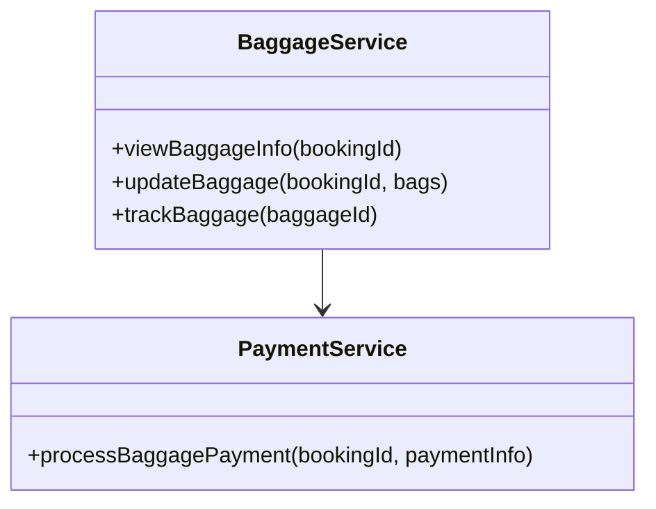
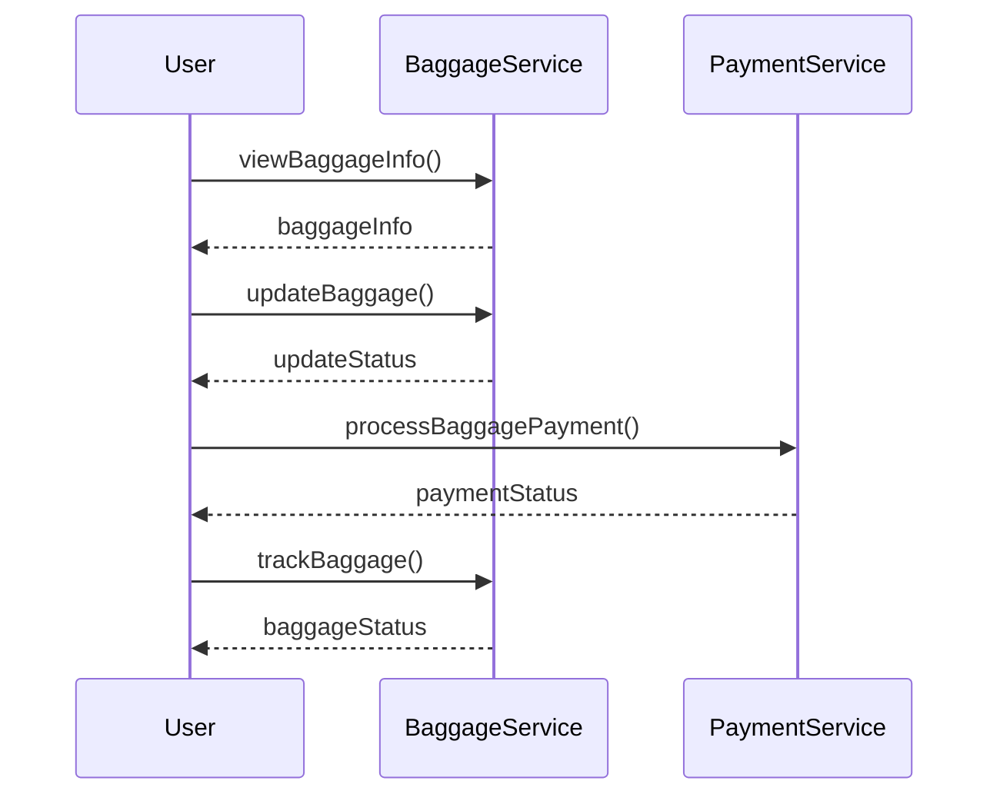
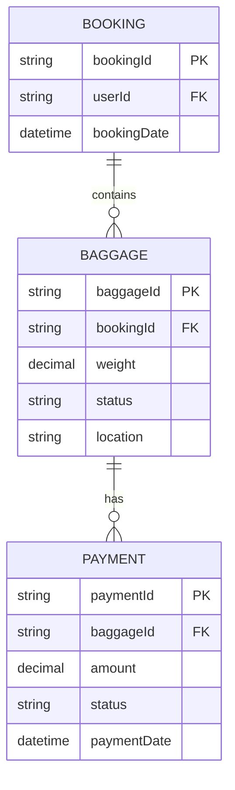

# For User Story Number [3]

1. Objective
The objective is to enable passengers to manage their baggage information online, including viewing baggage allowance, adding or removing baggage, prepaying for additional bags, and tracking checked luggage. The system should ensure compliance with airline/regulatory limits and provide accurate, timely baggage status updates. This enhances the passenger experience and streamlines baggage handling processes.

2. API Model
  2.1 Common Components/Services
    - Authentication Service (JWT/OAuth2)
    - Baggage Management Service
    - Payment Service (PCI-compliant)
    - Baggage Tracking Service

  2.2 API Details
| Operation            | REST Method | Type         | URL                                   | Request (JSON)                                   | Response (JSON)                                  |
|----------------------|------------|--------------|---------------------------------------|--------------------------------------------------|---------------------------------------------------|
| View Baggage Info    | GET        | Success/Fail | /api/baggage/info?bookingId={id}      | N/A                                              | {"bookingId": "B123", "allowance": 2, "fees": 50.0} |
| Add/Remove Baggage   | POST       | Success/Fail | /api/baggage/update                   | {"bookingId": "B123", "bags": [{"weight": 20}]} | {"status": "UPDATED", "totalFees": 100.0} |
| Pay for Baggage      | POST       | Success/Fail | /api/payments/baggage                 | {"bookingId": "B123", "paymentInfo": {...}} | {"paymentStatus": "SUCCESS", "transactionId": "T456"} |
| Track Baggage        | GET        | Success/Fail | /api/baggage/track?baggageId={id}     | N/A                                              | {"baggageId": "BG789", "location": "LAX", "status": "IN TRANSIT"} |

  2.3 Exceptions
| API                | Exception Type         | Error Message                                 |
|--------------------|-----------------------|-----------------------------------------------|
| View Baggage Info  | BookingNotFoundException | "Booking not found."                        |
| Add/Remove Baggage | ValidationException   | "Baggage limit exceeded."                    |
| Pay for Baggage    | PaymentFailedException | "Payment processing failed."                 |
| Track Baggage      | BaggageNotFoundException | "Baggage not found."                        |

3 Functional Design
  3.1 Class Diagram

  3.2 UML Sequence Diagram

  3.3 Components
| Component Name        | Description                                         | Existing/New |
|----------------------|-----------------------------------------------------|--------------|
| BaggageService       | Manages baggage info, updates, and tracking          | New          |
| PaymentService       | Handles payment for additional baggage               | Existing     |

  3.4 Service Layer Logic & Validations
| FieldName     | Validation                                         | Error Message                                 | ClassUsed           |
|---------------|----------------------------------------------------|-----------------------------------------------|---------------------|
| bags          | Not exceed airline/regulatory limits                | "Baggage limit exceeded."                     | BaggageService      |
| paymentInfo   | Valid card details, PCI compliance                 | "Invalid payment information."                | PaymentService      |
| baggageId     | Exists in system                                   | "Baggage not found."                          | BaggageService      |

4 Integrations
| SystemToBeIntegrated | IntegratedFor         | IntegrationType |
|---------------------|----------------------|-----------------|
| Airline APIs        | Baggage policies, fees| API             |
| Payment Gateway     | Payment processing    | API             |
| Airport Systems     | Baggage tracking      | API/File        |

5 DB Details
  5.1 ER Model

  5.2 DB Validations
- Baggage count/weight must not exceed airline/regulatory limits.
- Payment status must be updated atomically with baggage status.

6 Non-Functional Requirements
  6.1 Performance
    - Support up to 500 concurrent users.
    - Baggage management feature available 24/7.
    - Optimize baggage tracking queries for real-time updates.

  6.2 Security
    6.2.1 Authentication
      - Use JWT/OAuth2 for user authentication.
    6.2.2 Authorization
      - Only users with valid bookings can manage baggage.

  6.3 Logging
    6.3.1 Application Logging
      - Log all baggage management actions at INFO level.
      - Log payment attempts at WARN level.
      - Log errors at ERROR level.
    6.3.2 Audit Log
      - Log all baggage additions/removals and payment transactions for compliance.

7 Dependencies
  - Airline APIs
  - Payment gateway
  - Airport baggage tracking systems

8 Assumptions
  - Airline APIs provide accurate baggage policies and fees.
  - Payment gateway is PCI-compliant.
  - Airport systems support baggage tracking integration.
