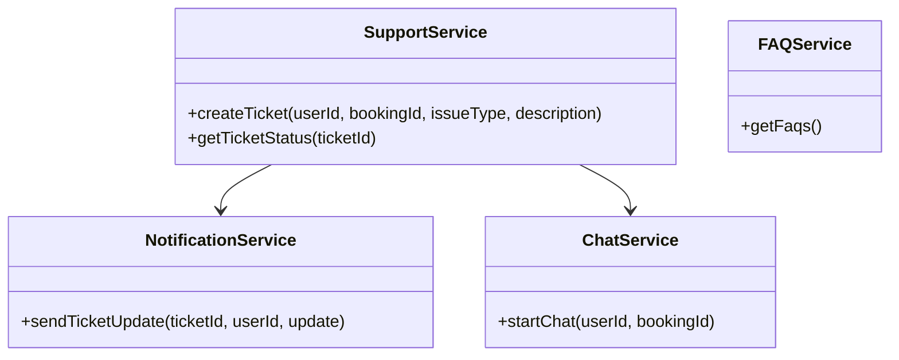
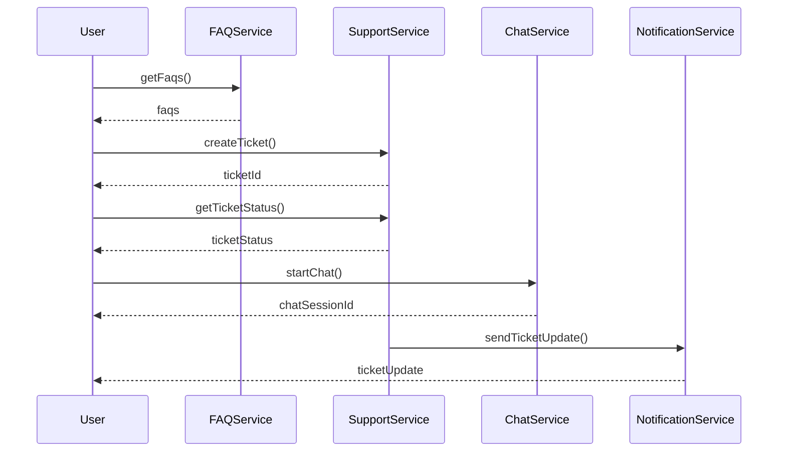
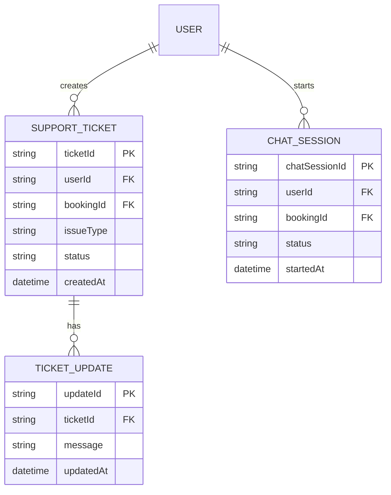

# For User Story Number [4]

1. Objective
The objective is to provide passengers with access to customer support through multiple channels (chat, email, phone) from within the platform. The system should offer a help center with FAQs, live chat, and ticketing for issue resolution, allowing users to track the status of their support requests. This ensures timely assistance and issue resolution during the passenger's journey.

2. API Model
  2.1 Common Components/Services
    - Authentication Service (JWT/OAuth2)
    - Support Ticket Service
    - FAQ/Help Center Service
    - Live Chat Integration Service
    - Notification Service (for ticket updates)

  2.2 API Details
| Operation            | REST Method | Type         | URL                                   | Request (JSON)                                   | Response (JSON)                                  |
|----------------------|------------|--------------|---------------------------------------|--------------------------------------------------|---------------------------------------------------|
| Get FAQs             | GET        | Success/Fail | /api/support/faqs                     | N/A                                              | [{"faqId": "F1", "question": "How to book?", "answer": "..."}, ...] |
| Create Support Ticket| POST       | Success/Fail | /api/support/tickets                  | {"userId": "U123", "bookingId": "B123", "issueType": "PAYMENT", "description": "..."} | {"ticketId": "T456", "status": "OPEN"} |
| Get Ticket Status    | GET        | Success/Fail | /api/support/tickets/{ticketId}       | N/A                                              | {"ticketId": "T456", "status": "IN PROGRESS", "updates": [{...}]} |
| Initiate Live Chat   | POST       | Success/Fail | /api/support/chat/start               | {"userId": "U123", "bookingId": "B123"}          | {"chatSessionId": "C789", "status": "ACTIVE"} |

  2.3 Exceptions
| API                | Exception Type         | Error Message                                 |
|--------------------|-----------------------|-----------------------------------------------|
| Create Ticket      | ValidationException   | "Missing user or booking details."            |
| Get Ticket Status  | TicketNotFoundException | "Ticket not found."                         |
| Initiate Live Chat | ChatFailedException   | "Unable to start live chat session."          |

3 Functional Design
  3.1 Class Diagram

  3.2 UML Sequence Diagram

  3.3 Components
| Component Name        | Description                                         | Existing/New |
|----------------------|-----------------------------------------------------|--------------|
| SupportService       | Manages support ticket creation and status           | New          |
| FAQService           | Provides FAQs and help center articles               | Existing     |
| ChatService          | Integrates live chat functionality                   | New          |
| NotificationService  | Sends ticket updates and confirmations               | Existing     |

  3.4 Service Layer Logic & Validations
| FieldName     | Validation                                         | Error Message                                 | ClassUsed           |
|---------------|----------------------------------------------------|-----------------------------------------------|---------------------|
| userId        | Not empty, exists in system                        | "Invalid user."                              | SupportService      |
| bookingId     | Not empty, exists in system                        | "Invalid booking."                           | SupportService      |
| issueType     | Must be valid issue type                           | "Invalid issue type."                        | SupportService      |
| description   | Not empty                                          | "Description required."                      | SupportService      |

4 Integrations
| SystemToBeIntegrated | IntegratedFor         | IntegrationType |
|---------------------|----------------------|-----------------|
| Knowledge Base (Zendesk/Freshdesk) | FAQs, ticketing | API             |
| Live Chat Provider  | Chat support         | API             |
| Notification Provider| Ticket updates      | API             |

5 DB Details
  5.1 ER Model

  5.2 DB Validations
- Support tickets must reference valid user and booking IDs.
- Ticket updates must be linked to valid tickets.
- Chat sessions must reference valid users and bookings.

6 Non-Functional Requirements
  6.1 Performance
    - Support system available 24/7.
    - Initial response within 5 minutes for live chat.
    - Optimize DB queries for ticket status and chat sessions.

  6.2 Security
    6.2.1 Authentication
      - Use JWT/OAuth2 for user authentication.
    6.2.2 Authorization
      - Only authenticated users can create/view tickets and initiate chat.

  6.3 Logging
    6.3.1 Application Logging
      - Log all support requests and chat sessions at INFO level.
      - Log ticket updates and responses at WARN level.
      - Log errors at ERROR level.
    6.3.2 Audit Log
      - Log all ticket creation, updates, and chat events for audit.

7 Dependencies
  - Knowledge base platform (Zendesk, Freshdesk)
  - Live chat provider
  - Notification provider

8 Assumptions
  - Knowledge base and chat provider APIs are available and reliable.
  - Notification provider supports required channels.
  - Users have valid bookings for support requests.
