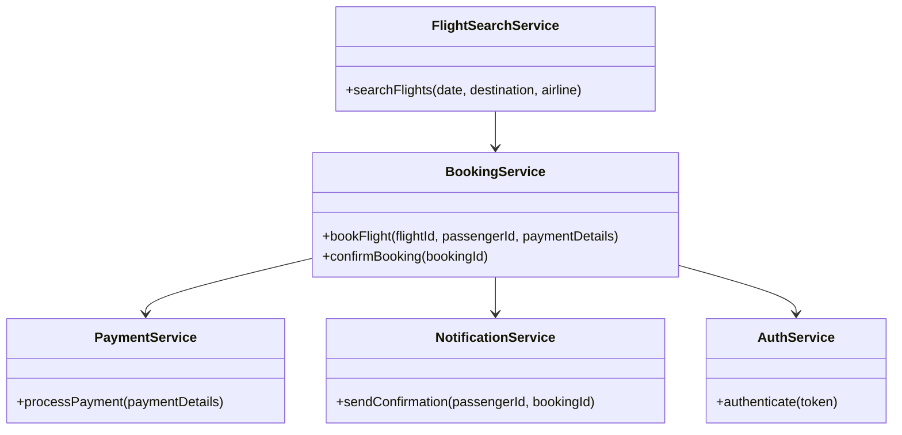
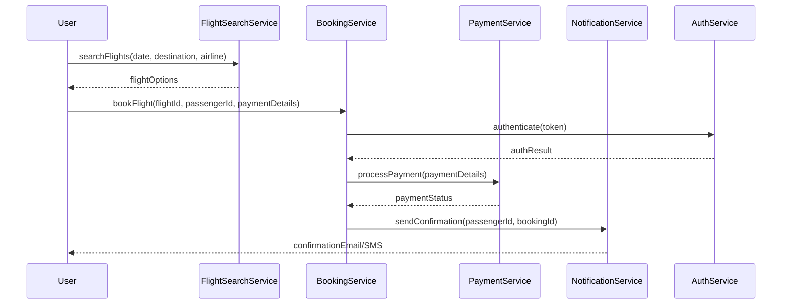

# For User Story Number [1]

1. Objective
The objective is to enable passengers to search, select, and book air transport tickets online. The system must provide a user-friendly interface for searching flights by date, destination, and airline, and allow secure payment processing. Booking confirmation should be sent after successful payment.

2. API Model
2.1 Common Components/Services
- Authentication Service (JWT)
- Payment Gateway Integration (Stripe/PayPal)
- Email/SMS Notification Service
- Flight Search Service
- Booking Service

2.2 API Details
| Operation   | REST Method | Type      | URL                       | Request (sample JSON)              | Response (sample JSON)            |
|-------------|-------------|-----------|---------------------------|------------------------------------|-----------------------------------|
| Search      | GET         | Success   | /api/flights/search       | {"date":"2025-10-10","destination":"LAX","airline":"Delta"} | [{"flightId":1,"time":"10:00","price":200,"duration":"2h"}] |
| Book        | POST        | Success   | /api/bookings             | {"flightId":1,"passengerId":123,"paymentDetails":{...}} | {"bookingId":456,"status":"CONFIRMED"} |
| Book        | POST        | Failure   | /api/bookings             | {"flightId":1,"passengerId":123,"paymentDetails":{...}} | {"error":"Payment failed"} |
| Confirm     | GET         | Success   | /api/bookings/{id}/confirm| N/A                                | {"bookingId":456,"status":"CONFIRMED","sentTo":"email"} |

2.3 Exceptions
| API           | Exception Type           | Description                          |
|---------------|-------------------------|--------------------------------------|
| /api/flights/search | InvalidInputException    | Invalid date/destination             |
| /api/bookings      | PaymentFailedException   | Payment processing failed            |
| /api/bookings      | DuplicateBookingException| Duplicate booking for passenger      |
| /api/bookings/{id}/confirm | NotFoundException | Booking not found                    |

3 Functional Design
3.1 Class Diagram


3.2 UML Sequence Diagram


3.3 Components
| Component Name       | Description                                         | Existing/New |
|---------------------|-----------------------------------------------------|--------------|
| FlightSearchService | Handles flight search queries                        | New          |
| BookingService      | Manages booking logic and seat availability          | New          |
| PaymentService      | Integrates with payment gateway                      | Existing     |
| NotificationService | Sends booking confirmation via email/SMS             | Existing     |
| AuthService         | Handles JWT authentication                          | Existing     |

3.4 Service Layer Logic and Validations
| FieldName      | Validation                                      | Error Message                       | ClassUsed         |
|----------------|-------------------------------------------------|-------------------------------------|-------------------|
| date           | Must be valid and not in the past               | Invalid date                        | FlightSearchService|
| destination    | Must be a valid airport code                    | Invalid destination                 | FlightSearchService|
| paymentDetails | Must pass payment gateway validation            | Payment failed                      | PaymentService    |
| passengerId    | No duplicate booking for same flight/passenger  | Duplicate booking                   | BookingService    |

4 Integrations
| SystemToBeIntegrated | IntegratedFor         | IntegrationType |
|----------------------|----------------------|-----------------|
| Stripe/PayPal        | Payment processing   | API             |
| Azure Blob Storage   | Document storage     | API             |
| Email/SMS Gateway    | Booking confirmation | API             |

5 DB Details
5.1 ER Model
```mermaid
erDiagram
    PASSENGER ||--o{ BOOKING : makes
    BOOKING }o--|| FLIGHT : for
    BOOKING }o--|| PAYMENT : has
    FLIGHT ||--o{ SEAT : contains
    PASSENGER {
        id PK
        name
        email
        phone
    }
    FLIGHT {
        id PK
        airline
        date
        destination
        time
        price
        duration
    }
    BOOKING {
        id PK
        passengerId FK
        flightId FK
        status
        bookingDate
    }
    PAYMENT {
        id PK
        bookingId FK
        amount
        status
        paymentDate
    }
    SEAT {
        id PK
        flightId FK
        seatNumber
        isAvailable
    }
```

5.2 DB Validations
- Unique constraint on (passengerId, flightId) in BOOKING
- Foreign key validations for all FK fields
- Payment status must be CONFIRMED before booking status is CONFIRMED

6 Non-Functional Requirements
6.1 Performance
- API response time for search < 2 seconds
- Caching of frequent flight search queries at API layer

6.2 Security
6.2.1 Authentication
- JWT-based authentication for all APIs
- PCI DSS compliance for payment APIs
6.2.2 Authorization
- Role-based access for booking management (admin/user)

6.3 Logging
6.3.1 Application Logging
- DEBUG: API request/response payloads
- INFO: Successful bookings, payments
- ERROR: Payment failures, booking errors
- WARN: Duplicate booking attempts
6.3.2 Audit Log
- Log booking creation, payment processing, and confirmation events

7 Dependencies
- Stripe/PayPal for payments
- Azure Blob Storage for document management
- Email/SMS gateway for notifications

8 Assumptions
- All airlines provide real-time seat availability
- Payment gateway integration is available and PCI DSS compliant
- Email/SMS gateway is reliable and supports required throughput