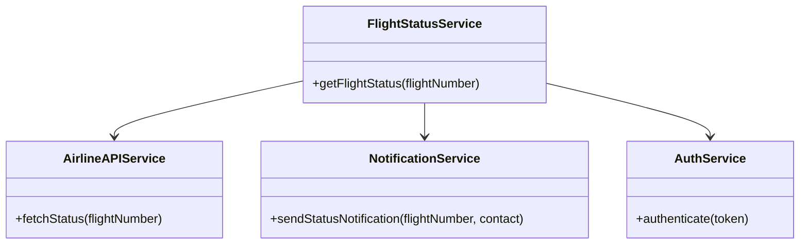
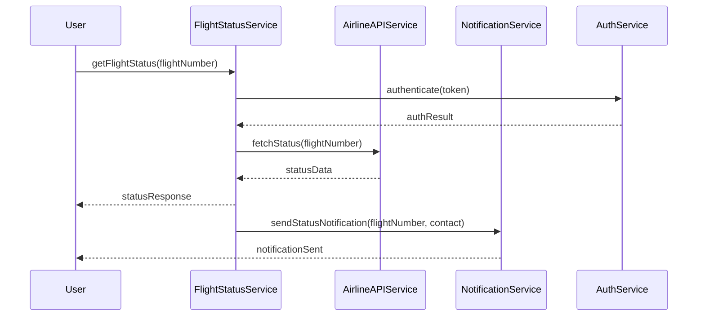

# For User Story Number [2]

1. Objective
Enable passengers to track the real-time status of their booked flights, including departure/arrival times, delays, and gate information. The system must provide timely notifications for any changes. Real-time integration with airline APIs is required for accurate updates.

2. API Model
2.1 Common Components/Services
- Authentication Service (JWT)
- Notification Service (Email/SMS/App Push)
- Flight Status Service
- Airline API Integration Service

2.2 API Details
| Operation   | REST Method | Type      | URL                        | Request (sample JSON)                  | Response (sample JSON)                       |
|-------------|-------------|-----------|----------------------------|----------------------------------------|----------------------------------------------|
| Status      | GET         | Success   | /api/flights/status        | {"flightNumber":"DL123"}              | {"flightNumber":"DL123","status":"ON TIME","gate":"A5","departureTime":"10:00"} |
| Status      | GET         | Failure   | /api/flights/status        | {"flightNumber":"DL123"}              | {"error":"Invalid flight number"}          |
| Notify      | POST        | Success   | /api/notifications/status  | {"flightNumber":"DL123","contact":"user@email.com"} | {"notificationId":789,"status":"SENT"} |

2.3 Exceptions
| API           | Exception Type           | Description                          |
|---------------|-------------------------|--------------------------------------|
| /api/flights/status | InvalidInputException    | Invalid flight number                |
| /api/flights/status | DataFetchException      | Airline API fetch failure            |
| /api/notifications/status | NotificationFailedException | Notification could not be sent |

3 Functional Design
3.1 Class Diagram


3.2 UML Sequence Diagram


3.3 Components
| Component Name         | Description                                         | Existing/New |
|-----------------------|-----------------------------------------------------|--------------|
| FlightStatusService   | Handles flight status queries                        | New          |
| NotificationService   | Sends notifications for status changes               | Existing     |
| AirlineAPIService     | Fetches real-time status from airline APIs           | New          |
| AuthService           | Handles JWT authentication                          | Existing     |

3.4 Service Layer Logic and Validations
| FieldName      | Validation                                      | Error Message                       | ClassUsed         |
|----------------|-------------------------------------------------|-------------------------------------|-------------------|
| flightNumber   | Must be valid and exist in airline system        | Invalid flight number               | FlightStatusService|
| statusData     | Must be timely and accurate                      | Status fetch failed                 | AirlineAPIService |
| contact        | Must be valid email/SMS/app id                   | Notification failed                 | NotificationService|

4 Integrations
| SystemToBeIntegrated | IntegratedFor         | IntegrationType |
|----------------------|----------------------|-----------------|
| Airline Status APIs  | Real-time flight status| API            |
| Email/SMS/App Push   | Status notifications  | API             |

5 DB Details
5.1 ER Model
```mermaid
erDiagram
    PASSENGER ||--o{ FLIGHT_STATUS : tracks
    FLIGHT_STATUS {
        id PK
        flightNumber
        status
        gate
        departureTime
        arrivalTime
        lastUpdated
    }
    NOTIFICATION {
        id PK
        flightStatusId FK
        contact
        sentAt
        status
    }
```

5.2 DB Validations
- Flight number must exist in FLIGHT_STATUS
- Notification contact must be valid

6 Non-Functional Requirements
6.1 Performance
- Real-time update latency < 1 minute
- Scalable to support spikes in queries

6.2 Security
6.2.1 Authentication
- JWT-based authentication for personalized notifications
6.2.2 Authorization
- Role-based access for notification management

6.3 Logging
6.3.1 Application Logging
- DEBUG: API request/response payloads
- INFO: Successful status fetches, notifications sent
- ERROR: API failures, notification errors
- WARN: Delayed status updates
6.3.2 Audit Log
- Log status fetch, notification sent events

7 Dependencies
- Airline status APIs for real-time data
- Email/SMS/App push gateway for notifications

8 Assumptions
- Airline APIs provide timely and accurate status data
- Notification gateways are reliable and scalable