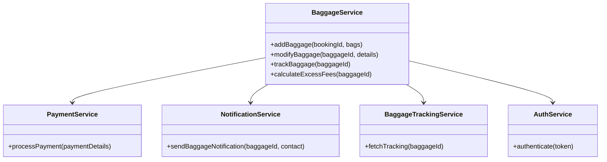
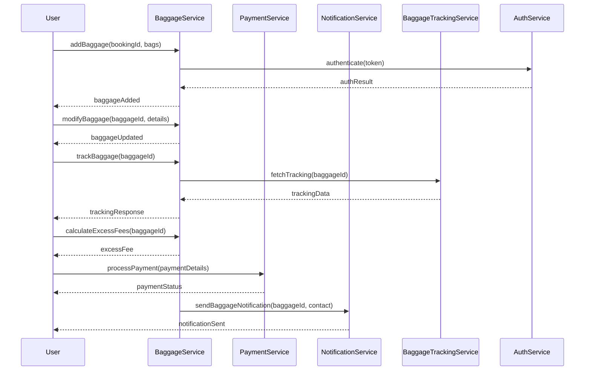

# For User Story Number [3]

1. Objective
Enable passengers to add, modify, and track their baggage information online. The system should provide details on baggage allowance, calculate excess baggage fees, and offer real-time tracking of checked-in baggage, including notifications for delays or misplaced baggage.

2. API Model
2.1 Common Components/Services
- Authentication Service (JWT)
- Baggage Management Service
- Payment Gateway Integration (for excess fees)
- Notification Service (Email/SMS)
- Baggage Tracking Integration Service

2.2 API Details
| Operation   | REST Method | Type      | URL                           | Request (sample JSON)                              | Response (sample JSON)                              |
|-------------|-------------|-----------|-------------------------------|----------------------------------------------------|-----------------------------------------------------|
| Add         | POST        | Success   | /api/baggage                  | {"bookingId":456,"bags":[{"weight":23,"dimensions":"55x40x20"}]} | {"baggageId":789,"status":"ADDED"}               |
| Modify      | PUT         | Success   | /api/baggage/{id}             | {"weight":25,"dimensions":"60x45x25"}            | {"baggageId":789,"status":"UPDATED"}             |
| Track       | GET         | Success   | /api/baggage/{id}/track       | N/A                                                | {"baggageId":789,"location":"LAX","status":"IN TRANSIT"} |
| PayExcess   | POST        | Success   | /api/baggage/{id}/pay-excess  | {"paymentDetails":{...}}                          | {"paymentId":101,"status":"CONFIRMED"}           |
| Notify      | POST        | Success   | /api/notifications/baggage    | {"baggageId":789,"contact":"user@email.com"}     | {"notificationId":102,"status":"SENT"}           |

2.3 Exceptions
| API           | Exception Type           | Description                          |
|---------------|-------------------------|--------------------------------------|
| /api/baggage          | InvalidInputException    | Baggage details invalid              |
| /api/baggage/{id}     | NotFoundException       | Baggage not found                    |
| /api/baggage/{id}/pay-excess | PaymentFailedException | Excess fee payment failed      |
| /api/baggage/{id}/track | TrackingFailedException | Baggage tracking API error           |
| /api/notifications/baggage | NotificationFailedException | Notification could not be sent |

3 Functional Design
3.1 Class Diagram


3.2 UML Sequence Diagram


3.3 Components
| Component Name         | Description                                         | Existing/New |
|-----------------------|-----------------------------------------------------|--------------|
| BaggageService        | Handles baggage add/modify/track logic               | New          |
| PaymentService        | Integrates with payment gateway for excess fees      | Existing     |
| NotificationService   | Sends baggage notifications                          | Existing     |
| BaggageTrackingService| Integrates with airport/airline baggage APIs         | New          |
| AuthService           | Handles JWT authentication                          | Existing     |

3.4 Service Layer Logic and Validations
| FieldName      | Validation                                      | Error Message                       | ClassUsed         |
|----------------|-------------------------------------------------|-------------------------------------|-------------------|
| weight         | Must comply with airline policy                  | Invalid baggage weight              | BaggageService    |
| dimensions     | Must comply with airline policy                  | Invalid baggage dimensions          | BaggageService    |
| paymentDetails | Must pass payment gateway validation             | Payment failed                      | PaymentService    |
| baggageId      | Must exist and be valid                          | Baggage not found                   | BaggageService    |
| trackingData   | Must be real-time and accurate                   | Tracking failed                     | BaggageTrackingService|

4 Integrations
| SystemToBeIntegrated | IntegratedFor         | IntegrationType |
|----------------------|----------------------|-----------------|
| Airline/Airport Baggage APIs | Real-time baggage tracking | API |
| Payment Gateway      | Excess baggage fee payment         | API |
| Email/SMS Gateway    | Baggage notifications              | API |

5 DB Details
5.1 ER Model
```mermaid
erDiagram
    PASSENGER ||--o{ BOOKING : makes
    BOOKING ||--o{ BAGGAGE : has
    BAGGAGE }o--|| PAYMENT : forExcessFee
    BAGGAGE ||--o{ BAGGAGE_TRACKING : trackedBy
    BAGGAGE {
        id PK
        bookingId FK
        weight
        dimensions
        status
        allowance
        excessFee
    }
    BAGGAGE_TRACKING {
        id PK
        baggageId FK
        location
        status
        lastUpdated
    }
    PAYMENT {
        id PK
        baggageId FK
        amount
        status
        paymentDate
    }
```

5.2 DB Validations
- Baggage weight/dimensions must comply with airline policy
- Payment status must be CONFIRMED for excess fee
- Baggage tracking must be updated in real-time

6 Non-Functional Requirements
6.1 Performance
- Real-time baggage tracking updates
- Response time < 2 seconds for baggage queries

6.2 Security
6.2.1 Authentication
- JWT-based authentication for all APIs
- PCI DSS compliance for payment APIs
6.2.2 Authorization
- Role-based access for baggage management

6.3 Logging
6.3.1 Application Logging
- DEBUG: API request/response payloads
- INFO: Successful baggage add/modify/track, payments
- ERROR: Payment failures, tracking errors
- WARN: Delayed baggage updates
6.3.2 Audit Log
- Log baggage add/modify, excess fee payment, tracking events

7 Dependencies
- Airline/airport baggage APIs for tracking
- Payment gateway for excess fees
- Email/SMS gateway for notifications

8 Assumptions
- Airline/airport APIs provide real-time baggage tracking
- Payment gateway integration is PCI DSS compliant
- Notification gateway is reliable