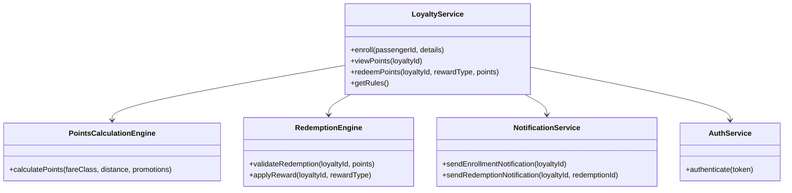
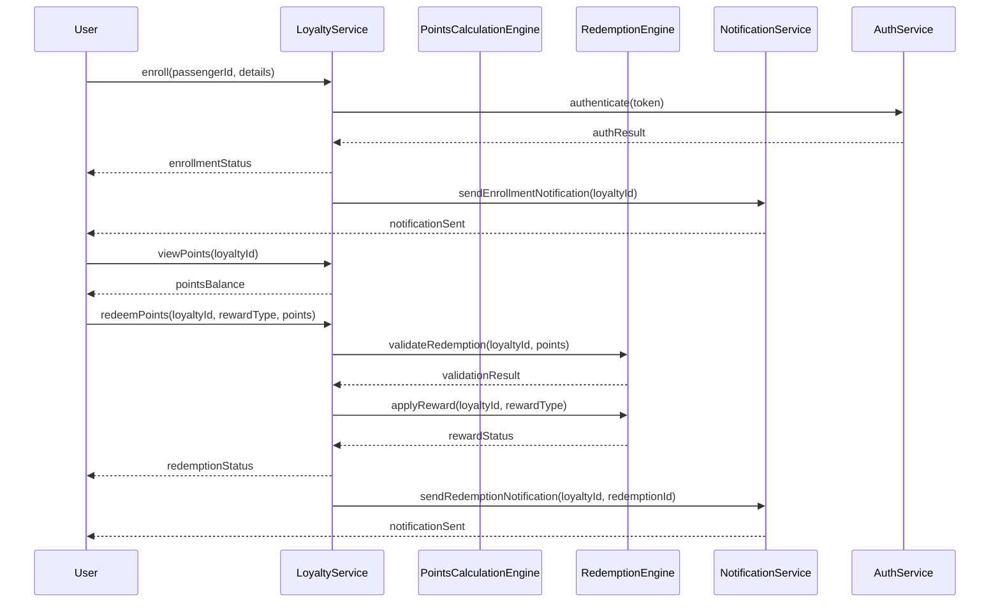

# For User Story Number [4]

1. Objective
Enable frequent flyers to enroll in a loyalty program, view their points balance, and redeem points for rewards such as flight upgrades or free tickets. The system should automate points crediting after eligible flights and provide clear information on earning and redemption rules.

2. API Model
2.1 Common Components/Services
- Authentication Service (JWT)
- Loyalty Program Service
- Points Calculation Engine
- Redemption Engine
- Notification Service (Email/SMS)

2.2 API Details
| Operation   | REST Method | Type      | URL                           | Request (sample JSON)                              | Response (sample JSON)                              |
|-------------|-------------|-----------|-------------------------------|----------------------------------------------------|-----------------------------------------------------|
| Enroll      | POST        | Success   | /api/loyalty/enroll           | {"passengerId":123,"details":{...}}              | {"loyaltyId":555,"status":"ENROLLED"}            |
| ViewPoints  | GET         | Success   | /api/loyalty/{id}/points      | N/A                                                | {"loyaltyId":555,"points":12000}                  |
| Redeem      | POST        | Success   | /api/loyalty/{id}/redeem      | {"rewardType":"UPGRADE","points":5000}           | {"redemptionId":888,"status":"REDEEMED"}         |
| Rules       | GET         | Success   | /api/loyalty/rules            | N/A                                                | {"rules":[{"fareClass":"Business","multiplier":2}]} |

2.3 Exceptions
| API           | Exception Type           | Description                          |
|---------------|-------------------------|--------------------------------------|
| /api/loyalty/enroll     | EligibilityException        | Passenger not eligible               |
| /api/loyalty/{id}/points| NotFoundException          | Loyalty account not found            |
| /api/loyalty/{id}/redeem| InsufficientPointsException| Not enough points for redemption     |
| /api/loyalty/rules      | DataFetchException         | Rules data fetch failed              |

3 Functional Design
3.1 Class Diagram


3.2 UML Sequence Diagram


3.3 Components
| Component Name         | Description                                         | Existing/New |
|-----------------------|-----------------------------------------------------|--------------|
| LoyaltyService        | Handles enrollment, points, redemption logic         | New          |
| PointsCalculationEngine| Calculates points based on rules                    | New          |
| RedemptionEngine      | Validates and applies redemption                    | New          |
| NotificationService   | Sends notifications for enrollment/redemption        | Existing     |
| AuthService           | Handles JWT authentication                          | Existing     |

3.4 Service Layer Logic and Validations
| FieldName      | Validation                                      | Error Message                       | ClassUsed         |
|----------------|-------------------------------------------------|-------------------------------------|-------------------|
| passengerId    | Must be eligible for enrollment                  | Not eligible                        | LoyaltyService    |
| loyaltyId      | Must exist and be valid                          | Loyalty account not found           | LoyaltyService    |
| points         | Must be sufficient for redemption                | Insufficient points                 | RedemptionEngine  |
| rewardType     | Must be valid and available                      | Invalid reward type                 | RedemptionEngine  |

4 Integrations
| SystemToBeIntegrated | IntegratedFor         | IntegrationType |
|----------------------|----------------------|-----------------|
| Airline Loyalty Systems | Points crediting and redemption | API |
| Email/SMS Gateway      | Enrollment/redemption notifications | API |

5 DB Details
5.1 ER Model
```mermaid
erDiagram
    PASSENGER ||--o{ LOYALTY_ACCOUNT : owns
    LOYALTY_ACCOUNT ||--o{ POINTS_TRANSACTION : records
    LOYALTY_ACCOUNT ||--o{ REDEMPTION : has
    LOYALTY_ACCOUNT {
        id PK
        passengerId FK
        enrollmentDate
        status
        pointsBalance
    }
    POINTS_TRANSACTION {
        id PK
        loyaltyAccountId FK
        points
        type
        flightId
        transactionDate
    }
    REDEMPTION {
        id PK
        loyaltyAccountId FK
        rewardType
        pointsUsed
        redemptionDate
        status
    }
```

5.2 DB Validations
- Enrollment eligibility check on PASSENGER
- Points balance must be >= points used for redemption
- Foreign key validations for all FK fields

6 Non-Functional Requirements
6.1 Performance
- Points update latency < 24 hours after flight completion
- 99.9% uptime for loyalty program service

6.2 Security
6.2.1 Authentication
- JWT-based authentication for all APIs
- GDPR compliance for personal data
6.2.2 Authorization
- Role-based access for loyalty management

6.3 Logging
6.3.1 Application Logging
- DEBUG: API request/response payloads
- INFO: Successful enrollments, points credited, redemptions
- ERROR: Redemption failures, points calculation errors
- WARN: Delayed points updates
6.3.2 Audit Log
- Log enrollment, points credit, redemption events

7 Dependencies
- Airline loyalty systems for points and rewards
- Email/SMS gateway for notifications

8 Assumptions
- Airline loyalty systems provide accurate points and redemption data
- Notification gateway is reliable
- GDPR compliance is ensured for all personal data